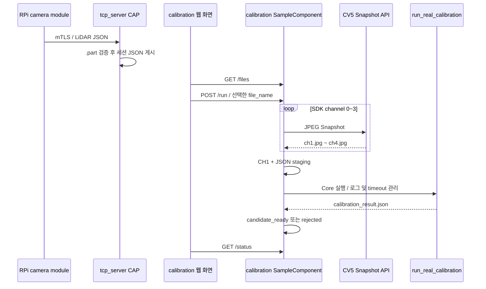

# CV5 자동 캘리브레이션 애플리케이션

`calibration`은 LiDAR 측정 JSON과 4채널 CCTV Snapshot을 묶어 Calibration Core를
실행하는 OpenSDK 전용 CAP이다. 기준 코드는 OpenSDK `a0832b6`, `d94b862`
(2026-08-24) 및 같은 날짜의 로컬 `calibration` 1.2 작업본이다.

이 문서에서 OpenSDK 기여는 두 층으로 나누어 기록한다. CAP의 웹 화면·Snapshot·작업
큐·상태 관리 구조는 다른 팀원이 작성한 OpenSDK 애플리케이션 범위다. 광진의
`d94b862`는 그 앱에 포함되어 있던 구버전 auto_calib Core를 `auto_calib/develop`의
알고리즘 업데이트에 맞춰 갱신하고, 실행 옵션과 K+D 입력 프로파일을 동기화한
downstream 업데이트다. OpenSDK 앱, MobileSAM, LSD, TCP server를 새로 개발했다는
의미로 해석하지 않는다.

| 항목 | 값 |
|---|---|
| 앱 역할 | 세션 선택, 영상 취득, Core 실행과 후보 결과 관리 |
| 네트워크 수신 | 없음; `tcp_server` CAP이 담당 |
| 입력 루트 | `/tmp/calibration` |
| Snapshot 채널 | 사용자 CH1~CH4 / SDK `0~3` |
| 캘리브레이션 영상 | 사용자 CH1 / SDK `0` / `ch1.jpg` |
| 실행 파일 | `../bin/run_real_calibration` |
| 기본 Core timeout | `1800초` |
| 최대 대기 작업 | `4` |
| 웹 목록·상태 갱신 | `3초` |
| 결과 정책 | `candidate_only`; 외부 파라미터 자동 활성화 금지 |

## CAP 책임 경계

`calibration` 앱에는 TCP listener, mTLS handshake, 인증서 provisioning 코드가 없다.
JSON 수신은 별도 `tcp_server` CAP이 담당하고, 알고리즘은 `Automatic_Calibration_Part`
저장소에서 가져온 Core 실행 파일이 담당한다. 이 앱은 두 경계를 연결하는 카메라 측
어댑터다.



JSON 도착만으로 자동 실행하지 않는다. 운영자가 웹 목록에서 파일을 선택하고 시작을
눌러야 Snapshot과 Core 작업이 시작된다.

## auto_calib Core 버전 차이와 업데이트 범위

### 문제 정의

기존 OpenSDK `calibration` CAP에는 다른 팀원이 OpenSDK 실행 환경에 맞춰 이식한
auto_calib Core 사본이 들어 있었다. 이 사본의 Core 버전이 `auto_calib/develop`의
후속 알고리즘 변경보다 낮았기 때문에, 자동 캘리브레이션을 최신 Core 기준으로
재현하려면 OpenSDK 쪽의 소스·헤더·실행기·설정 프로파일을 함께 갱신해야 했다.

이 문제는 OpenSDK 애플리케이션의 기능 부족을 새로 설계한 것이 아니라, 같은
캘리브레이션 Core를 서로 다른 저장소에서 유지하면서 발생한 버전 편차를 해소한
문제다.

### 광진이 수행한 업데이트

`d94b8625139e120b091ee267ca210af214a29fe0`은 다음 변경을 하나의 downstream 동기화
커밋으로 반영했다.

| 변경 영역 | 반영 내용 | 의미 |
|---|---|---|
| Core header/source | `calibration_core.hpp`, `calibration_core.cpp`를 최신 Core 흐름에 맞춰 갱신 | OpenSDK에 남아 있던 낮은 버전의 계산·검증 로직을 최신 upstream 기준으로 맞춤 |
| 실행기 | `run_real_calibration.cpp` 갱신 | 최신 Core 입력, 탐색 모드, 결과 계약을 OpenSDK 실행 경로에서 사용 |
| 탐색 | staged coarse-to-fine 탐색 반영 | 과거 전수 탐색 경로 대신 coarse 후보에서 local/Ceres 단계로 좁히는 최신 실행 모드 사용 |
| 왜곡 보정 | raw 영상과 사전 측정 K+D를 이용한 `cv::undistort` 경로 반영 | 렌즈 왜곡 상태와 Core 입력 프로파일의 불일치 방지 |
| 실행 설정 | `calibration_adapter.json`에서 staged, raw, intrinsic, 탐색 범위 동기화 | CAP adapter가 업데이트된 Core 옵션을 호출하도록 정렬 |
| 카메라 프로파일 | `camera_intrinsic.json` 추가 | PNM-C16083RVQ CH1의 ChArUco K+D 입력을 OpenSDK 패키지에 포함 |
| 출처 기록 | `automatic_calibration/UPSTREAM.md` 갱신 | 소스가 `Automatic_Calibration_Part`의 `develop`에서 가져온 것임을 기록 |

커밋 통계는 7개 파일, `+1945/-243`이다. 이 수치는 OpenSDK 앱 전체를 새로 만든
크기가 아니라, 기존에 이식되어 있던 Core 사본을 최신 구현과 호환시키기 위해 소스,
실행기, 설정, 프로파일, 출처 문서를 함께 갱신한 범위다.

### 업데이트에 포함된 Core 동작

OpenSDK 쪽에 동기화된 Core는 다음 경로를 사용한다.

```text
raw CH1 JPEG
  -> camera_intrinsic.json의 K+D로 cv::undistort
  -> LiDAR surface/structural feature 추출
  -> 5° coarse search
  -> Gaussian basin/local 1° search
  -> 선택 seed에 대한 Ceres 6-DoF refinement
  -> support·ambiguity·result gate
  -> calibration_result.json
```

업데이트된 adapter의 중요한 실행 조건은 다음과 같다.

| 옵션 | OpenSDK 값 | 해석 |
|---|---:|---|
| `--camera-channel` | `1` | Core 입력은 UI 기준 CH1 |
| `--ldc-enabled` | `false` | 별도 장치 LDC가 아니라 Core의 raw→undistort 경로 사용 |
| `--image-distortion-state` | `raw` | 입력 JPEG가 미보정 원본임을 명시 |
| `--manual-intrinsic` | `../res/camera_intrinsic.json` | K+D 프로파일 고정 |
| `--search-strategy` | `staged` | staged coarse-to-fine 탐색 사용 |
| 카메라 중심 | `(0.05928, -0.08105, 0) m` | LiDAR 원점 기준 CH1 오프셋 |
| down 범위 | `0°..30°`, step `5°` | OpenSDK 실행 시 탐색 범위 |
| optical roll | `-15°..15°`, step `5°` | OpenSDK 실행 시 탐색 범위 |
| timeout | `1800 s` | CAP adapter의 최대 Core 대기 시간 |

`camera_intrinsic.json`은 다음 입력 기준을 고정한다.

```text
camera model       = PNM-C16083RVQ
resolution         = 2592 × 1520
fx, fy             = 2033.901952, 2037.779638
cx, cy             = 1337.029701, 745.370056
distortion model   = OpenCV RadTan
accepted frames    = 18
calibration RMS    = 0.647206679 px
profile status     = PASS
profile id         = charuco-pass-clean18-20260814
```

이 프로파일 수치는 OpenSDK Core가 사용하는 입력 기준을 설명하기 위한 것이다. 이
문서의 OpenSDK 기여 판정은 프로파일을 새로 만든 앱 개발로 해석하지 않고, 낮은 버전의
Core가 최신 왜곡 보정 경로를 사용할 수 있도록 프로파일과 실행 설정을 함께 반영한
업데이트로 기록한다.

## OpenSDK 업데이트 검증 로그

### 정적 동기화 확인

| 로그 ID | 확인 방법 | 확인 결과 | 증거 수준 |
|---|---|---|---|
| OSDK-SYNC-01 | `d94b862`의 변경 파일과 commit message 대조 | Core header/source, 실행기, adapter, K+D profile, UPSTREAM이 함께 갱신됨 | Git diff 확인 |
| OSDK-SYNC-02 | `UPSTREAM.md`의 출처·변경 목록 대조 | `Automatic_Calibration_Part` `develop` 기반이며 staged, undistort, multimodal, validation gate가 기록됨 | 저장소 문서 확인 |
| OSDK-SYNC-03 | adapter 옵션과 실행기 인자 이름 대조 | `--manual-intrinsic`, `--image-distortion-state raw`, `--search-strategy staged`가 최신 OpenSDK 경로에 반영됨 | 설정·소스 대조 |
| OSDK-SYNC-04 | intrinsic profile JSON schema·품질 필드 확인 | 18 accepted views, RMS `0.647206679 px`, `status=PASS`, `solved=true` | 프로파일 정적 확인 |

### 실행 검증의 한계

현재 OpenSDK 저장소에서 확인된 `d94b862` 증적은 소스·설정·출처 문서와 intrinsic
profile이다. OpenSDK 장치에서 실제 CAP을 패키징하고 실행한 `output/core.log`,
`calibration_result.json`, `matching_scene_000.png` 결과는 저장소에서 확인되지
않았다. 따라서 아래를 문서상 PASS로 주장하지 않는다.

- CV5 장치에서 `run_real_calibration`이 실제로 완료되었다는 런타임 PASS
- OpenSDK 웹 화면의 `/run`부터 결과 검증까지의 E2E PASS
- 실제 CH1 영상과 LiDAR JSON으로 계산된 외부 파라미터의 제품 승인
- `d94b862` 자체가 MobileSAM·LSD·TCP server·CAP 앱 구조를 개발했다는 주장

OpenSDK 측의 후속 검증은 동일한 소스 버전의 Core 실행 파일, adapter JSON, intrinsic
profile, CH1 image, LiDAR JSON, `core.log`, 결과 JSON과 결과 PNG를 한 세션에 보존해야
한다. 실행 결과가 `candidate_ready`여도 제품 외부 파라미터 자동 활성화와는 별개의
후보 상태로 기록한다.

## 입력 파일과 세션 구조

```text
/tmp/calibration/calib-YYYYMMDD-HHMMSS/
├── calib-YYYYMMDD-HHMMSS_sweep-000001.json
├── ch1.jpg
├── ch2.jpg
├── ch3.jpg
├── ch4.jpg
├── staging/
│   ├── 000_image.jpg
│   └── 000_scan.json
├── output/
│   ├── core.log
│   ├── calibration_result.json
│   └── intermediate/
└── job_manifest.json
```

세션 파일명은 `calib-YYYYMMDD-HHMMSS`로 시작해야 한다. 앱은 `.part` 파일을
입력으로 사용하지 않으며 JSON에서 `interface_version`, `scan`, 비어 있지 않은
`measurements` 배열을 확인한다. 원본 JSON을 이동하거나 삭제하지 않는다.

서로 다른 CAP 사용자가 세션을 공유할 수 있도록 `/tmp/calibration`과 세션 디렉터리는
`01777` 권한을 사용한다. 장치 재부팅 시 `/tmp`의 JSON·Snapshot·결과는 사라진다.

## 4채널 Snapshot과 staging

Snapshot은 OpenPlatformManager의 `eAppSnapshotJpeg` 이벤트로 순차 요청한다.
처음에는 앱 전용 `../storage/captured`에 JPEG를 만든 뒤 공유 세션에 복사하고 임시
JPEG를 제거한다.

| 사용자 채널 | SDK 채널 | 세션 파일 | Core 사용 |
|---|---:|---|---|
| CH1 | `0` | `ch1.jpg` | 예 |
| CH2 | `1` | `ch2.jpg` | 아니오 |
| CH3 | `2` | `ch3.jpg` | 아니오 |
| CH4 | `3` | `ch4.jpg` | 아니오 |

```text
ch1.jpg            -> staging/000_image.jpg
original_scan.json -> staging/000_scan.json
```

네 채널을 캡처하지만 현재 Core에는 CH1과 LiDAR JSON 한 쌍만 전달한다. 4채널 전체의
독립 캘리브레이션 또는 다중 관측 학습은 현재 구현에 포함되지 않는다.

### job_manifest의 채널 표기 불일치

2026-08-24 작업본에서 실제 상수와 입력 선택은 CH1을 가리킨다.

```text
kCalibrationUiChannel  = 1
kCalibrationSdkChannel = 0
staging image           = ch1.jpg
```

그러나 `WriteJobManifest()`는 아래 값을 문자열로 고정 기록한다.

```json
{
  "calibration_channel": {"ui_channel": 3, "sdk_channel": 2}
}
```

즉 상태 API와 실제 staging은 CH1이지만 manifest 메타데이터는 CH3으로 잘못 표기된다.
결과 추적이나 검증 도구가 manifest만 읽으면 다른 카메라 채널로 오인할 수 있으므로
릴리스 전에 해당 값을 실제 상수와 일치시켜야 한다.

## 웹 API

| 요청 | 역할 |
|---|---|
| `GET /files` | 호환되는 세션 JSON 목록과 처리·대기 상태 조회 |
| `GET /status` | Core 실행 가능 여부, 채널 진행률, 세션, 오류와 경과 시간 조회 |
| `POST /run` | 선택한 JSON 파일에 대해 Snapshot과 작업 큐 등록 |

```json
{
  "file_name": "calib-20260824-120000_sweep-000001.json"
}
```

완료되었거나 `rejected` 상태인 세션은 다시 실행하지 않는다. 대기 또는 처리 중인
파일은 목록에서 별도 상태로 표시한다. 웹 화면은 3초마다 목록과 상태를 갱신한다.

### 상태 흐름

```text
waiting_for_selection
  -> capturing_channels
  -> calibration_queued
  -> preparing_calibration
  -> calibration_running
  -> candidate_ready | rejected

오류 분기:
  staging_failed | core_not_available | calibration_failed
  | result_validation_failed | manifest_failed
```

Core 자동 실행이 꺼져 있거나 실행 파일이 없으면 `ready_for_calibration` 상태로 남기고
원인을 기록한다. Core 종료 코드 `0`은 `candidate_ready`, `3`은 `rejected`로
처리하며 다른 코드는 실행 실패다.

## Core 실행 설정

로컬 1.2 작업본의 핵심 설정은 다음과 같다.

```json
{
  "auto_run_core": true,
  "executable": "../bin/run_real_calibration",
  "timeout_seconds": 1800,
  "arguments": [
    "--input-dir", "{staging_dir}",
    "--output", "{output_dir}",
    "--camera-channel", "1",
    "--image-distortion-state", "raw",
    "--manual-intrinsic-json", "../res/camera_intrinsic.json",
    "--search-strategy", "staged",
    "--camera-center-x-m", "0.05928",
    "--camera-center-y-m", "-0.08105",
    "--camera-center-z-m", "0",
    "--yaw-step-deg", "5",
    "--down-min-deg", "0",
    "--down-max-deg", "30",
    "--down-step-deg", "5",
    "--optical-roll-min-deg", "-15",
    "--optical-roll-max-deg", "15",
    "--optical-roll-step-deg", "5"
  ]
}
```

`{staging_dir}`, `{output_dir}`는 실행 직전에 실제 세션 경로로 치환한다. 공개 Git
`d94b862`의 설정은 `--manual-intrinsic`을 사용하지만 로컬 1.2는
`--manual-intrinsic-json`으로 수정했다. 실제 Core가 지원하는 옵션과 설정 JSON을 같은
버전으로 배포해야 한다.

기본 timeout은 1800초다. 과거 별도 실험에서 더 긴 timeout을 사용한 기록이 있더라도
현재 공개 코드와 로컬 1.2 설정의 기본값을 7200초라고 적으면 안 된다.

## 결과 검증과 자동 활성화 금지

Core 실행이 끝나면 `output/calibration_result.json`에 다음 값이 존재하는지 검사한다.

```json
{
  "status": "candidate_ready",
  "internal_gate_status": "example",
  "candidate_rt_status": "example",
  "product_approved_rt_status": "example",
  "reason_code": "example",
  "activation_allowed": false
}
```

문자열 값은 형식 설명용이며 실제 상태는 Core가 판정한다. `activation_allowed`가
`true`이면 앱이 결과를 거부한다. manifest도 `candidate_only: true`,
`activation_allowed: false`를 기록한다.

단일 CH1 영상과 단일 JSON의 결과는 후보 또는 진단 자료다. 여러 장면, hold-out,
ground truth와 승인 절차 없이 자동으로 카메라의 운영 외부 파라미터를 바꾸지 않는다.

## 시간 계측과 결과 보존

로컬 1.2는 웹의 시작 요청을 받은 시점부터 아래 작업의 전체 시간을 측정한다.

```text
request_elapsed_ms
  = 4채널 Snapshot
  + 작업 큐 대기
  + staging
  + Core 실행
  + 결과 검증 및 상태 기록
```

경과 시간은 `/status`, `job_manifest.json`, 앱 로그에 남긴다. Core 내부의
`runtime_ms`와 전체 요청 시간은 범위가 다르므로 같은 성능 지표로 비교하면 안 된다.

## 통합 전 확인 사항

1. `tcp_server`가 실제로 `/tmp/calibration/<session>`에 JSON을 게시하는지 확인한다.
   공개 `tcp_server` 1.0은 `storage/uploads`를 사용하므로 바로 연결되지 않는다.
2. CH1/SDK0 실제 이미지와 manifest의 CH3/SDK2 불일치를 수정·검증한다.
3. Core 옵션 이름과 `camera_intrinsic.json`을 동일한 소스 버전으로 맞춘다.
4. 정상 완료뿐 아니라 `.part`, 잘못된 JSON, Snapshot 실패, timeout, Core 종료 코드
   `3`, 재부팅 후 파일 소실을 시험한다.
5. `candidate_ready`를 제품 승인 또는 자동 적용과 혼동하지 않는다.
