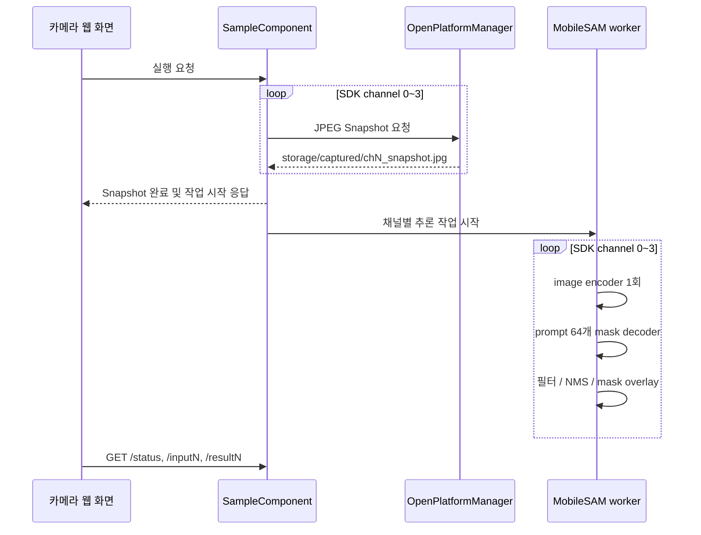

# 추가 검증용 CV5 MobileSAM 4채널 세그멘테이션

`sam_segmentation` OpenSDK 앱이 CV5 카메라의 4채널 Snapshot에 MobileSAM을
적용하는 구조를 정리한다. 기준 코드는 OpenSDK `704fbd1`(2026-08-19)이며 모델 변환
및 CV5 실행 기록은 앱의 개발 정리와 동일 시점 구현을 기준으로 한다.

이 앱은 **현재 A.D.T.S 자동 캘리브레이션 구조에서 사용하지 않는다.** CV5에서
MobileSAM ONNX가 OpenCV DNN으로 실행되는지와 4채널 Snapshot에 마스크를 생성할 수
있는지를 추가로 검증하기 위한 독립 CAP이다. `tcp_server`, `/tmp/calibration`,
`calibration`, `run_real_calibration`과 데이터를 주고받지 않는다.

| 항목 | 값 |
|---|---|
| 애플리케이션 | `sam_segmentation` |
| 현재 통합 구조 사용 여부 | 사용하지 않음 |
| 용도 | CV5 ONNX·OpenCV DNN·4채널 Snapshot의 추가 검증 |
| 추론 엔진 | OpenCV 4.12 DNN |
| 카메라 입력 | SDK 채널 `0~3`의 JPEG Snapshot |
| 모델 입력 크기 | `1024 × 1024` |
| 자동 prompt | `8 × 8`, 총 64개 |
| prompt embedding | `[1, 2, 256]` |
| 마스크 후보 | prompt당 3개, `256 × 256` |
| 실행 구조 | Snapshot 후 별도 worker에서 채널별 순차 추론 |
| 출력 | 채널별 반투명 마스크 JPEG와 처리 CSV |

## 현재 프로젝트 구조에서의 위치

현재 자동 캘리브레이션과 MobileSAM 검증 경로는 다음처럼 분리되어 있다.

```text
현재 자동 캘리브레이션 경로
RPi LiDAR JSON
  -> tcp_server
  -> /tmp/calibration/<session>
  -> calibration
  -> CH1 Snapshot + LiDAR JSON
  -> run_real_calibration
  -> 후보 외부 파라미터 / 거절 결과

추가 검증 경로
사용자 요청
  -> sam_segmentation 독립 CAP
  -> CH1~CH4 Snapshot
  -> MobileSAM ONNX 추론
  -> 마스크 JPEG / 처리 CSV
```

MobileSAM 마스크는 Calibration Core의 영상 입력을 대체하지 않고, 2D edge·구조선,
NID/NMI, Ceres refinement나 결과 gate에도 전달되지 않는다. 향후 별도 설계와 검증을
거쳐 통합할 수는 있지만 현재 문서와 구현에서 통합 완료로 간주하지 않는다.

## 모델 분리와 실행 파일

OpenCV DNN은 PyTorch `.pt` 모델을 직접 실행하지 않으므로 MobileSAM을 image encoder와
mask decoder ONNX 두 개로 분리한다. 자동 prompt embedding도 사전에 생성한다.

```text
mobile_sam.pt
  -> mobile_sam_image_encoder.onnx
  -> mobile_sam_mask_decoder.onnx
  -> mobile_sam_grid_prompts.bin
  -> mobile_sam_grid_prompts.json
```

| 파일 | 역할 | CAP에 필요 |
|---|---|---|
| `mobile_sam_image_encoder.onnx` | 이미지 한 장의 특징 embedding 생성 | 예 |
| `mobile_sam_mask_decoder.onnx` | 이미지 embedding과 prompt에서 마스크·IoU 생성 | 예 |
| `mobile_sam_grid_prompts.bin` | 미리 계산한 64개 prompt embedding | 예 |
| `mobile_sam_grid_prompts.json` | 격자 좌표와 embedding 형식 설명 | 구현 확인용 |
| `mobile_sam.pt` | ONNX 변환의 원본 체크포인트 | 아니오 |

실행 시 `cv::dnn::readNetFromONNX()`로 encoder와 decoder를 각각 읽는다. 원본
체크포인트나 학습 도구는 장치에 배포하지 않는다.

## OpenCV 4.12 ONNX 호환 문제

최초 decoder에는 동적 `Shape → Slice → Reshape` 경로가 포함되어 OpenCV 4.12에서
Slice shape 오류가 발생했다. 해당 경로를 없앤 뒤에는 출력 선택에 사용한 동적
`Gather`가 추가 오류를 일으켰다.

```text
최초 decoder
  -> 동적 Shape / Slice / Reshape
  -> OpenCV DNN Slice 오류

수정 decoder
  -> 입력 shape 고정
  -> 동적 Shape/Slice 패턴 제거
  -> 동적 Gather를 고정 범위 선택으로 변경
  -> OpenCV DNN load 및 forward 성공
```

| 텐서 | 기준 shape |
|---|---|
| image embedding | `[1, 256, 64, 64]` |
| sparse prompt embedding | `[1, 2, 256]` |
| 후보 마스크 | `[1, 3, 256, 256]` |
| IoU 점수 | `[1, 3]` |

개발 기록에서 수정 decoder의 PyTorch 대비 최대 출력 차이는 `0.0`으로 확인했다.
이는 해당 변환 검증 입력의 결과이며 모든 입력이나 CV5 전체 성능을 보증하는 수치는
아니다.

## 독립 추가 검증 실행 흐름



네 채널 Snapshot을 먼저 끝낸 뒤 시간이 긴 추론은 worker에서 순차 실행한다. 웹 화면은
`/status`를 조회해 현재 채널과 완료 개수를 표시하며 채널 `1~4` 버튼으로 원본과 결과를
비교한다.

## 자동 prompt와 후보 필터

prompt 좌표는 `1024 × 1024` 평면에 8×8 격자로 배치한다. 첫 좌표는 `(64, 64)`이며
마지막 좌표는 `(960, 960)`이다. 각 prompt에서 최대 3개의 마스크 후보를 평가한다.

```json
{
  "predicted_iou_threshold": 0.88,
  "stability_threshold": 0.90,
  "mask_nms_threshold": 0.85,
  "minimum_mask_area": 100,
  "overlay_alpha": 0.55
}
```

| 설정 | 기준값 | 역할 |
|---|---:|---|
| `predicted_iou_threshold` | `0.88` | 낮은 예측 IoU 후보 제거 |
| `stability_threshold` | `0.90` | 불안정한 마스크 제거 |
| `mask_nms_threshold` | `0.85` | 마스크 IoU 기반 중복 억제 |
| `minimum_mask_area` | `100` | 작은 영역 제거 |
| `overlay_alpha` | `0.55` | 마스크 반투명 합성 강도 |

실행 중 threshold는 `0~1` 범위로 제한하고 최소 면적은 1 이상으로 보정한다. 이미지
padding 영역에 걸친 마스크는 유효 영역으로 잘라 원본 해상도로 되돌린다. 바운딩 박스는
그리지 않는다.

## 결과 파일과 성능 지표

```text
storage/captured/
├── ch0_snapshot.jpg
├── ch1_snapshot.jpg
├── ch2_snapshot.jpg
└── ch3_snapshot.jpg

storage/segmentation/
├── ch0_masks.jpg
├── ch1_masks.jpg
├── ch2_masks.jpg
├── ch3_masks.jpg
└── segmentation_metrics.csv
```

```csv
channel_id,timestamp_ms,input,mask_count,elapsed_ms,output,status
0,1760000000000,../storage/captured/ch0_snapshot.jpg,7,1234.5,../storage/segmentation/ch0_masks.jpg,ok
```

CSV 예시의 마스크 개수와 시간은 설명용이다. encoder는 이미지당 한 번 실행하지만
decoder는 채널당 64회 실행하므로 4채널 전체에서 총 4회 encoder와 256회 decoder
평가가 발생한다. 장치 처리 시간이 길면 모델을 다시 export해 prompt 격자를 4×4로
줄이거나 임계값을 조정해 후처리 후보를 줄인다.

## 런타임 의존성과 패키징

| 의존성 | 용도 |
|---|---|
| `opencv_core` | 행렬과 공통 데이터 구조 |
| `opencv_imgproc` | resize, 마스크 필터와 합성 |
| `opencv_imgcodecs` | Snapshot JPEG 읽기·저장 |
| `opencv_dnn` | encoder·decoder ONNX 추론 |

헤더와 공유 라이브러리는 모두 동일한 OpenCV 4.12 계열의 CV5/AArch64 빌드여야 한다.
OpenCV 4.10과 4.12를 한 CAP에 섞거나 x86-64 Linux 라이브러리를 넣으면 장치에서
정상적으로 로드되지 않는다. Windows 공유 폴더에서 `.so` symlink 생성이 실패할 수
있으므로 실제 라이브러리와 SONAME 파일을 확인한다.

## 알려진 장애와 확인 항목

| 증상 | 확인할 원인 |
|---|---|
| `AppDispatcher component(as Receiver) is not found` | dispatcher manifest 두 개와 앱 GroupName 누락 |
| `MobileSAM models are not ready` | ONNX 파일, prompt binary 또는 DNN 공유 라이브러리 누락 |
| OpenCV `SliceLayerImpl` shape 오류 | 동적 Shape/Slice가 남은 비호환 decoder |
| 시작 요청이 HTTP 500 | 네트워크 자체보다 모델 초기화 실패 여부 확인 |
| 결과 이미지가 생성되지 않음 | Snapshot 권한, 채널 mapping, worker 로그 및 출력 디렉터리 |
| 장치 추론이 지나치게 느림 | prompt 개수, 모델 크기, CPU·온도와 채널별 CSV 시간 |

CV5 CAP 실행, ONNX load/forward, 64개 prompt와 결과 표시 기록은 추가 검증 결과로
확인했다. 이는 현재 자동 캘리브레이션의 기능 또는 성능 검증 결과가 아니다. 독립 CAP의
실제 처리량과 지연 시간은 동일한 카메라·입력 해상도·온도 조건에서 별도로 계측해야 한다.
