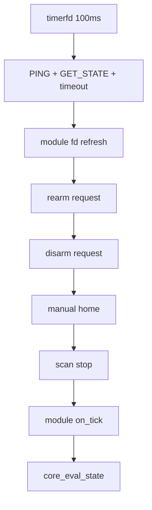
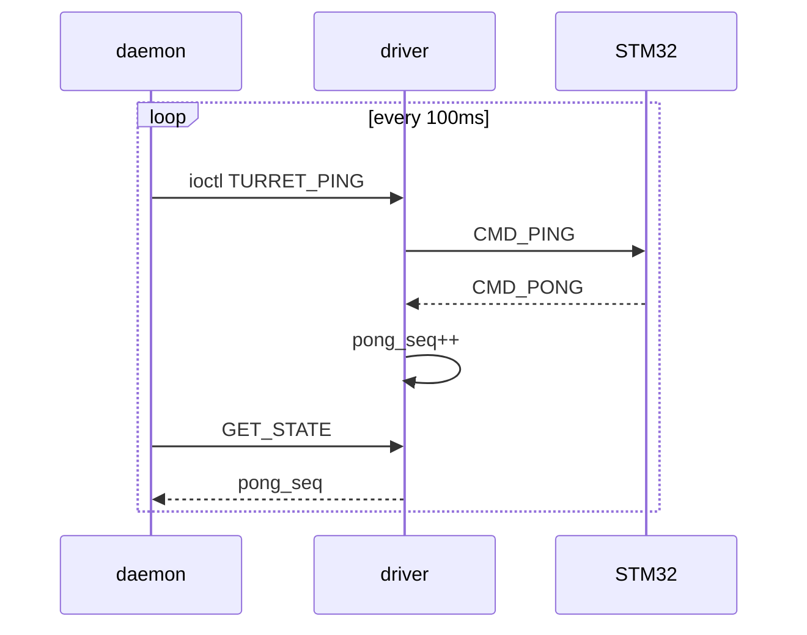
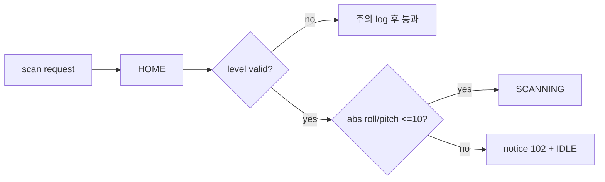
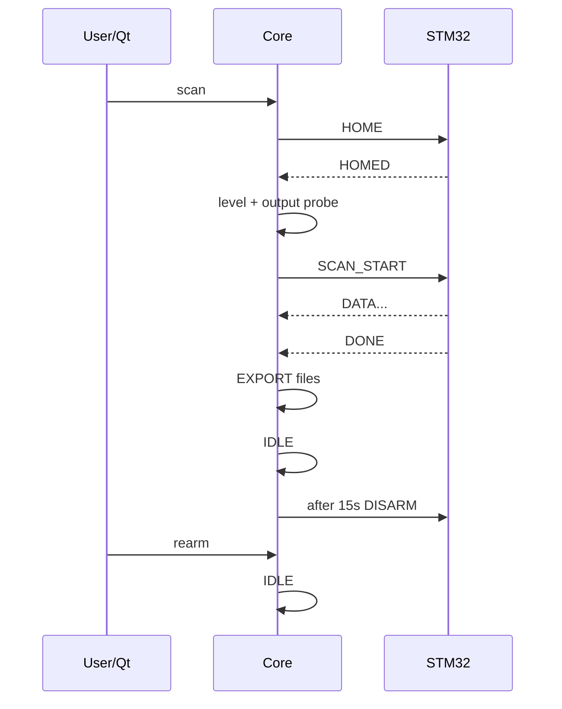

# 통합 데몬 — 100ms tick · heartbeat · HOME · FSM 전이

> 출처: 02-2. 100ms tick·heartbeat·HOME·FSM 전이 상세 (팀 위키 문서)
> **이 사본**: 2026-08-21 기준 스냅샷
> 기준 함수: `core_tick`, `core_poll_link`, `core_await_home`, `core_eval_state`, `core_transition`
> 코드 기준: `develop` / `4372771` / 2026-08-19

## 1. tick은 데몬의 정책 시계다

100ms timerfd 이벤트마다 core는 링크 확인, 모듈 fd 갱신, 외부 요청 소비, 모듈 tick, 자동
상태 전이를 실행한다. **이 순서가 안전 정책이다.**

REARM을 먼저 처리하고 DISARM을 나중에 처리해 **같은 tick에 둘 다 있으면 정지가 최종
상태가 된다.**

## 2. heartbeat가 필요한 이유

UART 파일이 열려 있다는 사실은 STM 펌웨어가 정상이라는 뜻이 아니다. 데몬은 100ms마다
PING을 보내고 PONG sequence 변화를 관측한다.

데몬은 첫 state read에서 sequence와 현재 monotonic time을 baseline으로 삼는다. sequence가
바뀌면 `hb_last_pong = now`. **300ms를 넘으면 DISARM한다.**

## 3. 왜 드라이버가 timeout을 판단하지 않는가

timeout은 **정책**이다. 300ms를 500ms로 바꾸거나 blocking 예외를 처리하려면 유저스페이스
배포만으로 바꾸는 것이 낫다. 드라이버는 **사실**인 pong sequence만 제공한다.

> ⚠️ Camera upload가 루프를 오래 멈춘 뒤 곧바로 timeout을 계산하면 **자기 block을 link
> failure로 오인한다.** 현재는 upload 마지막에 `core_hb_reprime()`을 호출한다. 이 보정은
> 진짜 PONG loss도 가릴 수 있으므로 **blocking 작업을 수행한 코드만** 호출해야 한다.

## 4. STM error 처리

`last_err`는 다음 성공까지 유지되므로 매 tick 로그하면 같은 줄이 초당 10번 쌓인다.
`last_err_seen`으로 **변화 edge만** 기록한다. 모든 state에서 error를 보고하되 SCANNING 중
fatal error일 때만 즉시 DISARM하는 식으로 **보고와 정책을 분리**한다.

## 5. HOME을 매 스캔 다시 하는 이유

드라이버의 `STF_HOMED`는 과거 HOMED를 캐시한다. **STM이 리셋돼 홈 상태를 잃어도 드라이버
캐시는 true로 남는다.** 그래서 core는 캐시만 보고 HOME을 생략하지 않고 스캔마다 ioctl을
보낸다. 드라이버도 HOME ioctl에서 플래그를 먼저 내린다.

## 6. `core_await_home` lifecycle

| 필드 | 의미 |
|---|---|
| `first_ms = 0` | 새 HOME |
| `first_ms != 0`, `homed = 0` | 대기 |
| `homed = 1` | 이번 응답 완료 |
| `now − first > 20s` | timeout → notice **101** |
| `now − last >= 500ms` | HOME 재시도 |

manual HOME과 scan-before-HOME은 **같은 대기 함수**를 쓰며 완료 뒤 행동만 다르다.
scan request는 HOME 동안 `valid` 상태로 남겨야 완료 후 사라지지 않는다.

## 7. level gate

HOME 뒤 SCANNING 진입 전에 IMU 값을 검사한다. `level.valid = 0`이면 개발 편의를 위해
gate를 생략한다.

> ⚠️ 현재 임계는 **10.0°**이며, 코드 주석상 **근거 있는 허용치가 아니라 사실상 gate를
> 열어둔 브링업 설정**이다. IMU 마운트와 rig를 실제 수평에서 재교정한 뒤 3° 이하로
> 되돌리는 작업이 필요하다.

## 8. FSM 전이 규칙

| 현재 | 허용 다음 |
|---|---|
| `IDLE` | `SCANNING`, `DISARM` |
| `SCANNING` | `EXPORT`, `IDLE`, `DISARM` |
| `EXPORT` | `IDLE`, `DISARM` |
| `DISARM` | `IDLE` |

허용하지 않은 전이는 로그 후 무시한다.

## 9. state 진입 동작

**SCANNING 진입** — request 검증 → seam 경고 → level gate → 출력 경로 write probe →
`SCAN_START` ioctl → progress/result reset.

**EXPORT 진입** — path와 point count를 핸들 해제 전에 복사 → `scan_out_close` → bool
결과로 `result.valid` 설정 → 실패 시 notice **105**. (commit `149bc63`에서 수정)

**DISARM 진입** — `TURRET_DISARM` → 열린 output close → HOME/auto-disarm 예약 clear.
DISARM 직전 대기 request가 REARM 후 자동 실행되지 않게 `core_rearm`에서도 request를 비운다.

> `eaa7125` 이후 `core_eval_state()`는 IDLE이 아닌 상태에서 `req.valid`가 보이면 **그
> tick에 즉시 지운다.** SCANNING/EXPORT에서는 "이미 스캔 진행 중", DISARM에서는 "rearm 후
> 재요청" 사유로 notice **106 `ERR_BUSY`**를 발행한다. 스캔 중 들어온 물리 버튼/MQTT
> 요청이 다음 IDLE에서 자동 시작되던 과거 경로는 소스상 폐쇄됐다.

## 10. SCANNING 완료 조건

정상은 드라이버 `STF_SCANNING`이 `SCAN_DONE`에서 clear되고 점이 1개 이상 있는 경우다.

**안전망**: 첫 점 전 **15초**, 시작 후 무입력 **3초**. 0점 timeout도 EXPORT로 가므로
**result의 point count와 file validity를 소비자가 구분해야 한다.**

## 11. EXPORT가 일시 state인 이유

진입 동작에서 파일을 닫고 모듈 `on_state`가 결과를 발행/업로드한다. 다음 tick의
`core_eval_state`가 IDLE로 보낸다. 상주 모드는 **15초 뒤 DISARM을 예약**하고, `--once`는
STM 되감기를 방해하지 않으려고 DISARM 없이 종료한다.

## 12. REARM 의미

프로토콜에 `CMD_ARM`은 없다. REARM은 **데몬을 DISARM→IDLE로 되돌릴 뿐**이며 모터는 다음
HOME/SCAN에서 다시 활성화된다. 링크가 죽어 있으면 REARM을 거부한다.

## 13. 정상 시퀀스

## 14. 장애 시퀀스

| 상황 | 결과 |
|---|---|
| PONG loss | 어느 state든 **DISARM** |
| 스캔 중 STM ERROR | 보고 + **DISARM** |
| HOME 무응답 | notice **101**, request 취소 |
| not-level | notice **102**, request 취소 |
| 파일 실패 | notice **105**, result invalid |
| Camera 실패 | notice **103**, 로컬 파일 유지 |
| stop | `STOP` ioctl 후 받은 점까지 EXPORT |

## 15. 시험 항목

fake pong sequence로 **299/301ms 경계**, HOME 재시도 횟수와 **20초 경계**, same-tick
rearm+disarm, **0점 timeout**, `SCAN_DONE` 유실, stop partial export, output failure,
`--once` cancellation exit code를 검증한다.

## 관련

- 02. adts_daemon 코어·FSM·스캔 산출물
- [MQTT 토픽 계약 §5](../../interfaces/mqtt-topic-contract.md) — Qt UI 매핑
- [스캔 산출물 포맷](../../interfaces/scan-output-format.md)
