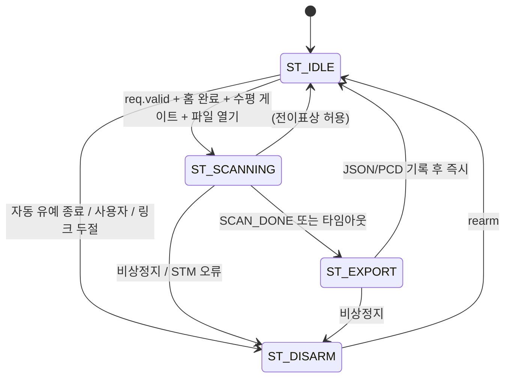

# daemon core 이벤트 루프와 FSM

| 항목 | 내용 |
|---|---|
| 문서 ID | `ADTS-DMN-30` |
| 파트 | Daemon (코어) |
| 담당 | 이현우 |
| 대상 소스 | `RPi/daemon/core/main.c` (1,278줄) |
| 기준 코드 | RPi `2a683ee` (2026-08-21). 대상 파일은 `f51ba0f` 이후 변경 없음 |
| 구조 | C11 · 단일 스레드 epoll · 락 없음 |
| 상태 | 구현 완료 · ARM64 빌드/정적분석 재검증 · 2026-08-19 실기 기록 확인 |

---

## 1. 개요

`adts_daemon` 은 RPi 런타임의 정책 소유자다. `main.c` 의 책임은 데이터 가공이 아니라
순서와 실패 정책이다.

```
타이머 tick   -> heartbeat 판정과 요청 처리 순서를 정한다
turret 이벤트 -> 점을 배출한다
전이 진입 동작 -> 하드웨어 명령과 산출물 확정을 수행한다
```

기하와 파일 포맷은 `scan_output.c` 로, 외부 전송은 모듈로 위임한다.

### 1.1 단일 스레드 epoll

| 얻는 것 | 대가 |
|---|---|
| 공유 상태 경쟁이 없다 (`shared_ctx` 에 락이 없다) | 콜백 하나가 오래 막으면 타이머·heartbeat·DISARM·시그널이 같이 밀린다 |
| 모듈을 mock 으로 바꿔 코어를 하드웨어 없이 시험할 수 있다 | 모든 콜백에 블로킹 금지 계약이 필요하다 |
| 요청 소비 순서를 한 함수에서 고정한다 | epoll이 동시에 반환한 fd 사이의 선후는 배열 순서에 따른다 |

카메라 업로드는 `ST_EXPORT` 진입의 `on_state` 콜백에서 동기 수행하므로 이 계약의
예외다. 업로드 중에는 timerfd·signalfd·turret 이벤트 처리가 모두 멈추며, 완료 뒤
`core_hb_reprime()`으로 heartbeat 기준 시각만 다시 맞춘다
(50 카메라 mTLS 업로드 3.3).

---

## 2. 적용 범위와 경계

| 다루는 것 | 다루지 않는 것 |
|---|---|
| epoll 루프, FSM, 타임아웃, heartbeat | 좌표 변환·격자·파일 → 31 scan_output 좌표계와 산출물 |
| 요청 소비 순서와 안전 정책 | 모듈 내부 → 40 MQTT 토픽 계약과 모듈, 50 카메라 mTLS 업로드 |
| CLI 인자와 종료 코드 | 드라이버 내부 → 20 turret_driver 커널 드라이버 |
| 수평 게이트 판정 | IMU 드라이버 내부 (송영빈) |

---

## 3. 설계

### 3.1 상태머신



전이표(`core_transition:770`)가 허용 여부를 강제하고, 허용되지 않는 전이는
`FSM reject` 로그를 남기고 무시한다.

| 목표 | 진입 동작 |
|---|---|
| `ST_SCANNING` | `core_scan_begin` — 검증 → seam 경고 → 수평 게이트 → 파일 열기 → `TURRET_SCAN_START` |
| `ST_EXPORT` | 경로·점수 스냅샷 → `scan_out_close` → `result.valid` 판정 → 통지 |
| `ST_DISARM` | `TURRET_DISARM` → 진행 중 산출물 마감 → 홈·예약 상태 리셋 |

### 3.2 타임아웃 상수

| 상수 | 값 | 용도 |
|---|---:|---|
| `TICK_MS` | 100 | tick 주기 = PING 주기 |
| `HB_TIMEOUT_MS` | 300 | `pong_seq` 무변화 지속 → link_dead |
| `HOME_TIMEOUT_MS` | 20,000 | 홈 대기 상한 |
| `SCAN_FIRST_POINT_TIMEOUT_MS` | 15,000 | 첫 점 대기 |
| `SCAN_IDLE_TIMEOUT_MS` | 3,000 | 점이 오다가 끊김 |
| `POST_SCAN_DISARM_MS` | 15,000 | 파킹 유예 후 자동 DISARM |
| `SCAN_BATCH` | 64 | `read()` 1회 최대 점 수 |

첫 점 타임아웃이 긴 이유는 홈 이후 시작점 이동 + 3초 정착이 걸리기 때문이다. 스캔이
돌기 시작하면 10ms 마다 점이 오므로 3초 침묵은 비정상이다.

### 3.3 데몬 자체 판정 코드

STM32 오류(`< 100`)와 데몬 판정(`>= 100`)을 코드 공간으로 분리했다.

| 코드 | 이름 | 의미 |
|---:|---|---|
| 100 | `DISARM` | 안전정지 |
| 101 | `HOME_TIMEOUT` | 20초 안에 홈 미완료 |
| 102 | `NOT_LEVEL` | 수평 게이트 거부 |
| 103 | `UPLOAD_FAIL` | 카메라 전송 실패 (파일은 로컬에 남음) |
| 104 | `BAD_REQUEST` | 요청 파라미터 불량 |
| 105 | `EXPORT_FAIL` | 측정값 복구 불가 |
| 106 | `BUSY` | 지금 받을 수 없는 요청 |

분리 이전에는 `4` 하나가 세 뜻으로 쓰여 Qt 가 STM32 거절과 데몬 파싱 실패를 구분할
수 없었다.

---

## 4. 구현 — 코드 해설

### 4.1 `struct core` (`:57`)

`shared_ctx` 는 외부 계약 상태, 나머지는 코어 내부 조율 상태다.

| 묶음 | 핵심 필드 | 책임 |
|---|---|---|
| 공유 상태 | `ctx` | 모듈과 공유하는 유일한 상태 |
| fd | `epoll_fd`, `turret_fd`, `timer_fd`, `signal_fd` | 이벤트 소스 |
| 모듈 | `modules[]`, `module_fd[]`, `n_modules` | 콜백 레지스트리 |
| heartbeat | `hb_last_seq`, `hb_last_pong`, `hb_primed` | `pong_seq` → `link_alive` |
| HOME | `home_req_first_ms`, `home_req_last_ms`, `home_manual` | 재시도·타임아웃 |
| 스캔 후 | `auto_disarm_at_ms` | 파킹 보호 유예 |
| 산출물 | `out`, `lidar_offset_mm` | `scan_output` 핸들 |
| 프로세스 모드 | `exit_after_scan`, `clean_exit`, `scan_failed` | `--once` / DISARM 생략 / 종료 코드 |
| 스캔 타임아웃 | `last_point_ms` | 첫 점 / 무입력 기준 |

### 4.2 진입과 종료

```
main (:1227)
  -> core zero/init
  -> parse_args (:1189)
  -> core_setup (:848)
  -> CLI 요청을 ctx.req 에 게시
  -> core_run (:1052)
  -> core_shutdown (:1089)
  -> return core.scan_failed ? 1 : 0
```

#### `parse_args()` (`:1189`)

```c
if ((strcmp(argv[i], "--scan") == 0) && ((i + 5) < argc)) {
    req->pan_start_ddeg  = (int16_t)atoi(argv[i + 1]);
    ...
    req->step_ddeg       = (uint16_t)atoi(argv[i + 5]);
```

#### `core_setup()` (`:848`)

```
1. ctx.core 설정, ST_IDLE
2. /dev/turret 를 O_NONBLOCK 으로 open — 실패하면 degraded 로 계속
3. timerfd, signalfd, epoll 생성
4. timer / signal / turret 등록
5. mqtt, imu, led, camera 모듈 init -> get_fd -> epoll 등록
```

`signalfd` 를 쓰므로 async signal handler 안에서 복잡한 I/O 를 하지 않는다. 시그널도
다른 이벤트와 같은 큐로 들어온다.

degraded 는 개발 편의다. production 에서는 systemd `ExecStartPre` 가 `/dev/turret`
을 최대 30초 기다려 조용한 degraded 를 막는다.

#### `core_shutdown()` (`:1089`)

성공한 `--once` 완료에서는 `clean_exit=true`를 세워 shutdown의 DISARM을 생략한다. STM32가 자율 수행 중인 파킹을 끊지 않기 위한 순서다.

### 4.3 이벤트 루프 — `core_run()` (`:1052`)

| ready fd | 핸들러 |
|---|---|
| `timer_fd` | `core_tick` |
| `signal_fd` | SIGINT·SIGTERM·SIGHUP 수신 후 `running = false` |
| `turret_fd` | `core_on_turret_event` |
| 모듈 fd | 해당 모듈 `on_event` |

### 4.4 100ms tick — `core_tick()` (`:984`)

순서가 곧 정책이다.

```c
core_poll_link(c);           /* 1. STM 링크 캐시 + heartbeat 판정 */
core_refresh_module_fds(c);  /* 2. 소켓 재접속 등으로 fd 가 바뀌었나 */

/* 주의: 복구를 정지보다 먼저 소비한다. 같은 tick 에 둘 다 서면(예: 조작자가
 *   REARM 을 누른 직후 링크가 끊겨 자동 정지가 걸린 경우) 나중에 처리되는
 *   쪽이 최종 상태가 되므로, 안전정지가 항상 이기도록 순서를 고정한다. */
if (c->ctx.req_rearm  != 0u) { ... core_rearm(c); }              /* 3 */
if (c->ctx.req_disarm != 0u) { ... core_transition(ST_DISARM); } /* 4 */
if (c->ctx.req_home   != 0u) { ... }                             /* 5 */
if (c->ctx.req_scan_stop != 0u) { ... }                          /* 6 */

for (module) m->on_tick(...);                                    /* 7 */
core_eval_state(c);                                              /* 8 */
```

3번과 4번의 순서가 안전 설계다. `core_tick()` 진입 시 두 플래그가 함께 서 있으면
나중에 처리되는 DISARM이 최종 상태가 된다. 다만 모듈 fd와 timerfd가 같은
`epoll_wait()`에서 함께 준비됐을 때 모듈 이벤트가 timer보다 뒤에 배치되면 요청 소비는
다음 tick으로 넘어간다.

5번 HOME 의 중복 방어:

```c
} else if (c->home_manual || (c->ctx.req.valid != 0u)) {
    /* 이미 홈이 돌고 있거나 스캔이 곧 홈을 잡는다. 여기서 다시 걸면
     * home_req_* 가 리셋돼 20초 타임아웃이 처음부터 다시 시작된다. */
    core_log(c, "HOME", "이미 홈 진행 중 — 중복 요청 무시");
}
```

모듈은 명령을 직접 실행하지 않는다. `shared_ctx` 의 플래그만 세우고 실제 전이는 이
tick 이 정해진 순서로 수행한다.

### 4.5 heartbeat — `core_read_state()` (`:407`) / `core_poll_link()` (`:485`)

```c
const uint64_t now = mono_ms();
if (!c->hb_primed) {
    c->hb_primed    = true;          /* 시작 시점부터 grace 부여 */
    c->hb_last_seq  = st.pong_seq;
    c->hb_last_pong = now;
} else if (st.pong_seq != c->hb_last_seq) {
    c->hb_last_seq  = st.pong_seq;
    c->hb_last_pong = now;
}

const bool alive = (now - c->hb_last_pong) <= HB_TIMEOUT_MS;
c->ctx.link.link_alive = alive ? 1u : 0u;

if (!alive && c->ctx.state != ST_DISARM) {
    core_log(c, "LINK", "link_dead (PONG > %ums) -> DISARM", HB_TIMEOUT_MS);
    core_transition(c, ST_DISARM);
    return;
}
```

- 드라이버는 `pong_seq` 만 올리고 판정은 데몬이 자기 `CLOCK_MONOTONIC` 으로 한다
- `hb_primed` 가 없으면 기동 직후 `pong_seq` 초기값과 비교하다 첫 tick 에 link_dead
  가 된다

보고와 정책은 분리한다.

```c
/* 예전에는 이 로그가 state == ST_SCANNING 안에 갇혀 있었다. 홈 대기 중 상태는
 * ST_IDLE 이라, STM 이 홈 도중 올린 ERR_NOT_HOMED / ERR_STALL 이 last_err 에
 * 담기기만 하고 출력되지 않았다. */
if (st.last_err != c->last_err_seen) { ... }
```

보고는 어느 상태에서든 수행하고, STM ERROR에 따른 DISARM은 `ST_SCANNING`에서만
수행한다. IDLE의 오류는 요청 거절이지 비상정지가 아니다. 드라이버는 `last_err`를
`SCAN_START`에서 초기화하고 그 외에는 캐시에 유지하므로 값이 바뀔 때만 출력한다.

### 4.6 HOME 대기 — `core_await_home()` (`:507`)

```
- 첫 진입에 캐시된 homed 를 믿지 않고 HOME 을 보낸다
- 500ms 마다 재전송
- 상태 캐시의 `homed==1` 이면 완료로 판정
- 20초 초과 시 NOTICE_HOME_TIMEOUT + 스캔 요청 취소
```

첫 진입에서는 이전 캐시를 그대로 사용하지 않고 HOME을 다시 보낸다. Protocol v6의
주기 STATUS도 `homed` 캐시를 갱신하므로 완료 상태를 해석할 때 요청 수명주기와 STM32
busy/error 응답을 함께 본다. STM32 `scan_home()`이 이미 HOMING 상태이면 재요청을
무시하므로 데몬의 500ms 재전송은 정착 타이머를 리셋하지 않는다.

대기 중에는 요청을 소비하지 않는다. 소비하면 홈이 선 뒤에 스캔이 사라진다.

### 4.7 스캔 데이터 배출 — `core_drain_scan_points()` (`:371`)

```c
struct proto_scan_point batch[SCAN_BATCH];        /* 64점 */

for (;;) {
    const ssize_t n = read(c->turret_fd, batch, sizeof(batch));
    if (n <= 0) break;                            /* EAGAIN / EOF */

    const size_t cnt = (size_t)n / sizeof(batch[0]);
    for (size_t i = 0; i < cnt; ++i)
        scan_out_add(c->out, &batch[i]);

    c->last_point_ms = mono_ms();                 /* 무입력 타임아웃 기준 */
    c->ctx.progress.points = scan_out_point_count(c->out);
    ...
    if ((size_t)n < sizeof(batch)) break;         /* 더 읽을 것 없음 */
}
```

- 드라이버가 부분 점을 주지 않으므로 `n / sizeof` 가 곧 점 개수다
- short read 를 종료 조건으로 쓰면 `EAGAIN` 을 한 번 더 부르는 것보다 syscall 하나를
  아낀다
- `progress.points` 는 격자에 처음 채운 셀 수이며 수신 프레임 수가 아니다

### 4.8 turret 이벤트 — `core_on_turret_event()` (`:1038`)

```c
if (c->ctx.state == ST_SCANNING) {
    core_drain_scan_points(c);   /* POLLIN: 스캔 점 배치 도착 */
}

/* 주의: 여기서 core_poll_link() 를 부르면 안 된다 — 그 안에 PING 송신이 있어
 *   스캔 중 POLLIN(초당 100회)마다 PING 이 나가 STM 하행이 폭주한다.
 *   실측: STM 메인루프가 PING 처리에 묶여 scan_tick 이 굶고 FIFO 가 넘쳐
 *   점이 뭉텅이로 유실됐다(121/320점, ~210ms 주기 끊김).
 *   PING 주기는 100ms tick 이 소유하고, 여기서는 상태만 읽는다. */
core_read_state(c);
```

turret fd 이벤트 경로에서는 점을 먼저 비우고 상태를 나중에 읽는다. `DONE` 통지와 FIFO
wakeup이 한 번의 readiness로 합쳐졌을 때 마지막 배치를 먼저 확보하기 위한 순서다.

### 4.9 FSM 평가 — `core_eval_state()` (`:629`)

#### `ST_IDLE`

```c
if ((c->ctx.req.valid != 0u) || c->home_manual) {
    c->auto_disarm_at_ms = 0u;      /* 새 작업이 오면 예약된 자동 DISARM 취소 */
}
```

조작 중에 유예가 끝나 안전정지로 떨어지면 다음 스캔이 거절되고 이유가 화면에 나타나지
않는다.

`--once`에서 홈 타임아웃으로 `req.valid`가 지워진 경우:

```c
} else if (c->exit_after_scan) {
    /* 예전에는 여기서 아무것도 안 해서 --once 데몬이 종료되지 않았다.
     * 스캔은 오지 않는데 프로세스가 살아 있어 배치가 첫 실패에서 멈춘다. */
    c->scan_failed = true;
    c->clean_exit  = true;
    c->running     = false;
}
```

#### `ST_SCANNING`

```c
if (c->turret_fd >= 0) {
    const bool done_sig =
        (c->ctx.link.scanning == 0u) && (c->ctx.progress.points > 0u);

    const bool     started  = (c->ctx.progress.points > 0u);
    const uint32_t limit_ms = started ? SCAN_IDLE_TIMEOUT_MS
                                      : SCAN_FIRST_POINT_TIMEOUT_MS;
    const bool timed_out = (mono_ms() - c->last_point_ms) > limit_ms;

    if      (done_sig)  core_transition(c, ST_EXPORT);
    else if (timed_out) core_transition(c, ST_EXPORT);
}
```

`points` 는 탈출 자격이 아니라 타임아웃 길이 선택에만 쓴다. `/dev/turret`이 연결된
운영 경로에서는 DONE 또는 유한한 무입력 타임아웃으로 마감한다.

완료 판정은 `STF_SCANNING` 해제다. 드라이버가 `SCAN_START` ioctl 시점에 세우고
`CMD_SCAN_DONE` 수신 시 내린다. ioctl 시점에 세우지 않으면 첫 배치 몇 점만 받고
완료로 오판한다.

#### `ST_EXPORT`

```c
core_transition(c, ST_IDLE);
if (c->exit_after_scan) {
    /* 되감기(STM32 자율 수행)를 끊지 않도록 DISARM 없이 종료한다. */
    c->clean_exit = true;
    c->running    = false;
} else {
    c->auto_disarm_at_ms = mono_ms() + POST_SCAN_DISARM_MS;
}
```

### 4.10 전이 — `core_transition()` (`:770`)

```c
switch (cur) {
case ST_IDLE:     ok = (want == ST_SCANNING) || (want == ST_DISARM); break;
case ST_SCANNING: ok = (want == ST_EXPORT) || (want == ST_IDLE) || (want == ST_DISARM); break;
case ST_EXPORT:   ok = (want == ST_IDLE) || (want == ST_DISARM); break;
case ST_DISARM:   ok = (want == ST_IDLE); break;   /* rearm */
}
if (!ok) { core_log(c, "FSM", "reject %s -> %s", ...); return; }
```

`ST_SCANNING` 진입은 `core_scan_begin()` (`:313`) 이 수행하며, 어느 단계라도 실패하면
전이가 취소되고 `ST_IDLE` 을 유지한다.

```
1. scan_request_valid       범위·step 검사
2. scan_out_warn_seam       이음매 중복 경고
3. level_gate_ok            수평 게이트
4. scan_out_open            파일 생성 + 쓰기 권한 probe
5. ioctl TURRET_SCAN_START
6. progress/result 리셋
7. expected count 와 타임아웃 기준 시각 설정
```

`ST_EXPORT` 진입:

```c
/* 경로·점수를 닫기 전에 뽑는다 — close 가 핸들을 해제한다. */
snprintf(c->ctx.result.path, ..., scan_out_path(c->out));
snprintf(c->ctx.result.json_path, ..., scan_out_json_path(c->out));
c->ctx.result.point_count = scan_out_point_count(c->out);

/* 무조건 1 을 세우면 안 된다. 권한·디스크 가득으로 파일이 안 써져도
 * MQTT 에는 성공이 나가고 카메라 모듈은 없는 파일을 올리려 든다. */
const bool wrote = scan_out_close(&c->out);
c->ctx.result.valid = wrote ? 1u : 0u;
if (!wrote) {
    notice_post(&c->ctx, NOTICE_EXPORT_FAIL, 1u, "ERR_EXPORT",
                "스캔 산출물 기록 실패 — 파일 없음");
}
```

전이 마지막에 `ctx.state` 를 바꾸고 모든 모듈의 `on_state` 를 부른다. 카메라 업로드는
산출물이 닫힌 뒤 `result.valid`를 확인하고 실행된다. 이 콜백은 동기 업로드라 반환할
때까지 코어 이벤트 루프를 막는다.

### 4.11 수평 게이트 — `level_gate_ok()` (`:283`)

```c
if (l->valid == 0u) {
    core_log(c, "LEVEL", "IMU 값 없음 — 수평 게이트 생략(주의)");
    return true;
}
if (ar > LEVEL_GATE_MAX_DEG || ap > LEVEL_GATE_MAX_DEG) {
    /* Qt 에 알린다. 이게 없으면 조작자 입장에서는 스캔을 시켰는데
     * state 가 SCANNING 으로 안 가고 아무 일도 안 일어난 것처럼 보인다.
     * fatal 로 보내는 이유: 킷을 물리적으로 다시 세우기 전에는 아무리
     * 눌러도 안 되므로 사용자 개입이 반드시 필요하다. */
    notice_post(..., NOTICE_NOT_LEVEL, 1u, ...);
    return false;
}
```

| 위치 | 임계 | 의미 |
|---|---:|---|
| 데몬 `LEVEL_GATE_MAX_DEG` | 10.0° | 스캔을 거부할 기준 |
| Qt 배너 | 1.5° | 경고를 띄울 기준 |

두 값은 서로 다른 결정을 위한 기준이다. 배너가 뜨더라도 스캔은 진행될 수 있다.

---

## 5. 실행과 운영

```bash
# 상주
sudo systemctl start adts-daemon

# 1회 스캔 후 종료
sudo ./adts_daemon --scan 0 1791 -900 900 9 --height 1805 --once
```

| 인자 | 의미 |
|---|---|
| `--scan p0 p1 t0 t1 step` | 기구각 범위와 격자 간격 (0.1°) |
| `--height` | 센서 높이 메타데이터 (mm). 좌표 미적용 |
| `--lidar-offset` | 축교점 → 발광면 거리 (기본 84mm) |
| `--once` | 성공한 스캔 1회 후 종료 |

```bash
journalctl -u adts-daemon -f -o cat            # 데몬 FSM
sudo dmesg -w                                   # 커널
journalctl -f -o short-precise _SYSTEMD_UNIT=adts-daemon + _TRANSPORT=kernel
```

상주 서비스가 `/dev/turret` 을 점유하므로 CLI 스캔 전에 `sudo systemctl stop
adts-daemon` 을 실행한다.

### 5.1 의존성과 기능 축소

| 없으면 | 결과 |
|---|---|
| `libmosquitto-dev` / `libcjson-dev` | MQTT 비활성 (`ADTS_NO_MQTT` no-op) |
| `libssl-dev` | 카메라 업로드 비활성 (`ADTS_NO_TLS`) |

에러 없이 해당 기능만 꺼진 채 빌드되므로 configure 로그를 확인한다. 카메라 업로드에
평문 폴백은 없다.

---

## 6. 검증

| 항목 | 방법 | 등급 | 결과 |
|---|---|---|---|
| ARM64 CMake 빌드 | `adts-build:latest`, source read-only mount | B | 2026-08-24 `-Werror` 통과. OpenSSL 3.0.13 / libmosquitto / libcjson 링크 |
| cppcheck | 같은 컨테이너에서 컴파일 DB 재생성, 대상 6파일 | B | 2026-08-24 통과 |
| 실기 스캔 완주 | 표준 스캔 | A | 40,088/40,400 유효, 약 9.5분 |
| heartbeat 오판 없음 | 같은 스캔 | A | 헛 DISARM 0회 |

---

## 7. 참고

- 소스: `RPi/daemon/core/main.c`
- 위임: 31 scan_output 좌표계와 산출물
- 계약: 32 module ABI 와 공유 상태, 10 Protocol v6 통신 계약
- 배포: 33 빌드 systemd 배포
