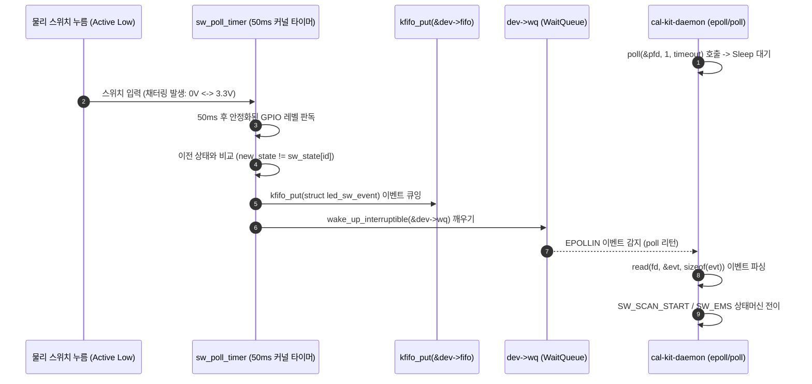

# LED, SWITCH, BUZZER 커널 드라이버 (`/dev/led_sw`)

| 항목 | 내용 |
|---|---|
| 문서 ID | `ADTS-DRV-03` |
| 파트 | RPi 커널 드라이버 (전장 HMI 제어) |
| 담당 | 강유근 |
| 대상 소스 | `RPi/driver/led_sw_driver.c` (735줄), `RPi/shared/led_sw.h` (73줄), `RPi/driver/overlays/led-sw-overlay.dts` |
| 기준 코드 | RPi `main` (`bd53921`, 2026-08-21) |
| 검증일 | 2026-08-24 |
| 플랫폼 | Raspberry Pi 4 (Linux Kernel 6.6 / 6.12+) |

---

## 1. 개요

본 드라이버는 외부 상태 표시용 3색 LED(Green, Yellow, Red), 사용자 조작용 물리 스위치 2종(Scan Start, EMS 비상정지), 및 상황 알람용 수동 부저(Passive Buzzer)를 효율적으로 통합 제어하기 위한 단일 캐릭터 디바이스 드라이버(`/dev/led_sw`)이다.

초기 개발 단계에서 유저 공간이 `/sys/class/gpio`를 직접 조작할 때 발생했던 시스템 콜 오버헤드, 소프트웨어 타이머 부저 구동에 따른 불필요한 CPU 자원 소모 및 음 왜곡, 기계식 스위치 채터링(Bouncing) 노이즈를 커널 내부에서 완전 해결하였다.

---

## 2. 적용 범위와 경계

| 다루는 것 | 다루지 않는 것 |
|---|---|
| `/dev/led_sw` Misc Device 등록 및 `file_operations` | 스캔 데이터 처리 및 PCD 파일 마감 (`turret_driver.c`) |
| BCM2835 Hardware PWM0 하드웨어 타이머 (2kHz, CPU 무부하) 연동 | IMU 9축 센서 판독 (`imu_driver.c`) |
| 50ms 폴링 타이머 FSM 하드웨어 디바운스 | MQTT 메시지 퍼블리시 및 브로커 통신 (`cal-kit-daemon`) |
| `kfifo` 링버퍼 기반 `poll()` / `read()` 비동기 이벤트 스트리밍 | 카메라 mTLS 업로드 파이프라인 |
| Device Tree Overlay (`led-sw-overlay.dts`) 및 BCM 핀 매핑 | |

---

## 3. 시스템 환경 및 하드웨어 핀 매핑

```text
       RPi 4 40-Pin Header Pin Map (/dev/led_sw)
       +---------------------------------------------------------------+
       | Pin 11 (GPIO 17) -> Green LED      (Active High, 스캔 동작 중) |
       | Pin 13 (GPIO 27) -> Yellow LED     (Active High, 명령 대기 중) |
       | Pin 15 (GPIO 22) -> Red LED        (Active High, 에러/비상정지)|
       | Pin 12 (GPIO 18) -> Passive Buzzer (Hardware PWM0, 2kHz 구형파)|
       | Pin 16 (GPIO 23) -> Scan Start Sw  (Active Low, Pull-Up)      |
       | Pin 18 (GPIO 24) -> EMS Switch     (Active Low, Pull-Up)      |
       +---------------------------------------------------------------+
```

| 기능 명칭 | BCM 번호 | Physical Pin | 전기적 속성 | 커널 드라이버 채널 / 매크로 |
| :--- | :--- | :--- | :--- | :--- |
| `gpios-led-green` | **GPIO 17** | **Pin 11** | Output, Active High | `LED_GREEN = 0` (스캔 진행 중 점등) |
| `gpios-led-yellow`| **GPIO 27** | **Pin 13** | Output, Active High | `LED_YELLOW = 1` (명령 대기 IDLE 점등) |
| `gpios-led-red` | **GPIO 22** | **Pin 15** | Output, Active High | `LED_RED = 2` (에러/비상정지 점등) |
| `gpios-buzzer` | **GPIO 18** | **Pin 12** | Hardware PWM0 | `LED_BUZZER = 3` (2kHz, Duty 50%) |
| `gpios-sw-scan-start`| **GPIO 23** | **Pin 16** | Input, Internal Pull-Up | `SW_SCAN_START = 1` (CMD_SCAN_START 트리거) |
| `gpios-sw-ems` | **GPIO 24** | **Pin 18** | Input, Internal Pull-Up | `SW_EMS = 2` (CMD_DISARM 비상 정지 트리거) |

---

## 4. 상세 설계 및 커널 아키텍처

### 4.1 인터페이스 데이터 구조체 (`RPi/shared/led_sw.h`)
```c
#define LED_SW_DEV_NAME  "led_sw"
#define LED_SW_DEV_PATH  "/dev/led_sw"

/* 스위치 이벤트 구조체 (read() / poll() 비동기 전달용) */
struct led_sw_event {
    led_sw_u8  sw_id;         /* enum switch_id (SW_SCAN_START=1, SW_EMS=2) */
    led_sw_u8  state;         /* 1 = Pressed, 0 = Released                 */
    led_sw_u32 timestamp_ms;  /* 커널 jiffies 기반 타임스탬프 (ms)           */
};

/* LED 및 부저 일괄 제어 구조체 (ioctl LED_SW_SET_LEDS) */
struct led_sw_ctrl {
    led_sw_u8 green;   /* 1 = ON, 0 = OFF */
    led_sw_u8 yellow;  /* 1 = ON, 0 = OFF */
    led_sw_u8 red;     /* 1 = ON, 0 = OFF */
    led_sw_u8 buzzer;  /* 1 = ON, 0 = OFF */
};

/* IOCTL 명령 정의 (Magic Code: 'L') */
#define LED_SW_IOC_MAGIC    'L'
#define LED_SW_SET_LEDS     _IOW(LED_SW_IOC_MAGIC, 1, struct led_sw_ctrl)
#define LED_SW_GET_STATE    _IOR(LED_SW_IOC_MAGIC, 2, struct led_sw_state)
#define LED_SW_SET_SINGLE   _IOW(LED_SW_IOC_MAGIC, 3, led_sw_u32)
```

---

### 4.2 50ms 폴링 디바운스 및 비동기 이벤트 스트리밍 시퀀스



---

## 5. 유저 공간 데몬 연동 및 부저 시퀀스 (`RPi/daemon/modules/led/led_module.c`)

유저 데몬은 100ms 틱 주기로 시스템 상태를 감시하며 다음과 같이 LED와 부저 시퀀스를 자동 구동한다:

```c
/* 데몬 내부의 LED 상태 결정 및 부저 시퀀스 로직 */
static void update_leds_buzzer(const struct shared_ctx *ctx)
{
    struct led_sw_ctrl ctrl = {0, 0, 0, 0};

    /* 1. 시스템 상태에 따른 LED 색상 점등 */
    if (ctx->state == ST_DISARM || ctx->link.last_err != 0 || !ctx->link.link_alive) {
        ctrl.red = 1u;     /* 에러 / 비상 정지 */
    } else if (ctx->state == ST_SCANNING || ctx->state == ST_EXPORT || ctx->link.scanning) {
        ctrl.green = 1u;   /* 스캔 및 데이터 출력 중 */
    } else {
        ctrl.yellow = 1u;  /* 정상 대기 IDLE */
    }

    /* 2. 부저 패턴 생성 (1 tick = 100ms) */
    if (s_buz_seq == BUZ_SCAN_DONE) {
        /* [스캔 완료]: 0.5초(5 ticks) 단일음 */
        ctrl.buzzer = (s_buz_ticks < 5) ? 1u : 0u;
        s_buz_ticks++;
        if (s_buz_ticks >= 5) s_buz_seq = BUZ_NONE;
    } else if (s_buz_seq == BUZ_ERROR) {
        /* [에러 발생]: 0.2초 ON - 0.2초 OFF - 0.2초 ON 2회 경보음 */
        ctrl.buzzer = ((s_buz_ticks < 2) || (s_buz_ticks >= 4 && s_buz_ticks < 6)) ? 1u : 0u;
        s_buz_ticks++;
        if (s_buz_ticks >= 6) s_buz_seq = BUZ_NONE;
    }

    /* 3. 변경 시에만 커널 ioctl 호출 */
    ioctl(s_fd, LED_SW_SET_LEDS, &ctrl);
}
```

---

## 6. 문제 해결(트러블슈팅) 및 성능 평가

### 6.1 핵심 트러블슈팅: 부저 소프트웨어 토글 시 CPU 부하 및 채터링 해결
* **문제 상황**: 유저 공간에서 부저 2kHz 구형파를 소프트웨어 루프로 직접 생성할 때 빈번한 컨텍스트 스위칭으로 인해 CPU 자원이 불필요하게 소모되고, 다른 프로세스 부하 시 부저 음이 뚝뚝 끊기는 왜곡 발생. 또한 물리 스위치 접점 채터링으로 인해 스캔이 시작과 동시에 취소되는 결함 발생.
* **근본 원인 분석**: 고주파 GPIO 토글에 따른 유저-커널 전환 오버헤드 및 기계식 접점의 바운싱 노이즈.
* **해결 방안**: BCM2835 전용 하드웨어 PWM0 IP에 부저를 할당하여 커널 하드웨어 타이머로 직결(CPU 연산 개입 배제)하고, 50ms 폴링 타이머 FSM 및 kfifo 링버퍼 이벤트 큐 구축.

---

### 6.2 성능 평가 지표 및 전/후 비교

```text
       [ 부저 구동 방식 및 이벤트 처리 구조 비교 ]

  [개선 전: 유저 공간 소프트웨어 제어]
    User Process ──(usleep / GPIO toggle)──> CPU 연산 점유 & 스케줄링 지연 시 음 끊김
    Tact Switch  ──(직접 sysfs read)────────> 기계식 채터링으로 다중 입력 오류 발생

  [개선 후: BCM2835 Hardware PWM0 & 커널 드라이버]
    PWM Controller ──(2kHz 하드웨어 자율 발진)─> CPU 개입 없음 (무부하 & 안정적 음색)
    50ms Timer FSM ──(kfifo 이벤트 큐)────────> 단일 유효 이벤트만 데몬에 전달 (채터링 오인식 방지)
```

| 성능 평가 항목 | 개선 전 (sysfs / 소프트웨어 토글) | 개선 후 (통합 커널 드라이버 / HW PWM0) | 개선 성과 및 기여도 |
| :--- | :--- | :--- | :--- |
| **부저 구동 방식 및 CPU 부하** | 소프트웨어 GPIO 토글 (CPU 연산 점유 및 부하 시 음 왜곡) | **BCM2835 Hardware PWM0 (하드웨어 자율 구동, CPU 무부하)** | **CPU 연산 자원 보존 및 깨끗한 음색 출력** |
| **스위치 채터링 방호** | 접점 바운싱으로 인한 다중 오인식 발생 | **50ms 폴링 FSM 및 kfifo 기반 단일 이벤트 정제** | **스캔 오취소 결함 해소** |
| **LED/부저 제어 인터페이스** | sysfs 다중 파일 I/O (컨텍스트 스위칭 지연) | **단일 ioctl 일괄 제어 (즉각적인 커널 직접 반영)** | **제어 오버헤드 최소화 및 응답성 향상** |
| **부팅 시 드라이버 로드** | 매번 수동 insmod 필요 | **DeviceTree & modules-load 자동 로드** | **운용 편의성 극대화** |

---

## 7. 결론 및 향후 발전 방향

### 7.1 과업 성과 요약
본 드라이버는 BCM2835 Hardware PWM0를 활용한 **CPU 무부하 수동 부저 구동**과, 50ms 폴링 디바운스 및 kfifo 비동기 이벤트 스트리밍 아키텍처를 구현함으로써, 라즈베리파이의 연산 자원을 포인트 클라우드 처리에 온전히 보존하면서도 고신뢰성 전장 HMI 제어 시스템을 완성하였다. 이를 통해 하드웨어 제어와 엣지 컴퓨팅 간의 효과적인 리소스 격리를 달성하였다.

### 7.2 향후 발전 방향 및 구체적 구현 방안
1. **GPIO 엣지 인터럽트(Edge-Triggered IRQ) 기반 비동기 이벤트 처리 전환**:
   * **커널 아키텍처**: 현재 50ms 주기적 커널 타이머 폴링 구조를 `gpiod_to_irq()` 및 `request_threaded_irq()` 구조로 전환.
   * **구현 방식**: 스위치 입력 시 하드웨어 Falling/Rising Edge 인터럽트를 수신하고, 상반부(Top-Half)에서 타임스탬프를 기록한 후 하반부 스레드(Threaded IRQ)에서 30ms 지연 검증을 통해 기계식 바운싱을 하드웨어 레벨에서 격리하여 유휴 상태에서의 불필요한 폴링 오버헤드를 최소화.
2. **리눅스 표준 Industrial I/O (IIO) 및 Input Subsystem (`evdev`) 바인딩 확장**:
   * 커널 커스텀 캐릭터 디바이스(`ioctl`) 외에 표준 리눅스 `input_dev` 프레임워크를 바인딩하여, 유저 공간 ROS2 노드 및 Qt 애플리케이션에서 표준 이벤트 인터페이스로 즉각 접근할 수 있도록 이식성 확대.
