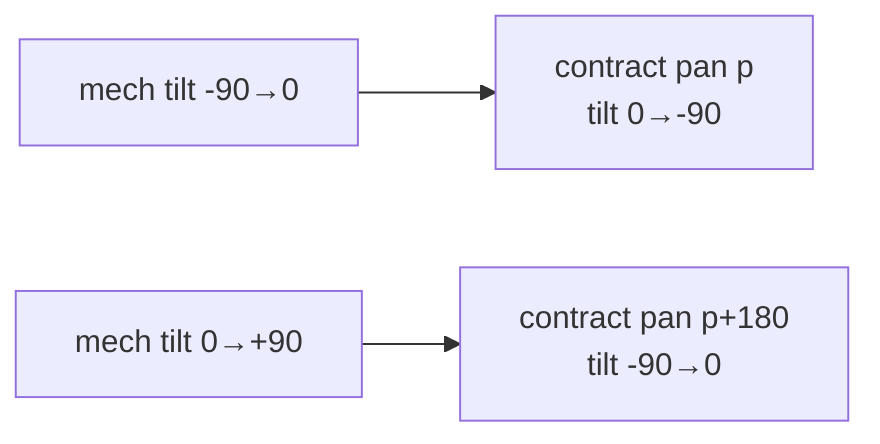
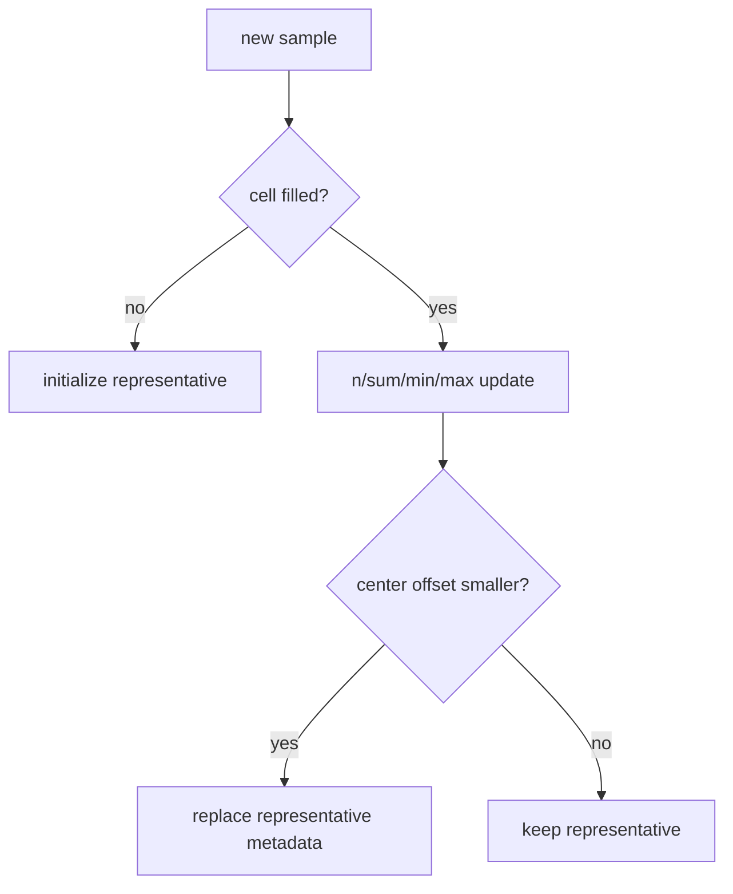

# 02-4. 기구각→계약각 · organized grid · 셀 병합 알고리즘

기준 파일: `daemon/core/scan_output.c` · 코드 기준: `develop` / `4372771` / 2026-08-19

## 1. 왜 각도가 두 종류인가

STM32는 motor mechanism을 제어하므로 mechanism pan/tilt를 보낸다. 소비자는 `lidar_scan`
좌표계의 방위·고각을 원한다. tilt가 nadir를 지나 반대 벽을 보면 **같은 mechanism pan에서도
광선 방위가 180° 바뀐다.**

## 2. `mech_to_contract`

```
m <= 0: contract pan = p,      tilt = -900 - m
m >  0: contract pan = p+1800, tilt = -900 + m
```

단위는 0.1°다. 결과 pan은 `0..3599`로 modulo normalize한다.

| mechanism | contract | 물리 의미 |
|---|---|---|
| p, −900 | p, 0 | 벽 A 수평 |
| p, 0 | p, −900 | nadir |
| p, +900 | p+1800, 0 | 벽 B 수평 |



## 3. 좌표계

frame은 원점 = pan/tilt 축 교점, `+x right`, `+y down`, `+z forward`, meter다.

```
r = (distance_mm + lidar_offset_mm) / 1000
x =  r cos(tilt) sin(pan)
y = -r sin(tilt)
z =  r cos(tilt) cos(pan)
```

LiDAR가 주는 거리는 **emitter face 기준**이고 좌표 원점은 **axis intersection**이므로
84mm를 더한다. sensor height는 다른 frame으로 옮길 때 쓰는 metadata이며 여기 좌표에는
넣지 않는다.

## 4. organized grid란

organized point cloud는 **2차원 row/column 구조를 보존한** point cloud다. camera image처럼
각 cell이 특정 angle bin을 뜻한다. 측정이 없으면 cell을 없애지 않고 JSON `null` 또는
PCD `NaN`으로 남긴다.

장점:

- absolute angle → index가 일정
- 구멍과 측정 실패를 표현
- 이웃 연산과 image-like processing 가능
- scan 간 shape 비교 가능

## 5. `grid_geometry`

request는 mechanism angle이므로 contract coverage로 바꾼다. nadir를 가로지르면 한 pan
line이 p와 p+180 두 방위를 덮으므로 **columns는 항상 full circle `3600/step`**이다.
부분 pan scan이어도 안 훑은 방위는 빈 cell로 남는다.

rows는 contract tilt absolute range를 step으로 나눈 값 +1이다. **row 0은 가장 높은
contract tilt**, 아래로 내려간다.

## 6. 왜 `span/step+1`이 항상 틀리는가

pan 0..179°, step 1°는 mechanism line이 180개다. 각 line이 **두 방위**를 만들므로 contract
column은 360개다. 단순 `179/1+1`은 우연히 line 수를 주고 contract coverage를 주지 않는다.
full-circle에서는 마지막 360°가 0°와 같으므로 **+1 duplicate column도 만들면 안 된다.**

## 7. `grid_index` rounding

각도 차이에 `step/2`를 더해 nearest cell로 반올림한다. full circle에서 계산 index가 cols와
같으면 0으로 wrap한다. pan difference는 modulo 3600으로 normalize한다.

rounding을 floor로 하면 **항상 한쪽 cell로 bias**가 생긴다. `step/2` 방식은 integer
deci-degree로 floating-point 없이 구현한다.

## 8. nadir 축퇴

tilt = −90°에서는 pan이 달라도 모든 광선이 같은 아래 방향이다. 여러 pan line이 같은
physical point를 보므로 **nadir row 일부 cell이 비거나 merge되는 것은 bug가 아니다.**
spherical coordinate의 pole singularity다.

## 9. `scan_cell`이 저장하는 것

대표 contract/mechanism angle, distance, signal, sensor/STM timestamp, status/precision,
receive time, sample count, min/max/sum, best center offset를 저장한다.
**raw evidence와 derived grid를 함께 보존해 문제 원인을 재구성한다.**

## 10. 같은 cell에 여러 sample이 올 때

첫 sample은 cell을 채운다. 다음 sample은 count/sum/min/max에 누적한다.
**cell center에 더 가까운 sample만 대표 metadata를 교체한다.**



## 11. distance 평균 조건

sample spread가 `max−min`이고 tolerance는 `max(30mm, min_distance × 15%)`다.
**spread가 tolerance 이하일 때만 rounded mean을 사용한다.**

벽과 foreground object가 같은 angular cell에 섞이면 평균이 **두 표면 사이의 존재하지 않는
점**을 만들 수 있어 representative를 유지한다.

## 12. quality의 의미

`signal_strength`은 calibrated reflectivity가 아니고 `range_precision = 0xFF`는 F2P에서
미지원이다. `dis_status`와 sample spread, merge count를 **함께** 봐야 한다.
**한 field만으로 유효성을 단정하면 안 된다.**

## 13. seam 경고

nadir를 가로지르며 `pan span × 2`가 360° 이상이면 first/last line이 같은 plane을 중복
측정한다. 1° grid는 0..179°, 0.9° grid는 0..179.1° 같은 **"한 바퀴에서 한 step 뺀 끝값"**을
사용한다.

## 14. 계산 복잡도와 메모리

grid lookup은 O(1), 전체는 O(raw samples + cells)다. 101×400 같은 grid는 cell struct
크기에 따라 수 MB memory를 사용한다. geometry를 point마다 다시 계산하는 integer 연산은
작지만 precompute하면 미세 최적화가 가능하다. **가장 큰 비용은 ASCII serialization이다.**

## 15. 경계 시험

- mechanism tilt −900 / 0 / +900
- pan 0 / 3599 wrap
- step 9 / 10
- full circle index cols → 0
- partial scan empty sectors
- nadir merge
- two surfaces same cell
- 84mm offset
- `sensor_height` coordinate 미적용
- reverse pan/tilt ranges
