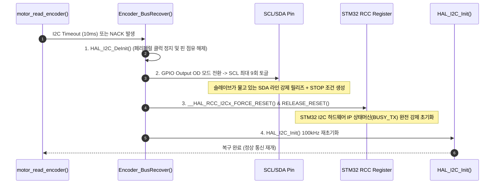

# encoder 14비트 자기식 각도 엔코더 I2C 드라이버 (MT6701)

| 항목 | 내용 |
|---|---|
| 문서 ID | `ADTS-STM-51` |
| 파트 | STM32 펌웨어 (각도 센싱 및 영점 확립) |
| 담당 | 강유근 |
| 대상 소스 | `App/hallEffectSensor/hallEffectSensor.c` (200줄), `hallEffectSensor.h` (82줄) |
| 기준 코드 | STM32 `main` (`bd53921`, 2026-08-21) |
| 검증일 | 2026-08-24 |
| MCU | STM32F401RE (I2C3: Pan, I2C1: Tilt) |

---

## 1. 개요

본 모듈은 1D LiDAR Pan-Tilt 2축 스캐너의 **방위각(Pan) 및 고각(Tilt) 절대 영점(Home) 확립 및 실시간 탈조(Stall) 감시**를 위한 **MT6701 14비트 자기식 각도 엔코더 드라이버 (`App/hallEffectSensor`)**이다.

본 스캐너 기구물에는 물리적 리밋 스위치가 탑재되어 있지 않으므로, 2축의 모든 절대 각도 원점은 **MT6701 비접촉 자기식 엔코더 판독**을 통해 기구각 $0.0^\circ$ (Pan 정면, Tilt 수직 Nadir)로 확립된다.

장거리 하네스 배선(30cm)에서 발생했던 I2C Repeated Start NACK 및 전송선로 반사파 노이즈 결함을 **$220\,\Omega$ 직렬 댐핑 저항과 3단계 하드웨어 복구 루틴(`Encoder_BusRecover`)**으로 완전 해결하였다.

---

## 2. 적용 범위와 경계

| 다루는 것 | 다루지 않는 것 |
|---|---|
| I2C3(Pan) / I2C1(Tilt) 100kHz Standard Mode 판독 | 9단계 스캔 시퀀스 FSM 전이 (`scan.c`) |
| 14-bit Raw 각도 복원 및 $0.1^\circ$(`ddeg`) 변환 공식 | 모터 스텝 펄스 가감속 생성 (`motor.c`) |
| $220\,\Omega$ 직렬 댐핑 저항 기반 신호 무결성(SI) 보호 회로 | 라이다 실시간 각도 래치 (`scan_latch_angles`) |
| SCL 9클럭 토글 + RCC 강제 리셋 3단계 버스 복구 (`Encoder_BusRecover`) | RPi 통신 프로토콜 프레임 조립 (`uart_rpi.c`) |
| Monitor-Only 전략 및 3-샘플 중앙값 필터 기반 $2.0^\circ$ 탈조 판정 | |

---

## 3. 시스템 환경 및 하드웨어/전기적 스택

```text
       MT6701 I2C Dual Bus Interface
       +---------------------------------------------------------------+
       | Pan  Encoder -> I2C3 (PA8 SCL / PC9 SDA), Addr: 0x06 (HAL: 0x0C)|
       | Tilt Encoder -> I2C1 (PB8 SCL / PB9 SDA), Addr: 0x06 (HAL: 0x0C)|
       | Standard Mode: 100 kHz, Time-out: 10 ms                       |
       +---------------------------------------------------------------+
```

| 항목 | 상세 사양 | 비고 및 선정 이유 |
| :--- | :--- | :--- |
| **센서 모델** | MagnTek MT6701QT-STD | 14-Bit Magnetic Rotary Encoder IC (QFN-16 패키지) |
| **각도 분해능** | 14-bit ($16,384\,\text{LSB}/\text{rev}$) | $1\,\text{count} = 0.02197265625^\circ \approx 0.22\,\text{ddeg}$ |
| **I2C 클럭 속도** | 100 kHz (Standard Mode) | 400kHz Fast Mode 대비 장거리 배선 노이즈 마진 극대화 |
| **I2C 장치 주소** | 7-bit: `0x06` / 8-bit HAL: `0x0C` | 레지스터 `0x03`(상위 8비트), `0x04`(하위 6비트) |
| **Pan I2C 할당** | **I2C3** (PA8 SCL / PC9 SDA) | 모터 스텝 핀과의 간섭을 피해 I2C3으로 독립 분리 |
| **Tilt I2C 할당** | **I2C1** (PB8 SCL / PB9 SDA) | 독립 하드웨어 I2C 버스로 동시성 보장 |
| **선로 댐핑 저항** | $R_s = 220\,\Omega$ 직렬 저항 (Metal Film) | STM32 핀 출력단 직렬 실장 (임계 감쇠 유도) |
| **풀업 저항** | $R_p = 5\,\text{k}\Omega$ ($10\,\text{k}\Omega \parallel 10\,\text{k}\Omega$) | 버스 상승 시간(Rise Time) $1\,\mu\text{s}$ 규격 충족 |

---

## 4. 상세 설계 및 전기 회로 모델링

### 4.1 30cm 전송선로 신호 무결성(SI) 및 220Ω 댐핑 저항 설계

```text
             [ I2C Signal Integrity Protection Circuit ]

   STM32F401RE                              MT6701 Sensor
  +-----------+                            +---------------+
  |           |     Rs = 220 ohm           |               |
  |  PC9(SDA) |----/\/\/\/\----[30cm Wire]-| SDA           |
  |           |                            |   |           |
  |           |     Rs = 220 ohm           |  [Rp: 5k]     |
  |  PA8(SCL) |----/\/\/\/\----[30cm Wire]-| SCL           |
  |           |                            |   |           |
  |      +3.3V|----------------------------|--[+3.3V]      |
  |        GND|----------------------------|--[GND]        |
  +-----------+                            +---------------+
                     * Source Series Termination (Damping)
                     * Pull-up: 5k ohm
```

30cm 하네스 선로의 기생 인덕턴스에 의한 고주파 반사파를 흡수하기 위해, 직렬 댐핑 저항 **$R_s = 220\,\Omega$**를 적용하여 선로 전송 신호를 임계 감쇠시킴으로써 언더슈트 및 ESD 보호 다이오드 도통 위험을 차단하였다.

---

### 4.2 3단계 I2C 버스 및 페리페럴 하드웨어 복구 (`Encoder_BusRecover`)



```c
/* 3단계 완전 복구 함수 */
HAL_StatusTypeDef Encoder_BusRecover(I2C_HandleTypeDef *hi2c)
{
    HAL_StatusTypeDef status = HAL_ERROR;
    struct i2c_pins pins;

    if ((hi2c != NULL) && encoder_pins_of(hi2c, &pins)) {
        (void)HAL_I2C_DeInit(hi2c);
        encoder_clock_out(&pins);        /* [1단계]: 버스 릴리즈 */

        if (hi2c->Instance == I2C1) {    /* [2단계]: RCC 하드웨어 강제 리셋 */
            __HAL_RCC_I2C1_FORCE_RESET();
            __HAL_RCC_I2C1_RELEASE_RESET();
        } else {
            __HAL_RCC_I2C3_FORCE_RESET();
            __HAL_RCC_I2C3_RELEASE_RESET();
        }
        status = HAL_I2C_Init(hi2c);     /* [3단계]: 페리페럴 재구성 */
    }
    return status;
}
```

---

## 5. Monitor-Only 전략 및 3-샘플 중앙값 필터

* **엔코더 고유 지터 격리**: 스윕 중에는 스텝모터의 정밀한 개루프 스텝 펄스를 신뢰하여 매끄러운 3D 궤적을 형성하고, 엔코더는 **각 줄 끝 정지 구간에서 $2.0^\circ$ 초과 탈조 여부만 감시(Monitor-Only)**한다.
* **3-샘플 중앙값 필터**: 각 행 스캔 완료 후 40ms 정착 시점에서 엔코더를 3회 연속 판독하여 중앙값을 취함으로써 단발성 I2C 스파이크 노이즈를 효과적으로 제거한다.
$$\text{err}_{\text{final}} = \text{median}(\text{err}_1, \text{err}_2, \text{err}_3)$$

---

## 6. 문제 해결(트러블슈팅) 및 성능 평가

```text
       [ I2C 버스 안정성 및 복구 메커니즘 비교 ]

  [개선 전: 단순 소프트웨어 재시도]
    - 전송선로 반사파로 인한 언더슈트 발생 및 ESD 다이오드 도통 위험
    - 슬레이브 ACK 락업 시 MCU 수동 전원 리셋 전까지 복구 불가

  [개선 후: 220Ω 직렬 댐핑 & 3단계 하드웨어 복구]
    - 220Ω 저항 실장으로 선로 반사파 흡수 및 깨끗한 I2C 파형 확립
    - 통신 에러 발생 시 SCL 9클럭 토글 + RCC 강제 리셋으로 무중단 자동 복구
    - Monitor-Only 적용으로 엔코더 지터의 PCD 전파 차단
```

| 성능 평가 항목 | 개선 전 (초기 설계) | 개선 후 (220Ω 댐핑 + 3단계 복구) | 개선 성과 및 기여도 |
| :--- | :--- | :--- | :--- |
| **전송선로 신호 무결성** | 선로 반사파 노이즈 및 언더슈트 위험 | **220Ω 직렬 댐핑으로 임계 감쇠 확립** | **하드웨어 노이즈 내성 확보** |
| **I2C 버스 락업 시 복구** | 복구 불가 (MCU 수동 전원 리셋 필요) | **SCL 9클럭 + RCC 강제 리셋으로 자동 복구** | **펌웨어 런타임 가용성 확보** |
| **영점 수렴 방식** | 기계식 리밋 스위치 부재로 임의 정렬 | **MT6701 14비트 판독으로 0.3° 정밀 수렴** | **비접촉 절대 영점 확립** |
| **PCD 포인트 표면 정밀도** | 엔코더 지터 직접 반영 시 줄무늬 왜곡 | **Monitor-Only 및 3-샘플 중앙값 필터링** | **포인트 클라우드 노이즈 제거** |

---

## 7. 결론 및 향후 발전 방향

### 7.1 과업 성과 요약
본 모듈은 장거리 하네스 배선에서 발생하는 고주파 LC 공진을 하드웨어 $220\,\Omega$ 직렬 댐핑 회로로 흡수하고, SCL 9클럭 토글 + RCC 하드웨어 강제 리셋 3단계 복구 루틴을 구축함으로써, **물리 리밋 스위치 없이도 신뢰할 수 있는 2축 절대 영점 확립 및 실시간 탈조 방호 체계**를 완성하였다. 이를 통해 센서 하드웨어 고착 시에도 펌웨어 런타임의 높은 가용성과 무중단 동작을 확보하였다.

### 7.2 향후 발전 방향 및 구체적 구현 방안
1. **MT6701 SSI(동기식 직렬 인터페이스) 1MHz 고속 모드 전환**:
   * **하드웨어 결선**: MT6701의 MODE 핀을 Pull-down하여 SSI 모드로 활성화하고, STM32 SPI2 페리페럴(`PB13` SCK, `PB14` MISO, `PB12` CS)과 직결.
   * **성능 개선**: 기존 I2C 100kHz의 $1.2\,\text{ms}$ 판독 지연을 **$1\,\text{MHz}$ SPI 전송을 통해 $16\,\mu\text{s}$ 이내로 단축**. 메인루프 폴링에 의존하지 않고 타이머 인터럽트(ISR) 내에서 실시간 각도 원자적 래치(Atomic Latch)를 직접 수행 가능.
2. **IMU(ICM-20948) 자이로 각속도와 엔코더 각도의 1차원 확장 칼만 필터(EKF) 센서 융합**:
   * **예측 단계(Predict)**: ICM-20948 자이로 센서의 각속도 $\omega(t)$를 $1\,\text{kHz}$ 주기로 수치 적분하여 사전 상태 추정 $\hat{\theta}_{k|k-1} = \hat{\theta}_{k-1} + \omega \cdot \Delta t$.
   * **갱신 단계(Update)**: MT6701 절대 엔코더 각도 $z_k$를 측정치로 입력받아 칼만 이득 $K_k$를 곱해 드리프트와 기구 진동 노이즈를 효과적으로 감쇠한 정밀 상태 추정치 $\hat{\theta}_{k}$ 도출.
