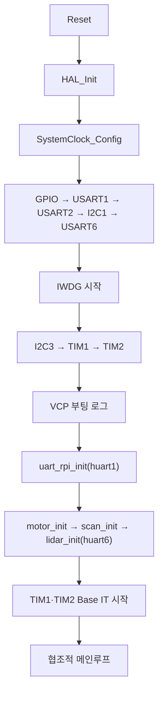

# STM32 펌웨어 런타임 연결

| 항목 | 내용 |
|---|---|
| 문서 ID | `ADTS-STM-62` |
| 파트 | STM32 (런타임 결선) |
| 담당 | 이현우 (페리페럴·모듈 결선, 오류 경로) / 강유근 (메인루프·TIM 콜백) / 송영빈 (가감속 타이머 결선) |
| 대상 소스 | `Core/Src/main.c`, `adts.ioc`, `App/` 모듈 진입점 |
| 기준 코드 | STM32 `bd53921` (`main`, 2026-08-21) |
| 검증일 | 2026-08-24 |
| MCU | STM32F401RE |

---

## 1. 개요

STM32 런타임은 CubeMX가 생성한 초기화 코드와 `App/` 모듈을 `main.c`에서 연결한다.
RTOS 없이 협조적 메인루프를 사용하며, 정밀한 펄스 생성과 UART 바이트 수신만
인터럽트에서 처리한다.

런타임의 책임은 다음 네 가지다.

1. CubeMX 페리페럴 초기화 후 모듈을 정해진 순서로 초기화한다
2. 메인루프에서 RPi 링크, 라이다, 스캔 시퀀서를 순서대로 실행한다
3. 공용 HAL 콜백을 UART와 모터 모듈에 분배한다
4. 메인루프 한 바퀴가 끝난 뒤 IWDG를 갱신한다

### 1.1 소스 계층

```text
Core/       CubeMX 생성 코드와 얇은 USER CODE 결선
Drivers/    STM32 HAL·CMSIS 벤더 코드
App/        uart_rpi, lidar, scan, motor, 엔코더와 브링업 도구
shared/     STM32와 RPi가 함께 사용하는 protocol.h
```

`tools/cppcheck_suppressions.txt`는 `Core/`와 `Drivers/`를 정적분석에서 제외한다.
따라서 `main.c`의 USER CODE 구역에는 초기화, 모듈 호출, HAL 콜백 위임만 두고
파싱·상태 전이·I2C 복구와 같은 로직은 `App/`에 둔다.

---

## 2. 적용 범위와 경계

| 다루는 것 | 다루지 않는 것 |
|---|---|
| 페리페럴과 모듈 초기화 순서 | CubeMX가 생성한 clock·GPIO 초기화 본문 |
| 협조적 메인루프 호출 순서 | 각 모듈의 파서·상태머신 내부 |
| UART·TIM HAL 콜백 분배 | 모터 ISR의 가감속 계산 |
| IWDG 갱신 위치와 지연 경계 | 라이다 NLink 프레임 해석 |
| 부팅 로그의 USART2 연결 | RPi Protocol v6 프레임 정의 |

---

## 3. 페리페럴 매핑

| 핸들 | 인스턴스 | 핀 | 설정·용도 |
|---|---|---|---|
| `huart1` | USART1 | PA9 TX / PA10 RX | RPi 링크, 115200 8N1 |
| `huart2` | USART2 | PA2 TX / PA3 RX | VCP 디버그 출력, 115200 8N1 |
| `huart6` | USART6 | PC6 TX / PC7 RX | TOFSense-F2 P 입력, 115200 8N1 |
| `hi2c1` | I2C1 | PB8 SCL / PB9 SDA | 틸트 MT6701, 100kHz |
| `hi2c3` | I2C3 | PA8 SCL / PC9 SDA | 팬 MT6701, 100kHz |
| `htim1` | TIM1 | — | 팬 스텝 Base 인터럽트 |
| `htim2` | TIM2 | — | 틸트 스텝 Base 인터럽트 |
| `hiwdg` | IWDG | 내부 LSI | 메인루프 워치독, 공칭 약 1.25초 |

UART와 I2C 핀은 `adts.ioc`와 `Core/Src/stm32f4xx_hal_msp.c`가 함께 정의한다.
TIM1·TIM2는 PWM 출력 핀을 사용하지 않고, 주기 인터럽트에서 STEP GPIO를 직접
토글한다.

---

## 4. 실행 컨텍스트 분리

| 컨텍스트 | 수행하는 일 | 넣지 않는 일 |
|---|---|---|
| USART ISR | 수신 바이트 적재, 프레임 완성 시 라이다 샘플 큐 적재, 다음 수신 무장 | 블로킹 송신, I2C, 시퀀스 전이 |
| TIM ISR | 축별 스텝 펄스 생성과 가감속 주기 갱신 | `printf`, I2C, `HAL_Delay` |
| 메인루프 | 프레임 파싱, 명령 처리, 샘플 전달, 스캔 상태 전이, 엔코더 I2C | 정밀 스텝 간격 생성 |

타이머 ISR이 펄스 간격을 유지하고 메인루프가 상태 전이와 블로킹 I/O를 맡는다.
이 경계를 통해 엔코더 재시도나 UART 송신이 발생해도 스텝 주기를 메인루프 주기에
의존시키지 않는다.

---

## 5. 부팅과 초기화

### 5.1 전체 순서



CubeMX 초기화 함수는 다음 순서로 호출된다.

```c
MX_GPIO_Init();
MX_USART1_UART_Init();
MX_USART2_UART_Init();
MX_I2C1_Init();
MX_USART6_UART_Init();
MX_IWDG_Init();
MX_I2C3_Init();
MX_TIM1_Init();
MX_TIM2_Init();
```

`MX_IWDG_Init()`를 호출한 시점부터 독립 워치독이 동작한다. 그 뒤의 I2C3·TIM
초기화와 애플리케이션 초기화도 첫 `HAL_IWDG_Refresh()` 전에 끝나야 한다.

### 5.2 애플리케이션 초기화

```c
setvbuf(stdout, NULL, _IONBF, 0);
printf("\r\n=== turret STM32 boot (proto v%u) ===\r\n", PROTO_VERSION);

uart_rpi_init(&huart1);
motor_init();
scan_init();
lidar_init(&huart6);

HAL_TIM_Base_Start_IT(&htim1);
HAL_TIM_Base_Start_IT(&htim2);
```

초기화 순서에는 다음 제약이 있다.

| 제약 | 근거 |
|---|---|
| `uart_rpi_init()`와 `lidar_init()`에서 UART 수신을 최초 무장한다 | HAL 콜백만 연결하고 수신을 시작하지 않으면 첫 바이트가 들어오지 않는다 |
| `motor_init()`을 타이머 시작보다 먼저 호출한다 | 모터 계층이 TIM1·TIM2를 1MHz 시간축과 시작 속도에 맞게 다시 설정한다 |
| `motor_init()`은 전류 차단 상태로 끝난다 | 부팅만으로 축이 움직이지 않으며 HOME·SCAN 명령이 구동을 시작한다 |
| 홈과 스캔을 초기화 구역에서 시작하지 않는다 | 명령 수락과 Protocol v6 응답 경로를 통해서만 수명주기를 시작한다 |

CubeMX의 TIM1·TIM2 Prescaler·Period는 모터 초기화 전의 기본값이다.
`motor_init()`은 두 타이머의 PSC를 1MHz에 맞추고 ARR를 50pps 시작 속도로
설정한다. 이동 중에는 가감속 상태가 바뀔 때 모터 계층이 ARR를 갱신한다.

| 상수 | 값 | 의미 |
|---|---:|---|
| `MOTOR_TIM_TICK_HZ` | 1,000,000 | 타이머 1틱 = 1µs |
| `MOTOR_START_PPS` | 50 | 양축 출발·도착 속도 |
| `MOTOR_PAN_CRUISE_PPS` | 100 | 팬 순항 속도 |
| `MOTOR_TILT_CRUISE_PPS` | 750 | 틸트 순항 속도 |
| `MOTOR_PAN_ACCEL_PPS2` | 1,200 | 팬 가속도 |
| `MOTOR_TILT_ACCEL_PPS2` | 1,800 | 틸트 가속도 |

실행값의 단일 기준은 `App/motor/motor.h`다.

### 5.3 표준 출력

```c
int __io_putchar(int ch)
{
  HAL_UART_Transmit(&huart2, (uint8_t *)&ch, 1, HAL_MAX_DELAY);
  return ch;
}
```

`printf`는 USART2 VCP로 리타깃된다. Protocol v6 링크인 USART1과 디버그 출력을
분리하므로 로그 바이트가 RPi 프레임에 섞이지 않는다.

---

## 6. 협조적 메인루프

```c
while (1) {
    uart_rpi_process();
    uart_rpi_status_tick();
    lidar_process();
    scan_process();
    HAL_IWDG_Refresh(&hiwdg);
}
```

| 순서 | 호출 | 역할 |
|---:|---|---|
| 1 | `uart_rpi_process()` | USART1 링버퍼를 비우고 명령을 파싱·디스패치한다 |
| 2 | `uart_rpi_status_tick()` | 내부 1초 주기에 도달하면 STATUS를 송신한다 |
| 3 | `lidar_process()` | ISR이 적재한 샘플을 `scan_submit_sample()`로 전달한다 |
| 4 | `scan_process()` | 홈·이동·스윕·파킹 상태를 전이한다 |
| 5 | `HAL_IWDG_Refresh()` | 앞선 작업이 모두 반환한 경우에만 워치독을 갱신한다 |

RPi 명령을 먼저 처리하므로 정지·해제 명령은 같은 루프에서 스캔 상태머신보다
앞서 반영된다. 라이다 샘플 큐도 상태 전이 전에 비워 수신 시점에 래치한 각도와
거리의 전달 순서를 유지한다.

### 6.1 워치독과 지연 경계

IWDG 설정은 Prescaler 32, Reload 1250, 공칭 LSI 32kHz다. 공칭 타임아웃은
다음과 같이 약 1.25초다.

```text
(Reload + 1) × Prescaler ÷ LSI
= (1250 + 1) × 32 ÷ 32000
≈ 1.251초
```

워치독을 루프 마지막 한 곳에서만 갱신하므로 앞선 모듈 중 하나가 반환하지 않으면
재부팅으로 드러난다. 정상 경로의 주요 지연과 관측 수단은 다음과 같다.

| 경로 | 코드상 상한·용량 | 관측 수단 |
|---|---|---|
| Protocol v6 프레임 송신 | 프레임당 `HAL_UART_Transmit(..., 100ms)` | `tx_fail` |
| USART1 수신 링버퍼 | 배열 256B, 실효 용량 255B | `rx_ovf` |
| 라이다 샘플 링버퍼 | 배열 8개, 실효 용량 7개 | `lidar_drop` |
| MT6701 판독 | 10ms I2C 타임아웃, 최대 5회 시도와 버스 복구 | `enc_retry` |
| 메인루프 전체 정지 | 공칭 약 1.25초 | IWDG 리셋 |

버퍼 카운터는 지연 시간만 측정하지 않는다. 생산자 입력량이 용량을 넘은 경우에만
증가하므로 `rx_ovf`와 `lidar_drop`은 IWDG보다 짧은 구간의 병목을 찾는 보조 지표로
해석한다.

---

## 7. HAL 콜백 분배

### 7.1 UART 수신과 오류 콜백

```c
void HAL_UART_RxCpltCallback(UART_HandleTypeDef *huart)
{
  uart_rpi_on_rx_cplt(huart);
  lidar_on_rx_cplt(huart);
}

void HAL_UART_ErrorCallback(UART_HandleTypeDef *huart)
{
  uart_rpi_on_error(huart);
  lidar_on_error(huart);
}
```

HAL은 UART 인스턴스마다 별도 콜백 함수를 만들지 않는다. `main.c`는 두 모듈에
콜백을 브로드캐스트하고, 각 모듈이 자신의 핸들만 처리한다.

| 모듈 | 필터 | 수신 완료 처리 | 오류 처리 |
|---|---|---|---|
| `uart_rpi` | `huart == s_huart` | 1B 링버퍼 적재 후 `HAL_UART_Receive_IT()` 재등록 | ORE 제거 후 1B 수신 재등록 |
| `lidar` | `huart->Instance == g_huart->Instance` | NLink 파서 진행, 완성 샘플 적재, 1B 수신 재등록 | 오류 플래그·파서 상태 제거 후 수신 재등록 |

두 오류 훅은 HAL 오류 뒤 수신을 다시 무장하는 경로다. 새 UART 소비자를 추가하면
수신 완료 콜백과 오류 콜백 양쪽에 같은 위임 규칙을 적용해야 한다.

### 7.2 타이머 콜백

```c
void HAL_TIM_PeriodElapsedCallback(TIM_HandleTypeDef *htim)
{
  if (htim->Instance == TIM1) {
    motor_pan_isr();
  }
  else if (htim->Instance == TIM2) {
    motor_tilt_isr();
  }
}
```

TIM1은 팬, TIM2는 틸트 ISR에 연결된다. 각 ISR은 목표까지 남은 펄스를 확인해
한 번에 최대 한 펄스를 출력하고, 가감속 상태에 따라 다음 인터럽트 주기를 조정한다.
I2C, 로그 출력, 스캔 상태 전이는 이 콜백에서 수행하지 않는다.

---

## 8. 브링업 도구 연결

메인루프에는 모터·라이다·엔코더 단독 진단 호출 위치가 남아 있으나 정상 빌드에서는
주석 처리돼 있다.

```c
//motor_bench_run();
//lidar_bench_run();
//encoder_bench_run();
```

| 도구 | 활성 매크로 | 기본값 | 용도 |
|---|---|---:|---|
| `motor_bench_run()` | `MOTOR_BENCH_TEST` | 0 | 축별 목표·펄스·EN 확인 |
| `lidar_bench_run()` | `LIDAR_BENCH_TEST` | 0 | 수신 바이트·프레임·체크섬·드롭 확인 |
| `encoder_bench_run()` | `ENCODER_BENCH_TEST` | 0 | 두 MT6701 판독과 영점 후보 확인 |

매크로가 0이면 진단 본문 대신 빈 함수가 컴파일된다. 실제로 도구를 사용할 때는
대상 매크로와 메인루프 호출을 함께 활성화하며, 각 도구의 `#warning`으로 브링업
구성을 식별한다. 모터·라이다 도구는 장시간 진단 중 `BENCH_SERVICE()`로 IWDG를
갱신하고, 엔코더 도구는 호출을 반환한 뒤 메인루프 끝에서 IWDG를 갱신한다.

---

## 9. 오류 정지 경로

```c
void Error_Handler(void)
{
  __disable_irq();
  while (1) {
  }
}
```

HAL 초기화 실패 시 `Error_Handler()`는 인터럽트를 끄고 반환하지 않는다. 오류 발생
시점에 따른 결과는 다음과 같다.

| 오류 시점 | 결과 |
|---|---|
| `MX_IWDG_Init()` 완료 이후 | 워치독이 갱신되지 않아 공칭 약 1.25초 뒤 리셋된다 |
| `MX_IWDG_Init()` 이전 또는 IWDG 자체 초기화 실패 | 워치독이 시작되지 않았으므로 외부 리셋까지 정지 상태를 유지한다 |

오류 핸들러가 반환하면 인터럽트가 꺼진 상태로 메인루프가 이어질 수 있으므로 반드시
종료되지 않는 함수로 유지한다.

---

## 10. 검증

검증 기준은 STM32 `bd53921`이다.

| 항목 | 방법 | 결과 |
|---|---|---|
| 초기화·메인루프 결선 | `Core/Src/main.c` 호출 순서 대조 | 일치 |
| 핀·통신 설정 | `adts.ioc`, `stm32f4xx_hal_msp.c`, UART/I2C 초기화 대조 | 일치 |
| 타이머 실행값 | `motor_init()`, `motor.h`의 PSC·ARR·속도 상수 대조 | 일치 |
| UART 콜백 필터·재무장 | `uart_rpi.c`, `lidar.c` 콜백 구현 대조 | 일치 |
| IWDG 타임아웃 | LSI·Prescaler·Reload로 공칭값 재계산 | 약 1.251초 |
| 펌웨어 빌드 | `cmake --build --preset Debug --clean-first` | 성공 — RAM 3,520B / 96KB, FLASH 44,576B / 512KB |
| 정적분석 | `bash tools/run_static_analysis.sh` | cppcheck 2.21.0, 15개 파일 통과 |

정적분석은 `App/` 로직과 공유 계약을 검사한다. `Core/`는 생성 코드와 USER CODE가
한 파일에 섞여 있어 억제되므로, 런타임 결선 변경은 빌드와 코드 대조를 함께 수행한다.
