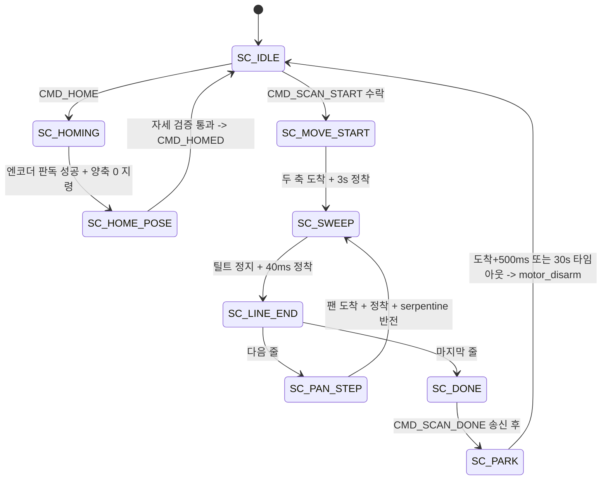

# Edge AI CCTV 2D 마커리스 자동 캘리브레이션 킷 · Module 1 (H/W & Embedded Control)

**2축 스캔 시퀀서 (`App/scan/`)**
작성: 이현우 (VEDA 7기 1팀) — 계층 분리 리팩터링·프로토콜 연계
원 구현 및 탈조 감시: 강유근 · 모터/엔코더 내부: 강유근 · 라이다 파서: 송영빈
대상 코드: STM32 `bd53921` (`main`, 2026-08-21) — `scan.c` 809줄 / `scan.h` 273줄
문서 갱신: 2026-08-24

---

## 1. 개요

`scan` 은 RPi 명령을 모터 목표 시퀀스로 바꾸고, 스윕 구간의 각도-거리 쌍만 상행하는
**메인루프 상태머신**입니다.

**핵심: 이것은 ISR 이 아닙니다.** 그래서 여기서는 블로킹 I2C(엔코더)도 `HAL_Delay` 도
안전합니다. 이 분리가 이 모듈의 가장 중요한 설계 결정입니다.

시퀀서가 ISR 안에 있던 시절, 거기서 `HAL_Delay`(SysTick 대기 → 데드락)와 블로킹
I2C(라이다 유실)를 했습니다. **개별 버그가 아니라 계층 문제**였고, 메인루프로
나누니 저절로 사라졌습니다.

| 실행 컨텍스트 | 하는 일 |
|---|---|
| ISR (TIM1 / TIM2) | 스텝 펄스 생성 |
| ISR (USART6 라이다) | 각도 래치 (`scan_latch_angles`) |
| 메인루프 | 시퀀서 전이, 엔코더 I2C, 정착 대기, 프레임 송신 |

**각도는 전부 기구각입니다.** 계약 좌표계 변환은 RPi 데몬 몫이고, 펌웨어는 모터가
어디 있는지만 정직하게 보고합니다.

이 문서가 다루지 않는 것 — 모터 구동·가감속 램프(강유근), MT6701 판독·I2C 복구
(강유근), 라이다 NLink 파싱(송영빈), UART 프레임 조립(`App/uart_rpi/`).

---

## 2. 상태머신



**틸트가 빠른 축, 팬이 느린 인덱스 축**이며 줄마다 틸트 방향을 뒤집는 serpentine
입니다. 되감기 구간(`SC_SETTLE`/`SC_REWIND`)은 serpentine 도입으로 사라졌습니다.

내부 상태(`scan.c:14`)는 lifecycle(`state`, `homed`) · 요청(각도 5개) ·
진행(`line`, `n_lines`, `tilt_to_end`) · HOME(`home_retry`, `proto_homed`) ·
진단(`reject_busy`) · 타이밍(`settle_until_ms`, `park_deadline_ms`) 으로 나뉩니다.

HAL tick 데드라인은 부호 없는 뺄셈 뒤 부호 있는 부호 검사로 **49일 wrap** 을
처리합니다.

```c
const uint32_t park_elapsed = HAL_GetTick() - s.park_deadline_ms;
const bool timed_out = ((int32_t)park_elapsed >= 0);
```

---

## 3. 타이밍 상수

`scan.h` 기준, 기준선 `bd53921`.

| 상수 | 값 | 용도 |
|---|---:|---|
| `SCAN_HOME_SETTLE_MS` | 3,000 | 홈 자세 도착 후 검증까지 |
| `SCAN_HOME_FINE_SETTLE_MS` | 300 | 세부조정 1회당 |
| `SCAN_START_SETTLE_MS` | 3,000 | 스캔 시작점 도착 후 |
| `SCAN_LINE_SETTLE_MS` | **40** | 줄 끝 / 팬 스텝 후 |
| `SCAN_PARK_SETTLE_MS` | 500 | 파킹 도착 후 |
| `SCAN_PARK_TIMEOUT_MS` | 30,000 | 파킹 강제 종료 |
| `SCAN_HOME_FINE_DDEG` | 3 (0.3°) | 홈 수렴 완료 |
| `SCAN_HOME_TOL_DDEG` | 40 (4.0°) | 홈 실패 판정 |
| `SCAN_STALL_PAN_DDEG` | 20 (2.0°) | 팬 탈조 임계 |
| `SCAN_STALL_TILT_DDEG` | 20 (2.0°) | 틸트 탈조 임계 |

정착 타이머는 **축이 움직이는 동안 계속 밀립니다** — `motor_is_idle()` 이 false 면
매 사이클 `settle_until_ms` 를 다시 세우므로, 실제로는 "정지한 뒤 40ms" 가 됩니다.
비용은 줄마다 두 번이라 200줄 × 2 × 40ms = **+16초**입니다.

`SCAN_HOME_SETTLE_MS` 를 3초로 길게 잡는 이유는 정착만이 아닙니다. 이 시간 동안
킷이 수직으로 선 채 정지해 있어 **사람이 눈으로 자세를 확인**할 수 있습니다. 스캔당
한 번이라 총 시간에 거의 영향이 없습니다.

### 3.1 정착 100ms → 40ms 결정

`70e7126`(S-Curve 가감속, 강유근, 2026-08-21)이 내린 값입니다. 같은 커밋이
`MOTOR_TILT_CRUISE_PPS` 를 800 → **750**(84.375°/s)으로 낮췄습니다
(`App/motor/motor.h:134`) — 격자 1칸당 1.07 샘플을 확보해 위상 결측을 없애려는
조정입니다.

정착 시간을 줄이는 대신 링잉 자체를 줄였습니다.

| 대안 | 기각 사유 |
|---|---|
| 100ms 유지 | 줄마다 두 번이라 200줄에 +40초. 직가속 링잉이 남아 셀 내 산포가 컸다 |
| 정착을 없앤다 | 링잉이 그대로 줄 끝 엔코더 오차로 들어가 탈조 판정을 흔든다 |
| S-Curve 로 저크를 없애고 40ms | **채택.** 링잉의 원인을 줄이고 대기를 짧게 |

실기 2회로 검증돼 있습니다 (2026-08-21,
`STM32/docs/motor_profile_test/raw_data/scan_phase4_golden.json`, `…_750pps_run2.json`).

| | golden | run2 |
|---|---:|---:|
| 격자 | 101 × 400 = 40,400 | 동일 |
| `valid_count` | 40,181 (99.46%) | 40,182 |
| 소요 | 571.3초 | 571.3초 |
| `merged_sample_count` | 13,567 | 13,573 |
| `out_of_range_angle_count` | 0 | 0 |
| `checksum_error_count` | 0 | 0 |

직전 기준선 `c5c1c67` 의 2026-08-19 스캔(40,088점)보다 유효점이 많습니다.

> **주의 — 이 실기가 답하지 않는 것.** Phase 2 에서 `ERR_STALL`(code=5, axis=2)이
> 기구 간섭에 정상 작동한 것이 확인됐습니다. 그것은 **참 양성**이고, 아래 9절
> STM-61-01 이 묻는 것은 **헛 `ERR_STALL`(거짓 양성)** 입니다. 40ms 2회 완주가
> "거짓 양성이 없다"의 직접 증거는 아니며, 399회 판정을 두 번 통과했다는
> 상한만 줍니다. 두 설정의 줄 끝 오차 분포를 직접 비교한 기록은 아직 없습니다.

### 3.2 파급 — 이 상수를 건드리면 같이 깨지는 것

| 상수 | 같이 움직이는 것 |
|---|---|
| `SCAN_LINE_SETTLE_MS` | 총 소요 시간과 탈조 판정 시점의 링잉 여유가 동시에 |
| `SCAN_HOME_FINE_DDEG` | 홈 수렴 판정. 키우면 원점이 그만큼 벌어진 채 확정된다 |
| `SCAN_HOME_TOL_DDEG` | 홈 실패 판정. 키우면 DIR 극성 반전을 못 잡는다 (4.2절) |
| `SCAN_STALL_*_DDEG` | 줄마다 판정하므로 399회 중 한 번만 걸려도 스캔이 중단된다 |
| `SCAN_PARK_TIMEOUT_MS` | 도착 못 하는 상황에서 코일 전류가 흐르는 최대 시간 (7절) |

---

## 4. 홈 확립

MT6701 은 **절대 엔코더**라 기계식 호밍 시퀀스가 필요 없습니다. 전원을 꺼도 위치를
알므로 HOME 은 "엔코더 2개 읽기"로 끝납니다(약 0.3ms). **리밋 스위치를 쓰지
않습니다.**

```
scan_home()         SC_IDLE 에서 homed=false, state=SC_HOMING 만 세운다
scan_do_homing()    양축 엔코더 판독 -> 스텝카운트 sync -> provenance 저장
                    -> 양축 기구각 0 으로 이동 지령
scan_do_home_pose() 도착 후 엔코더로 다시 대조
scan_home_finish()  CMD_HOMED(엔코더 raw + 각도) 송신 -> SC_IDLE
```

**`scan_home()` 이 이미 HOMING 상태면 재요청을 무시합니다.** 데몬이 500ms 마다 HOME 을
재전송해도 정착 타이머가 계속 리셋되지 않게 하기 위해서입니다.

### 4.1 자세 검증 (`scan_do_home_pose()`, `:502`)

| 결과 | 통지 |
|---|---|
| FINE(0.3°) 이내 | `CMD_HOMED` |
| TOL(4.0°) 이내지만 FINE 미수렴 | 스텝카운트를 실측에 sync 한 뒤 `CMD_HOMED` |
| 재시도 10회 소진 + TOL 초과 | `ERR_STALL` + axis |
| 엔코더 판독 실패 | `ERR_ENCODER` + axis |

**판독 실패를 "수렴 완료"로 접지 않는 것이 중요합니다.** TOL 판정에서 그 축을 빼고
넘기면 검증 안 된 원점으로 스캔이 돌아갑니다.

축마다 I2C 버스가 분리돼 있어(Pan=I2C3 / Tilt=I2C1) **한쪽만 죽는 것이 오히려 흔한
시나리오**입니다 — 겪은 고장이 전부 그랬습니다(틸트 SDA 단락, 팬 I2C 미복구).
예전에는 반환이 `bool` 하나였고 판독 실패를 `SETTLED` 로 접어서, 한 축의 I2C 가
죽어도 다른 축만 수렴하면 검증 없이 `CMD_HOMED` 가 나갔습니다(`scan.c:156~165`).

```c
const uint8_t ax = (uint8_t)((ok_p ? 0u : (uint8_t)ERR_AXIS_PAN)
                           | (ok_t ? 0u : (uint8_t)ERR_AXIS_TILT));
```

**축 값은 비트 플래그(PAN=1, TILT=2)라 OR 로 합칩니다.** 삼항 연산자로 하나만 고르면
양축 동시 실패 시 한쪽 비트가 누락됩니다. `c0f9ecb` 에서 고친 것입니다.

### 4.2 홈이 잡지 못하는 것

> **주의 — 영점 상수(`MOTOR_*_ZERO_OFFSET_DEG`)가 틀린 것은 여기서 못 잡습니다.**
> 홈에서 위치를 세울 때와 검증할 때 같은 offset 을 쓰므로 수식에서 상쇄됩니다.
> 자세 검증이 잡는 것은 **DIR 극성 반전**(오차가 이동량의 2배로 벌어짐)과
> **축 걸림/탈조**(목표에 못 옴)입니다.

`CMD_HOMED` 가 엔코더 raw 를 함께 올리므로, 영점이 틀렸다고 나중에 밝혀져도 이미
찍은 스캔의 각도를 오프라인에서 재계산할 수 있습니다.

### 4.3 홈 완료 신호 (`scan_is_homed()`, `:350`)

내부 `s.homed` 와 밖으로 내보내는 값이 다릅니다.

```c
return s.homed && (s.state != SC_HOMING) && (s.state != SC_HOME_POSE);
```

`s.homed` 는 `SC_HOMING` 에서 엔코더 판독이 성공한 순간 참이 됩니다. 그런데 그
시점엔 자세 이동이 남아 있습니다 — 팬 순항 100pps = 11.25°/s 라 최대 180° 이동은
약 **16초**입니다(`App/motor/motor.h:127`). 그대로 내보내면 데몬이 그때
`SCAN_START` 를 보내고 STM 은 아직 `SC_IDLE` 이 아니라 `ERR_BUSY` 로 거절합니다.

| 대안 | 기각 사유 |
|---|---|
| `s.homed` 를 자세 이동이 끝난 뒤에 세운다 | 홈 판독 성공 사실을 그때까지 따로 들고 있어야 한다 |
| 데몬이 `CMD_HOMED` 프레임만 믿는다 | `CMD_STATUS` 가 1초 주기로 flags 를 덮어써 되살린다 |

**파급: `CMD_HOMED` 를 보내는 시점과 이 플래그가 서는 시점이 같아야 합니다.** 둘 중
하나만 바꾸면 데몬 쪽 불변식("`TURRET_HOME` ioctl 이 `STF_HOMED` 를 내렸으므로 이후
`homed==1` 은 이번 HOME 의 응답")이 깨집니다.

반증: 이 조건이 없었다면 단독 `CMD_HOME` 직후의 `SCAN_START` 가 `ERR_BUSY` 로
거절돼야 하고, 2026-08-19 실기에서 실제로 그렇게 났습니다. 거꾸로 지금 빌드에서
같은 시나리오를 재현했을 때 `reject_busy` 가 오르면 보드 펌웨어가 이 가드 이전
버전이라는 뜻입니다.

---

## 5. 스캔 수락과 줄 계산

`scan_start()` (`:251`) 의 분기입니다.

| 조건 | 결과 |
|---|---|
| `state != SC_IDLE` | `reject_busy++`, `ERR_BUSY` |
| `!homed` | `ERR_NOT_HOMED` |
| 범위 밖 (`scan_request_in_range`) | `ERR_OUT_OF_RANGE` |
| 수락 | 카운트 리셋, 요청 복사, `n_lines` 계산, 모터 enable, `SC_MOVE_START` |

거절 사유 세 가지가 전부 다른 오류 코드로 나갑니다. `ERR_BUSY` 가 v6 에서 생기기
전에는 이 경로가 카운터로만 남았고, 그래서 데몬이 "왜 스캔이 안 되지"를 알 수
없었습니다. 그전에는 상태를 안 보고 파라미터를 통째로 갈아끼워, 진행 중인 스윕이
그 자리에서 새 범위로 바뀌면서 **두 스캔이 한 파일에 섞였습니다.**

카운터는 요청이 받아들여진 **뒤에** 밉니다. 디스패처에서 먼저 밀면 거절된 요청
하나가 진행 중인 스캔의 점 수를 0 으로 지워 `SCAN_DONE` 의 `point_count` 가 실제보다
작게 나갑니다.

```c
span = pan_end - pan_start;  if (span < 0) span += 3600;   /* 랩어라운드 */
n_lines = span / step + 1;
```

랩어라운드로 계산해 팬이 한 바퀴를 넘어 감기지 않게 합니다.

`SC_MOVE_START` 진입 시 **정착 마감을 반드시 새로 잡습니다.** 축이 이미 시작점에
있으면 첫 바퀴에 곧장 idle 로 판정하는데, 그때 이전 스캔의 낡은 마감이 남아 있으면
이미 지난 시각이라 대기가 통째로 건너뛰어집니다.

### 5.1 목표 각도는 항상 절대각에서 환산

```c
ddeg  = pan_start_ddeg + line * step_ddeg;     /* 절대각 */
pulse = motor_ddeg_to_pulse(ddeg);             /* 가장 가까운 정수 마이크로스텝 */
```

**한 스텝의 펄스를 굳혀서 매 줄 더하면 안 됩니다.** 1펄스가 0.1125° 라 나머지가
누적돼 180줄에서 2° 이상 어긋납니다. 절대각에서 매번 통째로 환산하면 절삭 오차가
쌓이지 않습니다.

| 입력 `step_ddeg` | 변환 | 누적 |
|---|---|---|
| 9 (0.9°) | 정확히 8펄스 (8 × 0.1125 = 0.900°) | 매 줄 정수배, 오차 0 |
| 10 (1.0°) | 가장 가까운 9펄스 (1.0125°) | 절대각 환산이라 180줄에서 정확히 1600펄스(180.0°)로 수렴 |

### 5.2 범위 검사를 세 곳에서 중복하는 이유

데몬·드라이버·펌웨어가 각각 검사합니다. 소스 주석(`:236~241`)이 근거를 적어
두었습니다 — 팬이 범위를 벗어나면 `span += 3600` 보정으로도 음수가 남고,
`uint32_t` 로 접히면서 `n_lines` 가 수십억이 됩니다. 셋 중 하나를 없애면 나머지 둘이
뚫렸을 때 그 값이 곧바로 모터 목표가 됩니다.

---

## 6. 라이다 연계 경계

### 6.1 각도 래치 (`scan_latch_angles()`, `:786`)

라이다 **16바이트 프레임이 완성되는 순간 ISR 에서** 모터 카운터를 읽어 스냅샷을
만듭니다. 32비트 정렬 워드 읽기만 하고 상태를 바꾸지 않으므로 ISR 에서 안전합니다.

**폴링은 폐기됐습니다.** 메인루프가 언제 읽느냐에 따라 최대 한 프레임 주기(10ms)
어긋나고, 그동안 틸트가 움직이는 각이 곧 스미어입니다.

| 틸트 순항 | 각속도 | 10ms 스미어 | 격자 0.9° 대비 |
|---|---:|---:|---|
| **750pps (기준선)** | 84.375°/s | 0.84° | 한 칸에 거의 맞먹는다 |
| 800pps (`70e7126` 이전) | 90°/s | 0.90° | 한 칸이 통째로 뭉개진다 |

어느 쪽이든 격자 한 칸 규모라 폴링은 성립하지 않습니다. 750pps 로 내린 것은 셀당
1.07 샘플을 맞추려는 조정이고 스미어 문제와는 별개입니다(3.1절).

| 대안 | 기각 사유 |
|---|---|
| 메인루프 폴링 | 최대 10ms 어긋나 격자 한 칸이 뭉개진다 |
| `__disable_irq` 임계구역으로 두 축을 함께 읽기 | 두 값이 각각 32비트 정렬 워드라 판독 자체가 원자적이다 |
| 타임스탬프를 실어 RPi 에서 보간 | RPi 에 연관 부담을 되돌려 준다. 라이다가 100Hz 고정이라 보간할 여지도 작다 |

매칭이 STM32 에서 원자적으로 끝나 `(pan, tilt, d)` 가 짝지어져 올라오므로 **RPi 의
연관 부담이 0** 입니다.

**파급: 원자성의 근거가 "32비트 정렬 워드 단일 판독"(`scan.c:788`)입니다.**
`motor_get_ddeg()` 가 여러 필드를 조합하거나 64비트가 되면 그 근거가 사라지고 찢긴
값이 그대로 좌표가 됩니다. 이 함수는 ISR 에서 불리므로 락을 넣을 수도 없습니다.

### 6.2 샘플 상행 (`scan_submit_sample()`, `:798`)

**`SC_SWEEP` 상태일 때만** `uart_rpi_send_scan_point()` 를 부릅니다. 거르는 두 구간의
성격이 서로 다릅니다.

| 구간 | 왜 거르나 |
|---|---|
| 줄 끝 정지 | 축이 멈춰 있어 같은 각도에 중복만 쌓인다 |
| 팬 이동 (`SC_PAN_STEP`) | 팬 카운터가 계속 변하므로 각도는 다르지만, 틸트 스윕 밖이라 격자 행에 대응하지 않는다 |

두 경우를 "같은 각도 중복" 으로 뭉뚱그리면 안 됩니다 — 팬 이동 중에는 각도가 실제로
변합니다(`App/motor/motor.c:518~548`).

| 대안 | 기각 사유 |
|---|---|
| 전부 올리고 RPi 에서 거른다 | UART 대역과 데몬 부담이 늘고, 거를 기준(상태)을 RPi 가 모른다 |
| 라이다를 스윕 구간에서만 켠다 | 기동·안정화 시간이 붙어 줄마다 비용이 생긴다 |

**파급: 필터가 상태 하나(`s.state == SC_SWEEP`)에 걸려 있습니다.** 스윕을 여러
상태로 쪼개면 그 순간부터 점이 조용히 사라집니다 — 오류가 아니라 `valid_count`
감소로만 나타납니다.

---

## 7. 엔코더 사용처와 탈조 감시

**스윕 중에는 엔코더를 읽지 않습니다.** I2C 판독 완료 시각과 라이다 샘플 시각이 달라
그 값은 그 점의 각도가 아니기 때문입니다. **각도원은 양축 모두 스텝카운트입니다.**

| 지점 | 목적 | 재영점 |
|---|---|---|
| ① 홈 확립·자세 검증 | 기준 좌표 확립 | **함** (`motor_sync_pulse`) |
| ② 틸트 스윕 끝점(±90°) | 탈조 감시 | **안 함** (Monitor-Only) |
| ③ 팬 줄 시작점 | 탈조 감시 | **안 함** (Monitor-Only) |

②③ 은 2026-08-20 강유근이 추가했습니다(`1720546`). 그 이전에는 줄 경계에서 엔코더를
읽지 않아 스윕 중 탈조를 감지할 수단이 파킹 자세 육안 확인뿐이었습니다.

### 7.1 왜 ②③ 에서 재영점을 하지 않는가

엔코더 지터(0.42°)가 스텝카운터로 주입되면 **매 스윕마다 랜덤 오프셋**이 생겨
포인트클라우드에 줄무늬(striping)와 표면 노이즈(+27%)가 남습니다. 스텝모터의 매끄러운
기구 궤적을 보존하는 편이 낫습니다.

### 7.2 판정과 중앙값 필터

| 상수 | 값 | 근거(주석) |
|---|---:|---|
| `SCAN_STALL_PAN_DDEG` | 20 (2.0°) | 1 풀스텝(1.8°) 자기적 데드밴드 + 케이블 장력·마찰 여유 |
| `SCAN_STALL_TILT_DDEG` | 20 (2.0°) | 지터(0.42°) + 편심(0.5°) + 데드밴드 |

판독은 **3회 샘플 중앙값 필터**를 거칩니다(`motor_read_encoder_pulse`).

```c
static inline int32_t motor_median3(int32_t a, int32_t b, int32_t c)
{
    int32_t min = a, max = a;
    if (b < min) min = b;  if (b > max) max = b;
    if (c < min) min = c;  if (c > max) max = c;
    return (a + b + c) - min - max;
}
```

정상 상태에서 3회는 약 0.4ms 라 40ms 정착 대기에 영향이 없습니다. 단 1회의 스파이크는
무시되는데, **정확히는 그 값이 세 표본의 최대 또는 최소일 때입니다** — 스파이크가 두
정상값 사이로 떨어지면 중앙값으로 뽑힐 수 있으므로 "무조건" 은 아닙니다. 2회만
성공하면 평균, 1회면 그 값, 0회면 실패입니다.

| 결과 | 동작 |
|---|---|
| 정상 | 다음 줄로 진행 |
| 임계 초과 | `motor_disarm()`, `homed=false`, `ERR_STALL` + axis, `SC_IDLE` |
| I2C 판독 실패 | `motor_disarm()`, `homed=false`, `ERR_ENCODER` + axis, `SC_IDLE` |

한 번 걸리면 스캔이 그 자리에서 죽습니다. 다만 **산출물이 아예 없는 것은 아닙니다** —
데몬은 `CMD_SCAN_DONE` 을 못 받아도 무입력이 `SCAN_IDLE_TIMEOUT_MS` 를 넘으면
`ST_EXPORT` 로 넘어가 그때까지의 점으로 파일을 마감합니다
(`RPi/daemon/core/main.c:713~740`). 잃는 것은 남은 줄이고, 남는 것은 부분 격자입니다.

`SCAN_NO_ENCODER=1` 브링업 빌드에서는 이 블록이 `#if` 로 통째 제외됩니다. 그 모드는
판독을 실패시키는 것이 아니라 **호출 자체를 건너뜁니다** — 실패시키면
`motor_read_encoder_pulse` 가 재시도로 약 120ms 를 잡아먹습니다
(`motor.h:212~215`, `MOTOR_ENC_MAX_RETRY 5` / `MOTOR_ENC_RETRY_DELAY_MS 10`).

---

## 8. 종료 경로

| 진입 | 동작 |
|---|---|
| `scan_stop()` (`:313`) | 현재 위치를 목표로 고정하고 `SC_DONE` — 부분 카운트로 DONE 후 파킹 |
| `scan_abort()` (`:340`) | 즉시 `SC_IDLE` 로 상태만 폐기. 가짜 DONE·파킹 목표를 만들지 않음 |
| 마지막 줄 | `SC_DONE` |

`scan_do_done()` (`:642`) 의 주석 하나에 설계 판단 네 개가 들어 있습니다.

1. **파킹 자세를 항상 기구각 0 으로** — 예전에는 팬만, 그것도 그 스캔의 시작각으로
   되돌렸습니다. 그러면 파킹 자세가 스캔 파라미터마다 달라져 **육안 탈조 확인이 안
   됩니다.** 팬은 리밋이 없어 개루프 드리프트를 잡을 수단이 없는데, 매번 같은 자세로
   서면 스캔이 끝났을 때 눈으로 어긋남을 알아챌 수 있습니다.
2. **`CMD_SCAN_DONE` 을 파킹보다 먼저** — 데몬이 그걸 받아야 산출물을 마감합니다.
3. **홈이 없으면 안 움직입니다** — 펄스 0 이 무엇인지 모르기 때문입니다.
4. **`SC_PARK` 를 거쳐 전류를 끊습니다** — 예전에는 곧장 `SC_IDLE` 로 갔고, 파킹은
   모터 계층이 끝내지만 **코일 전류가 켜진 채 남아 모터가 뜨거워졌습니다.**

`scan_do_park()` (`:683`) 에서 이동 중에는 마감을 계속 밀어 두고, 정착 500ms 또는
30초 타임아웃 후 `motor_disarm()` 합니다. **타임아웃이 정착 조건을 무시하는 것이 안전
설계입니다** — "도착 못 했으니 전류를 켜둔 채 기다린다"가 바로 막으려던 상태입니다.

> **참고 — "팬에 리밋이 없다"의 범위.** 팬 드리프트를 **감시**할 수단은 있습니다
> (줄 시작마다 MT6701 대조, 7절). 없는 것은 **보정·재확립** 수단입니다. 감시는
> Monitor-Only 라 어긋남을 알려줄 뿐 원점을 다시 세우지 못하고, 그래서 파킹 자세의
> 육안 확인이 남습니다.

---

## 9. 검증 현황

등급 — **A** 실기 측정값으로 뒷받침 · **B** 도구 출력(빌드·정적분석)으로 뒷받침 ·
**C** 코드 확인만 · **D** 근거 기록 없음.

| 항목 | 방법 | 등급 | 결과 |
|---|---|:---:|---|
| CMake 빌드 | Debug, clean | B | 성공. text 44,092 / data 468 / bss 3,052 |
| 메모리 | 링커 리포트 | B | RAM 3,520 B (3.58%) / FLASH 44,576 B (8.50%) |
| cppcheck / MISRA | `tools/run_static_analysis.sh` | B | 15파일 통과 (cppcheck 2.21, exit 0) |
| 홈 확립·자세 검증 | 실기 | A | 2026-08-19 스캔 provenance 기록 |
| serpentine 200줄 완주 | 실기 | A | 기준선 40,181/40,400 · 직전 기준선 40,088/40,400 |
| `ERR_BUSY` 경로 | 실기 | A | `CMD_STATUS` 불변식 위반을 실제로 검출 |
| 40ms + 750pps + S-Curve | 실기 2회 | A | 2026-08-21 유효 40,181 / 40,182점(99.46%), 571.3초, 재현 일치 |
| 탈조 감시 — 참 양성 | 실기 | B | Phase 2 기구 간섭에서 `ERR_STALL`(axis=2) 정상 작동 |
| `scan_is_homed` 가드 | 실기 | C | 사건 서술은 있으나 당시 프레임 로그·`reject_busy` 원본 미인용 |
| `SCAN_NO_ENCODER` 분기 | — | C | `#ifdef` 반대편은 빌드 확인만 |
| 탈조 감시 — 거짓 양성 없음 | — | **D** | 헛 `ERR_STALL` 을 직접 겨눈 시험 없음 (STM-61-01) |
| 범위 검사 | — | **D** | 펌웨어 경로 발화 기록이 저장소에 없음 (5.2절) |

빌드·정적분석은 기준선 `bd53921` 에서 2026-08-24 에 다시 돌린 결과입니다. 직전
기준선 `c5c1c67` 의 값(text 43,916 / FLASH 8.47%)은 그 시점 것입니다.

---

## 10. 알려진 이슈

| ID | 항목 | 우선순위 | 상태 | 조치 방향 |
|---|---|:---:|---|---|
| STM-61-01 | 탈조 임계 2.0° 여유 부족 가능성 | P0 | 열림 | 지터 분포 실측 후 임계 재산정 또는 N회 연속 위반 조건 |
| STM-61-02 | `span % step` 미검증 | P1 | 열림 | 마지막 줄이 끝각에 못 미쳐도 오류가 없다 |
| STM-61-06 | `protocol.h` §4 주석의 "재영점" 불일치 | P1 | 열림 | 구현이 맞다. 주석을 Monitor-Only 로 정정 |
| STM-61-08 | `scan_encoder_error_ddeg` 주석이 호출부와 불일치 | P1 | 열림 | "홈에서만" 이 거짓. 구현이 맞고 주석이 낡았다 |
| STM-61-03 | `scan_init` 이 `reject_busy` 미리셋 | P2 | 열림 | 재초기화 후 이전 카운트 잔존 |
| STM-61-04 | `latch_*_ddeg` 가 잔여 상태 | P2 | 열림 | `scan_init` 에서 초기화되지만 사용되지 않음 |
| STM-61-05 | `CMD_SCAN_DONE` 이 파킹보다 먼저 | P2 | 보류 | 의도된 순서. 데몬이 고정 15초 유예로 대신함 |
| STM-61-07 | 헤더 주석의 스캔 시간 표기 불일치 | P2 | 열림 | "27분"·"180줄"·"200줄" 혼재. 실측 약 9.5분 / 200줄 |
| STM-61-10 | `scan.c:124` 의 엔코더 최악 대기 100ms 가 `motor.h` 의 120ms 와 불일치 | P2 | 열림 | 주석 수치만 정정 |
| STM-61-11 | `PAN_CAILI_SWITCH`(PC8)가 선언·초기화되지만 읽히지 않는다 | P2 | 열림 | 배선만 된 죽은 핀. 쓸지 지울지 결정 필요 |
| STM-61-09 | 기준선이 40ms·750pps 실기를 반영하지 않았다 | P1 | **닫힘** | 2026-08-24 기준선을 `bd53921` 로 올리고 빌드·정적분석 재실행 |

### STM-61-01 (P0) 상세

헤더 주석 자체가 데드밴드를 1.8°, 엔코더 지터를 0.42° 로 잡고 있는데 임계가 2.0° 라
여유가 **0.2°** 뿐입니다.

판정은 줄 끝 200회 + 팬 스텝 199회 = **399회** 일어납니다(마지막 줄에는 팬 스텝이
없습니다). 동일 구조가 과거 줄 끝 재영점 방식에서 헛 `ERR_STALL` 을 발생시켰고, 급정지
링잉과 판독 잡음이 임계를 넘겨 **첫 줄에서 스캔이 죽었습니다.**

기준선에서 정착이 40ms 입니다. 완화 요인 중 대기 쪽이 100ms 시절의 40% 로 줄었으므로
S-Curve 의 링잉 감소분이 그만큼을 메워야 합니다. 40ms 실기 2회가 399회 판정을
통과했다는 것이 현재 가진 유일한 관측이고, **오차 분포 자체를 잰 기록은 없습니다.**

반증 가능한 검증: RPi `driver/encoder_jitter_test` 로 무전류·정지 상태의 지터 분포를
양축에서 측정하고, 표준 스캔의 줄 끝 오차 실측 분포와 2.0° 사이 여유를 수치로
확인합니다. 부족하면 임계를 올리거나 N회 연속 위반을 조건으로 바꿉니다.

---

## 11. 참고 자료

- `STM32/App/scan/scan.c` / `scan.h` — 구현과 상수 근거 (주석이 상세합니다)
- `STM32/App/motor/motor.c` — `motor_read_encoder_pulse` 의 중앙값 필터 (강유근)
- `STM32/App/motor/motor.h` — 순항 속도·엔코더 재시도 상수
- `STM32/shared/protocol.h` — 각도 규약과 오류 코드
- `STM32/docs/motor_profile_test/` — S-Curve·750pps 실기 원자료와 요약 보고서
- `RPi/driver/encoder_jitter_test.c` — 무전류 정지 상태 지터 측정 도구
