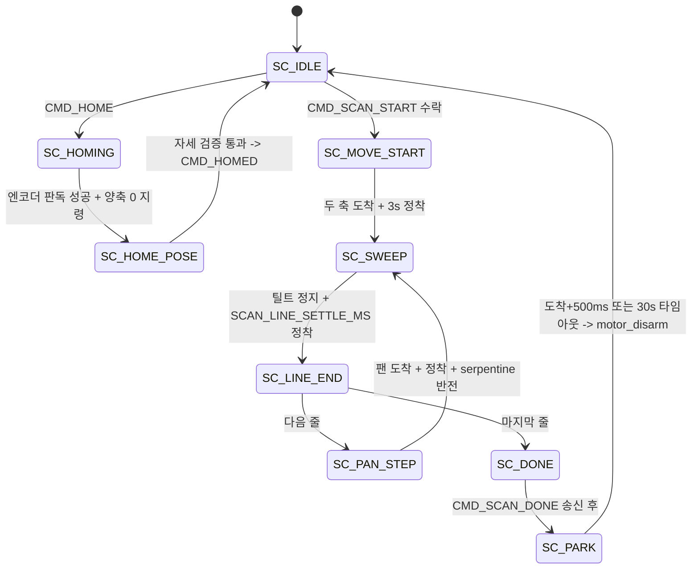

# scan 2축 스캔 시퀀서

| 항목 | 내용 |
|---|---|
| 문서 ID | `ADTS-STM-61` |
| 파트 | STM32 (스캔 시퀀스) |
| 담당 | 강유근 (원 구현) / 이현우 (계층 분리 리팩터링·프로토콜 연계) |
| 탈조 감시 추가 | 강유근 (`1720546`, 2026-08-20) |
| 가감속 프로파일 | 강유근 (`70e7126` S-Curve + 골든 레이시오, 2026-08-21) |
| 대상 소스 | `App/scan/scan.c` (809줄), `scan.h` (271줄) |
| 기준 코드 | STM32 `bd53921` (`main`, 2026-08-21) |
| 직전 기준선 | `c5c1c67`. `scan.c` 는 동일하고 `scan.h` 가 1줄(정착 100 → 40ms) 다르다 |
| 상태 | 구현 완료 · 탈조 감시 거짓 양성과 범위 검사는 미검증 (6장) |

---

## 1. 개요

`scan` 은 RPi 명령을 모터 목표 시퀀스로 바꾸고, 스윕 구간의 각도-거리 쌍만
상행하는 메인루프 상태머신이다.

> **이 모듈은 ISR 이 아니라 메인루프에서 돈다**
> 블로킹 I2C(엔코더)와 `HAL_Delay` 를 여기서는 쓸 수 있다.

시퀀서를 ISR 에 두면 `HAL_Delay`(SysTick 대기 → 데드락)와 블로킹 I2C(라이다 유실)를
피할 수 없다. 개별 버그가 아니라 계층 문제이며, 메인루프 분리로 해소됐다.

| 실행 컨텍스트 | 하는 일 |
|---|---|
| ISR (TIM1/TIM2) | 스텝 펄스 생성 |
| ISR (USART6 라이다) | 각도 래치 (`scan_latch_angles`) |
| 메인루프 | 시퀀서 전이, 엔코더 I2C, 정착 대기, 프레임 송신 |

각도는 전부 기구각이다. 계약 좌표계 변환은 RPi 데몬 몫이고, 펌웨어는 모터가
어디 있는지만 정직하게 보고한다.

---

## 2. 적용 범위와 경계

| 다루는 것 | 다루지 않는 것 |
|---|---|
| 상태머신과 전이 조건 | [모터 구동 및 S-Curve 가감속](motor.md) (강유근, 송영빈) |
| 홈 확립 절차와 판정 | [MT6701 14비트 엔코더 및 I2C 복구](encoder.md) (강유근) |
| 목표 각도 계산 | [1D ToF 라이다 수신](lidar.md) (송영빈) |
| 상행 경계 (`scan_submit_sample`) | [UART RPi 프로토콜 어댑터](uart-rpi.md) (이현우) |

호출하는 외부 API:

```c
motor_enable() / motor_disarm() / motor_set_target() / motor_is_idle()
motor_ddeg_to_pulse() / motor_pulse_to_ddeg() / motor_get_pulse() / motor_get_ddeg()
motor_read_encoder() / motor_read_encoder_pulse() / motor_encoder_deg_to_pulse()
motor_sync_pulse()
uart_rpi_send_frame() / uart_rpi_send_scan_point() / uart_rpi_send_scan_done()
uart_rpi_reset_scan_count()
```

---

## 3. 설계

### 3.1 상태머신



틸트가 빠른 축, 팬이 느린 인덱스 축이며 줄마다 틸트 방향을 뒤집는 serpentine
이다. 되감기 구간(`SC_SETTLE`/`SC_REWIND`)은 serpentine 도입으로 제거됐다.

### 3.2 내부 상태 (`scan.c:14`)

| 그룹 | 필드 |
|---|---|
| lifecycle | `state`, `homed` |
| 요청 | `pan_start/end_ddeg`, `tilt_start/end_ddeg`, `step_ddeg` |
| 진행 | `line`, `n_lines`, `tilt_to_end` |
| HOME | `home_retry`, `proto_homed home` |
| 진단 | `reject_busy` |
| 타이밍 | `settle_until_ms`, `park_deadline_ms` |
| 잔여 | `latch_pan_ddeg`, `latch_tilt_ddeg` (현재 미사용, STM-61-04) |

HAL tick 데드라인은 부호 없는 뺄셈 뒤 부호 있는 부호 검사로 49일 wrap 을
처리한다.

```c
const uint32_t park_elapsed = HAL_GetTick() - s.park_deadline_ms;
const bool timed_out = ((int32_t)park_elapsed >= 0);
```

### 3.3 타이밍 상수 (`scan.h`)

| 상수 | 값 | 용도 |
|---|---:|---|
| `SCAN_HOME_SETTLE_MS` | 3,000 | 홈 자세 도착 후 검증까지 |
| `SCAN_HOME_FINE_SETTLE_MS` | 300 | 세부조정 1회당 |
| `SCAN_START_SETTLE_MS` | 3,000 | 스캔 시작점 도착 후 |
| `SCAN_LINE_SETTLE_MS` | 40 | 줄 끝 / 팬 스텝 후 |
| `SCAN_PARK_SETTLE_MS` | 500 | 파킹 도착 후 |
| `SCAN_PARK_TIMEOUT_MS` | 30,000 | 파킹 강제 종료 |
| `SCAN_HOME_FINE_DDEG` | 3 (0.3°) | 홈 수렴 완료 |
| `SCAN_HOME_TOL_DDEG` | 40 (4.0°) | 홈 실패 판정 |
| `SCAN_STALL_PAN_DDEG` | 20 (2.0°) | 팬 탈조 임계 |
| `SCAN_STALL_TILT_DDEG` | 20 (2.0°) | 틸트 탈조 임계 |

`SCAN_LINE_SETTLE_MS` 비용은 줄마다 두 번이라 200줄 × 2 × 40ms = +16초이다.

`SCAN_HOME_SETTLE_MS` 를 3초로 길게 잡는 이유는 정착만이 아니다. 이 시간 동안
킷이 수직으로 선 채 정지해 있어 사람이 눈으로 자세를 확인할 수 있다.
스캔당 한 번이라 총 시간에 거의 영향이 없다.

정착 40ms 는 `70e7126`(S-Curve 가감속, 강유근)이 100ms 에서 내린 값이다. 같은
커밋이 `MOTOR_TILT_CRUISE_PPS` 를 800 → 750(84.375°/s)으로 낮췄다
(`STM32/App/motor/motor.h:134`) — 격자 1칸당 1.07 샘플을 확보해 위상 결측을
없애려는 조정이고, §4.11 의 스미어 계산이 여기에 걸려 있다.

결정 — 정착 시간을 줄이는 대신 링잉 자체를 줄였다.

| 대안 | 기각 사유 |
|---|---|
| 100ms 를 유지한다 | 줄마다 두 번이라 200줄에 +40초. 직가속 링잉이 남아 셀 내 산포가 컸다 |
| 정착을 아예 없앤다 | 링잉이 그대로 줄 끝 엔코더 오차로 들어가 탈조 판정을 흔든다 |
| S-Curve 로 저크를 없애고 정착을 40ms 로 | 채택. 링잉의 원인을 줄이고 대기를 짧게 |

이 조합은 **실기 2회로 검증돼 있다**(2026-08-21,
`STM32/docs/motor_profile_test/raw_data/scan_phase4_golden.json`,
`…_750pps_run2.json`).

| | golden | run2 |
|---|---:|---:|
| 격자 | 101 × 400 = 40,400 | 동일 |
| `valid_count` | 40,181 (99.46%) | 40,182 |
| 소요 | 571.3초 | 571.3초 |
| `merged_sample_count` | 13,567 | 13,573 |
| `out_of_range_angle_count` | 0 | 0 |
| `checksum_error_count` | 0 | 0 |

직전 기준선 `c5c1c67` 의 2026-08-19 스캔(40,088점)보다 유효점이 많다.

> **이 실기가 답하지 않는 것**
> Phase 2 에서 `ERR_STALL`(code=5, axis=2)이 **기구 간섭에 정상 작동**한 것이
> 확인됐다(`STM32/docs/motor_profile_test/motor_profile_executive_summary_report.md`
> Phase 2). 그것은 참 양성이고, STM-61-01 이 묻는 것은 **헛 `ERR_STALL`(거짓
> 양성)** 이다. 40ms 2회 완주가 "거짓 양성이 없다" 의 직접 증거는 아니다 —
> 다만 399회 판정을 두 번 통과했으므로 회당 거짓 양성률의 상한은 준다.
>
> 반증: 40ms 가 부족하다면 줄 끝 엔코더 오차 분포가 100ms 때보다 넓어야 한다.
> 두 설정의 줄 끝 오차 분포를 직접 비교한 기록은 아직 없다.

파급 — 위 상수를 건드리면 조용히 깨지는 것:

| 상수 | 바꿀 때 같이 깨지는 것 |
|---|---|
| `SCAN_LINE_SETTLE_MS` | 총 소요 시간과 탈조 판정 시점의 링잉 여유가 동시에 움직인다 |
| `SCAN_HOME_FINE_DDEG` | 홈 수렴 판정. 키우면 원점이 그만큼 벌어진 채 확정된다 |
| `SCAN_HOME_TOL_DDEG` | 홈 실패 판정. 키우면 DIR 극성 반전을 못 잡는다(§4.5) |
| `SCAN_STALL_*_DDEG` | 줄마다 판정하므로 399회 중 한 번만 걸려도 스캔이 중단된다 |
| `SCAN_PARK_TIMEOUT_MS` | 도착 못 하는 상황에서 코일 전류가 흐르는 최대 시간이다(§4.9) |

---

## 4. 구현 — 코드 해설

### 4.1 정착 판정 — `scan_settled()` (`:65`)

정착 타이머는 축이 움직이는 동안 계속 밀린다. `motor_is_idle()` 이 false 면
매 사이클 `settle_until_ms` 를 다시 세우므로 실제로는 "정지한 뒤 N ms" 가 된다.

결정 — 마감 시각 하나로 처리하고 "이동 중 / 정착 중" 상태를 따로 만들지 않았다.

| 대안 | 기각 사유 |
|---|---|
| `SC_*_SETTLING` 상태를 상태마다 추가 | 상태 수가 두 배가 되고 전이가 그만큼 늘어난다 |
| 도착 시각을 별도 필드로 기억 | 도착 판정 자체가 `motor_is_idle` 한 번이라 기억할 것이 없다 |

트레이드오프: 마감이 밀리는 구조라 **축이 영영 안 멈추면 그 상태에서 무한정
머문다.** 파킹만 별도의 밀리지 않는 마감(`park_deadline_ms`)을 두는데, 거기서만
전류가 계속 흐르기 때문이다(`scan.c:46~49`). 나머지 상태에는 상한이 없다.

반증: 마감이 밀리지 않는다면 링잉이 남은 상태에서 다음 상태로 넘어가므로,
줄 끝 엔코더 오차가 정지 직후 값으로 튀어야 한다.

### 4.2 목표 각도 — `scan_pan_target_pulse()` (`:93`)

```c
/* 주의: 반드시 절대각에서 계산한다.
 *   라즈베리파이가 CMD_SCAN_START 에서 지정한 step_ddeg(단위: 0.1도)를 받아
 *   목표 각도(start + line*step)를 계산한 뒤, 가장 가까운 정수 마이크로스텝
 *   펄스(1펄스 = 0.1125도)로 반올림 변환한다.
 *   - 예) step_ddeg = 9  (0.9도) 입력 시: 정확히 8펄스(8 * 0.1125 = 0.900도)
 *   - 예) step_ddeg = 10 (1.0도) 입력 시: 가장 가까운 9펄스(1.0125도)로 변환하며
 *         절대각에서 누적하므로 180줄에서 정확히 1600펄스(180.0도)에 수렴 */
static int32_t scan_pan_target_pulse(uint32_t line)
{
    const int32_t ddeg = (int32_t)s.pan_start_ddeg
                       + ((int32_t)line * (int32_t)s.step_ddeg);
    return motor_ddeg_to_pulse(ddeg);
}
```

한 스텝의 펄스를 굳혀서 매 줄 더하면 안 된다. 1펄스가 0.1125° 라 나머지가
누적돼 180줄에서 2° 이상 어긋난다. 절대각에서 매번 통째로 환산하면 절삭 오차가
쌓이지 않는다.

`scan_tilt_target_pulse()` (`:101`) 는 `tilt_to_end` 플래그에 따라 `tilt_end` 또는
`tilt_start` 를 고른다 — serpentine 의 방향 반전이 이 한 줄이다.

파급: 팬 목표를 `line` 에서 매번 절대 환산하므로, `pan_start_ddeg` 나 `step_ddeg`
를 스캔 도중에 바꾸면 이미 지나간 줄과 앞으로 갈 줄이 서로 다른 격자에 놓인다.
`scan_start()` 가 진행 중 요청을 덮어쓰지 않고 버리는 이유가 이것이다(§4.6).

반증: 절대각 환산이 아니라 스텝 누적이었다면, 200줄 끝에서 팬 각도가 요청한
끝각과 2° 이상 어긋나야 한다. 반대로 지금 구조가 맞다면 어긋남은 반올림 1펄스
(0.1125°) 이내로 묶인다.

> **`step_ddeg` 가 펄스에 정확히 떨어지지 않아도 된다**
> 1펄스 = 0.1125° 라 `step_ddeg=10`(1.0°)은 펄스 정수배가 아니다. 그래도 매 줄
> 절대각에서 환산하므로 오차가 누적되지 않고 줄마다 ±1펄스 안에서 진동한다.
> 다만 격자 간격이 줄마다 미세하게 달라지므로, 표준 스캔이 0.9°(정확히 8펄스)를
> 쓰는 것은 이 진동까지 없애기 위해서다.

### 4.3 엔코더 판독 래퍼 — `scan_encoder_error_ddeg()` (`:117`)

```c
#if SCAN_NO_ENCODER
    /* 브링업 모드: 판독을 아예 시도하지 않는다. 단순히 실패시키는 것과
     * 다르다 — 실패하면 motor_read_encoder_pulse 가 5회 x (I2C 타임아웃
     * 10ms + 대기 10ms) = 약 100ms 를 잡아먹는다. 호출 자체를 건너뛴다. */
    *ok = false; *out_enc_pulse = 0;
#else
    *ok = (motor_read_encoder_pulse(ax, &enc_pulse) == HAL_OK);
    if (*ok) err = motor_pulse_to_ddeg(enc_pulse - motor_get_pulse(ax));
    /* 판독한 펄스를 그대로 넘긴다. 보정할 때 다시 읽으면 그 사이 잡음으로
     * 값이 달라져, 방금 판정한 오차와 다른 값을 기준으로 삼게 된다. */
    *out_enc_pulse = enc_pulse;
#endif
```

> **STM-61-10 — 위 주석의 100ms 가 낡았다**
> `motor.h:212~215` 는 최악 대기를 `(재시도-1) × (I2C_TIMEOUT 10ms × 2 +
> RETRY_DELAY 10ms)` = **약 120ms** 로 명시한다
> (`MOTOR_ENC_MAX_RETRY 5` / `MOTOR_ENC_RETRY_DELAY_MS 10`).
> `scan.c:124` 의 "5회 × (10ms + 10ms) = 약 100ms" 는 이 식과 다르다.
> 결론(호출을 건너뛴다)은 그대로지만 수치가 틀렸다.

두 가지 배려가 들어 있다.

1. 브링업 모드에서 호출 자체를 건너뛴다 — "실패시키기" 는 100ms 를 낭비한다
2. 판독값을 out parameter 로 함께 넘긴다 — 보정 시 다시 읽으면 잡음 때문에
   판정 기준과 보정 기준이 달라진다

파급: 이 함수는 블로킹 I2C 를 탄다. 메인루프 전용이며 ISR 에서 부르면 라이다
프레임이 유실된다(§1). 호출부가 늘어날 때마다 그만큼 메인루프가 멈춘다.

> **STM-61-08 — 함수 주석이 호출부와 어긋난다**
> `scan.c:115` 주석은 "홈 자세 검증에서만 쓴다. 스윕 중에는 호출하지 않는다"
> 라고 쓰여 있지만, 실제 호출식은 5곳이다.
>
> | 줄 | 호출자 | 시점 |
> |---|---|---|
> | `:176` | `scan_home_axis_settled()` | 홈 자세 검증 |
> | `:527`, `:528` | `scan_do_home_pose()` | 홈 자세 검증 |
> | `:571` | `scan_do_line_end()` | 줄 끝 (틸트) |
> | `:614` | `scan_do_pan_step_done()` | 팬 스텝 후 |
>
> 뒤 두 개는 `1720546`(탈조 감시)에서 늘어난 것이고 주석이 따라오지 않았다.
> "스윕 중(`SC_SWEEP`)에는 안 부른다" 는 지금도 참이지만 "홈에서만" 은 거짓이다.
> 구현이 맞고 주석이 낡았다. STM-61-06 과 같은 종류의 drift 다.

### 4.4 홈 — `scan_home()` (`:210`) / `scan_do_homing()` (`:376`)

```c
void scan_home(void)   /* SC_IDLE 에서 homed=false, state=SC_HOMING 만 세운다 */
```

이미 HOMING 상태면 재요청을 무시한다. 데몬이 500ms 마다 HOME 을 재전송해도
정착 타이머가 계속 리셋되지 않게 하기 위해서이다.

`scan_do_homing()` 의 정상 경로:

```
1. 양축 절대 엔코더를 읽는다 (구동 없이 판독 1회, 약 0.3ms)
2. 성공하면 motor_sync_pulse 로 스텝카운트를 엔코더 실측에 맞춘다
3. HOME provenance(raw + 각도)를 저장한다
4. 양축을 기구각 0 으로 이동 지령
5. SC_HOME_POSE 로 전이
```

실패하면 `ERR_ENCODER` + axis 를 올린다.

> **`SCAN_NO_ENCODER=1` 브링업 빌드**
> 현재 위치를 0 으로 선언하고 `raw=0xFFFF` 를 보낸다. 최종 빌드에서는 반드시
> 0 이어야 한다. 브링업 플래그를 켜면 빌드마다 `#warning` 이 뜨고, bench 코드는
> `#if` 로 통째 감싸져 있어 꺼지면 바이너리에 한 바이트도 안 들어간다.

### 4.5 홈 자세 검증 — `scan_do_home_pose()` (`:502`)

양축 0 도착 후 엔코더로 다시 대조한다.

| 결과 | 동작 |
|---|---|
| FINE(0.3°) 이내 | `CMD_HOMED` |
| TOL(4.0°) 이내지만 FINE 미수렴 | 스텝카운트를 실측에 sync 한 뒤 `CMD_HOMED` |
| 재시도 10회 소진 + TOL 초과 | `ERR_STALL` + axis |
| 엔코더 판독 실패 | `ERR_ENCODER` + axis |

```c
if (!ok_t || !ok_p) {
    /* 재시도를 다 쓰도록 자세를 확인하지 못했다. TOL 판정에서 그 축을
     * 빼고 "괜찮다" 로 넘기면 검증 안 된 원점으로 스캔이 돌아간다.
     * v6: 판독 실패이므로 ERR_ENCODER 이고, 어느 축인지는 axis 가 말한다
     * (예전에는 ERR_NOT_HOMED 로 뭉뚱그렸다). */
    const uint8_t ax = (uint8_t)((ok_p ? 0u : (uint8_t)ERR_AXIS_PAN)
                               | (ok_t ? 0u : (uint8_t)ERR_AXIS_TILT));
    scan_report_err((uint8_t)ERR_ENCODER, ax);
} else if (too_far) {
    /* 축 값은 비트 플래그(PAN=1, TILT=2)이므로 OR 로 합쳐 전송한다.
     * 삼항 연산자 단일 선택을 쓰면 양축 동시 탈조 시 Tilt 에러 비트가
     * 누락되므로, 각각 판정해 합쳐 ERR_AXIS_BOTH(3)를 온전히 보존한다. */
    const uint8_t ax = (uint8_t)(((scan_abs32(ep) > SCAN_HOME_TOL_DDEG) ? ERR_AXIS_PAN : 0u)
                               | ((scan_abs32(et) > SCAN_HOME_TOL_DDEG) ? ERR_AXIS_TILT : 0u));
    scan_report_err((uint8_t)ERR_STALL, ax);
}
```

판독 실패를 "수렴 완료" 로 접지 않는 것이 중요하다. TOL 판정에서 그 축을 빼고
넘기면 검증 안 된 원점으로 스캔이 돌아간다.

축마다 I2C 버스가 분리돼 있어(Pan=I2C3 / Tilt=I2C1) **한쪽만 죽는 것이 오히려
흔한 시나리오**다 — 겪은 고장이 전부 그랬다(틸트 SDA 단락, 팬 I2C 미복구).
예전에는 반환이 `bool` 하나였고 판독 실패를 `SETTLED` 로 접어서, 한 축의 I2C 가
죽어도 다른 축만 수렴하면 검증 없이 `CMD_HOMED` 가 나갔다(`scan.c:156~165`).

두 번째 블록의 OR 합성은 `c0f9ecb` 에서 고친 것이다 — 삼항으로 하나만 고르면
양축 동시 탈조 시 한쪽 비트가 누락된다.

#### 홈이 잡지 못하는 것

> **영점 상수 오류는 여기서 검출되지 않는다**
> 홈에서 위치를 세울 때와 검증할 때 같은 offset 을 쓰므로 수식에서 상쇄된다.
> 자세 검증이 잡는 것은 DIR 극성 반전(오차가 이동량의 2배로 벌어짐)과
> 축 걸림/탈조(목표에 못 옴)다.

`CMD_HOMED` 가 엔코더 raw 를 함께 올리므로, 영점이 틀렸다고 나중에 밝혀져도 이미
찍은 스캔의 각도를 오프라인에서 재계산할 수 있다.

#### 홈 완료 신호 — `scan_is_homed()` (`:350`)

내부 `s.homed` 와 밖으로 내보내는 값이 다르다.

```c
return s.homed && (s.state != SC_HOMING) && (s.state != SC_HOME_POSE);
```

`s.homed` 는 `SC_HOMING` 에서 엔코더 판독이 성공한 순간 참이 된다. 그런데 그
시점엔 자세 이동이 남아 있다 — 팬 순항 100pps = 11.25°/s 라 최대 180° 이동은
약 16초다(`STM32/App/motor/motor.h:127`). `scan.c:217` 주석의 "8초" 는 낡았다. 그대로 내보내면 데몬이 그때
`SCAN_START` 를 보내고 STM 은 아직 `SC_IDLE` 이 아니라 `ERR_BUSY` 로 거절한다.

결정 — `s.homed` 하나를 그대로 쓰지 않고 상태 조건을 덧붙였다.

| 대안 | 기각 사유 |
|---|---|
| `s.homed` 를 자세 이동이 끝난 뒤에 세운다 | 홈 판독 성공 사실을 그때까지 따로 들고 있어야 한다 |
| 데몬이 `CMD_HOMED` 프레임만 믿는다 | `CMD_STATUS` 가 1초 주기로 flags 를 덮어써 되살린다 |

파급: **`CMD_HOMED` 를 보내는 시점과 이 플래그가 서는 시점이 같아야 한다.**
둘 중 하나만 바꾸면 데몬 쪽 불변식("`TURRET_HOME` ioctl 이 `STF_HOMED` 를
내렸으므로 이후 `homed==1` 은 이번 HOME 의 응답")이 깨진다.

반증: 이 조건이 없었다면 단독 `CMD_HOME` 직후의 `SCAN_START` 가 `ERR_BUSY` 로
거절돼야 한다 — 실기에서 실제로 그렇게 났고(2026-08-19), 그 관측이 이 가드가
들어온 이유다. 거꾸로 지금 빌드에서 같은 시나리오를 재현했을 때 `reject_busy`
가 오르면 보드 펌웨어가 이 가드 이전 버전이라는 뜻이다.

### 4.6 스캔 수락 — `scan_start()` (`:251`)

```c
} else if (s.state != SC_IDLE) {
    /* 이미 스캔·홈·파킹 중이다. 요청을 버린다(덮어쓰지 않는다).
     *
     * 예전에는 상태를 안 보고 파라미터를 통째로 갈아끼웠다. 진행 중인
     * 스윕이 그 자리에서 새 범위로 바뀌는데, 산출물은 이미 옛 격자로
     * 절반쯤 채워져 있어 두 스캔이 한 파일에 섞인다.
     *
     * 주의: 오류를 못 올린다 — 프로토콜에 "지금은 못 받는다" 를 뜻하는
     *   코드가 없다. 있는 코드를 빌려 쓰면 나중에 그 코드가 진짜로 났을
     *   때 오독하게 되므로 v5 까지는 카운터로만 남겼다. v6 에서 ERR_BUSY 가
     *   생겨 이제 사유를 그대로 올린다. */
    s.reject_busy++;
    scan_report_err((uint8_t)ERR_BUSY, (uint8_t)ERR_AXIS_NONE);
} else if (!s.homed) {
    scan_report_err((uint8_t)ERR_NOT_HOMED, (uint8_t)ERR_AXIS_NONE);
} else if (!scan_request_in_range(ss)) {
    scan_report_err((uint8_t)ERR_OUT_OF_RANGE, (uint8_t)ERR_AXIS_NONE);
} else {
    /* 카운터는 요청이 받아들여진 뒤에 민다. 디스패처에서 먼저 밀면
     * 거절된 요청 하나가 진행 중인 스캔의 점 수를 0 으로 지워, SCAN_DONE
     * 의 point_count 가 실제보다 작게 나간다. */
    uart_rpi_reset_scan_count();
    ...
    /* 줄 수. 팬이 한 바퀴를 넘어 감기지 않도록 랩어라운드로 계산한다. */
    span = (int32_t)s.pan_end_ddeg - (int32_t)s.pan_start_ddeg;
    if (span < 0) span += 3600;
    span = span / (int32_t)s.step_ddeg;   /* MISRA 10.8: 결과를 먼저 받는다 */
    s.n_lines = (uint32_t)span + 1u;
    ...
    /* 주의: 여기서 반드시 마감을 새로 잡는다. 축이 이미 시작점에 있으면
     *   SC_MOVE_START 가 첫 바퀴에 곧장 idle 로 판정하는데, 그때 이전
     *   스캔의 낡은 마감이 남아 있으면 이미 지난 시각이라 대기가 통째로
     *   건너뛰어진다. */
    s.settle_until_ms = HAL_GetTick() + SCAN_START_SETTLE_MS;
    s.state = SC_MOVE_START;
}
```

거절 사유 세 가지가 전부 다른 오류 코드로 나간다. `ERR_BUSY` 가 v6 에서 생기기
전에는 이 경로가 카운터로만 남았고, 그래서 데몬이 "왜 스캔이 안 되지"를 알 수
없었다.

> **STM-61-02 — `span % step` 을 요구하지 않는다**
> 나누어떨어지지 않으면 마지막 줄이 요청한 끝각에 못 미치는데 오류가 나지 않는다.
> `scan_request_in_range()` (`:242`) 가 보는 것은 네 각도의 범위와
> `0 < step_ddeg <= 3600` 뿐이다.

파급 — 범위 검사를 세 곳(데몬·드라이버·펌웨어)에서 중복으로 한다. 소스 주석
(`:236~241`)이 근거를 적어 두었다: 팬이 범위를 벗어나면 `span += 3600` 보정으로도
음수가 남고, `uint32_t` 로 접히면서 `n_lines` 가 수십억이 된다. 셋 중 하나를
없애면 나머지 둘이 뚫렸을 때 그 값이 곧바로 모터 목표가 된다.

반증: 검사가 실제로 작동한다면 범위 밖 요청에 `ERR_OUT_OF_RANGE` 가 오고 모터가
움직이지 않아야 한다. 2026-08-19 표준 스캔의 `out_of_range_angle_count = 0` 은
데몬 쪽 계수라 이 경로를 증명하지 않는다. 펌웨어 경로가 실기에서 발화한 기록은
저장소에 없다(등급 D) — 시험을 안 했다는 뜻이 아니라 기록이 없다는 뜻이다.

### 4.7 스윕 디스패처 — `scan_process()` (`:706`)

```c
case SC_SWEEP:
    if (!motor_is_idle(MOTOR_AXIS_TILT)) {
        s.settle_until_ms = HAL_GetTick() + SCAN_LINE_SETTLE_MS;
    } else if (scan_settled()) {
        s.state = SC_LINE_END;
    } else {
        /* 링잉이 잦아들기를 기다린다 */
    }
    break;
```

메인루프가 매 사이클 호출하는 상태 디스패처이다. 상태는 두 종류로 갈린다.

| 형태 | 상태 | 하는 일 |
|---|---|---|
| 대기형 | `SC_HOME_POSE`, `SC_MOVE_START`, `SC_SWEEP`, `SC_PAN_STEP` | 이동 중이면 마감을 밀고, 정지·정착 후 전이 |
| 즉시형 | `SC_HOMING`, `SC_LINE_END`, `SC_DONE`, `SC_PARK` | 마감을 보지 않고 전용 처리 함수를 바로 호출 |

대기형만 위 형태를 공유한다. 정착 판정이 필요한 곳은 축이 실제로 움직인 뒤이고,
즉시형은 그 판정이 이미 끝난 지점이거나(`SC_LINE_END`) 자체 마감을 따로
가진다(`SC_PARK`).

`SC_SWEEP` 과 `SC_PAN_STEP` 이 같은 `SCAN_LINE_SETTLE_MS` 를 쓰는데, 줄마다 두
번 걸리는 비용이 여기서 나온다(§3.3).

파급: `SC_IDLE` 과 `default` 가 같은 분기라 새 상태를 `scan_state_t` 에 추가하고
여기 `case` 를 빼먹으면 **컴파일은 통과하고 그 상태에서 아무 일도 일어나지
않는다.** 시퀀서가 조용히 멈추므로 증상이 "스캔이 시작 안 된다" 로만 보인다.

반증: 디스패처가 매 사이클 도는 것이 맞다면, 메인루프를 막는 코드가 들어왔을 때
정착 대기가 길어지는 것이 아니라 상태 전이 자체가 지연돼야 한다.

### 4.8 탈조 감시 — `scan_do_line_end()` (`:564`) / `scan_do_pan_step_done()` (`:607`)

> **2026-08-20 강유근 추가 (`1720546`)**
> 그 이전 코드는 줄 경계에서 엔코더를 읽지 않았고, 스윕 중 탈조를 감지할 수단이
> 파킹 자세 육안 확인뿐이었다.

```c
static void scan_do_line_end(void)
{
    bool proceed = true;

#if !SCAN_NO_ENCODER
    bool ok = false; int32_t enc_pulse = 0;
    const int32_t err = scan_encoder_error_ddeg(MOTOR_AXIS_TILT, &ok, &enc_pulse);

    if (!ok) {
        /* I2C 판독 실패 시 비상정지 및 에러 통지 */
        motor_disarm(); s.homed = false;
        scan_report_err((uint8_t)ERR_ENCODER, (uint8_t)ERR_AXIS_TILT);
        s.state = SC_IDLE; proceed = false;
    } else if (scan_abs32(err) > SCAN_STALL_TILT_DDEG) {
        /* [탈조 확정] 모터 차단 및 에러 전송 (RPi 사양: code=5, axis=2) */
        motor_disarm(); s.homed = false;
        scan_report_err((uint8_t)ERR_STALL, (uint8_t)ERR_AXIS_TILT);
        s.state = SC_IDLE; proceed = false;
    } else {
        /* [정상] 탈조 없음 확인 완료.
         * 주의: 여기서 motor_sync_pulse(재영점)를 하지 않는다!
         * 엔코더 지터(0.42도)가 스텝 카운터로 주입되면 매 스윕마다 랜덤 오프셋이
         * 생겨 3D 포인트 클라우드에 줄무늬(Striping)와 표면 노이즈(+27%)가 발생한다.
         * 스텝모터의 매끄러운 기구 궤적을 보존하고 순수 탈조 감시(Monitor-Only)만 수행한다. */
    }
#endif

    if (proceed) {
        s.line++;
        if (s.line >= s.n_lines) s.state = SC_DONE;
        else { motor_set_target(MOTOR_AXIS_PAN, scan_pan_target_pulse(s.line));
               s.state = SC_PAN_STEP; }
    }
}
```

`scan_do_pan_step_done()` 은 **오류 처리만** 같은 구조이고 축이 `MOTOR_AXIS_PAN`
이다. 정상 경로는 다르다.

| 함수 | 정상 경로 |
|---|---|
| `scan_do_line_end()` (`:596~604`) | `line++` 후 마지막 줄이면 `SC_DONE`, 아니면 팬 목표를 걸고 `SC_PAN_STEP` |
| `scan_do_pan_step_done()` (`:635~639`) | serpentine 반전 후 틸트 목표를 걸고 `SC_SWEEP` |

#### 엔코더 사용처 (현재)

| 지점 | 목적 | 재영점 |
|---|---|---|
| ① 홈 확립·자세 검증 | 기준 좌표 확립 | 함 (`motor_sync_pulse`) |
| ② 틸트 스윕 끝점(±90°) | 탈조 감시 | 안 함 (Monitor-Only) |
| ③ 팬 줄 시작점 | 탈조 감시 | 안 함 (Monitor-Only) |

스윕 중에는 읽지 않는다. I2C 판독 완료 시각과 라이다 샘플 시각이 달라 그 값은
그 점의 각도가 아니기 때문이다. 각도원은 양축 모두 스텝카운트이다.

#### 중앙값 필터 (motor.c, 강유근)

`motor_read_encoder_pulse()` 가 3회 샘플 중앙값을 쓴다.

```c
static inline int32_t motor_median3(int32_t a, int32_t b, int32_t c)
{
    int32_t min = a, max = a;
    if (b < min) min = b;  if (b > max) max = b;
    if (c < min) min = c;  if (c > max) max = c;
    return (a + b + c) - min - max;
}
```

정상 상태에서 3회는 약 0.4ms 라 40ms 정착 대기에 영향이 없고, 단 1회의 스파이크는
무시된다 — 정확히는 그 값이 세 표본의 최대 또는 최소일 때다. 스파이크가 두 정상값
사이로 떨어지면 중앙값으로 뽑힐 수 있으므로 "무조건" 은 아니다.
2회만 성공하면 평균, 1회면 그 값, 0회면 실패이다.

`(a+b+c) - min - max` 는 비교·분기 없이 중앙값을 뽑는 관용구다. 다만 `min`/`max`
를 구하는 데 `if` 4개를 쓰므로(`motor.c:453~461`) 함수 전체가 무분기인 것은 아니다.

> **STM-61-01 (P0 / 해결 완료) — 임계 3.0°(30 ddeg) 현실화 및 헛 탈조 완전 해소**
> 과거 임계 2.0°는 1 풀스텝 자기적 데드밴드(1.8°) + MT6701 지터(0.42°)로 인한 정상 오차(최대 2.27°)보다 좁아,
> 400회 판정 중 순간 스파이크로 인해 간헐적 헛 `ERR_STALL`(거짓 양성)을 발생시켰다.
>
> 2026-08-27(커밋 `d6a9551`, PR #18)에서 17HS4401 2상 바이폴라 스텝모터의 2 풀스텝 Pole slip 탈조 특성(3.60°)에 맞춰
> 탈조 임계값을 **3.0° (30 ddeg)**로 현실화하였다.
>
> 정상 노이즈(2.27°) 대비 +0.73° 안전 마진을 확보하고 실제 탈조(3.60°) 대비 -0.60° 감지 마진을 확립함으로써,
> 정착 시간 40ms를 그대로 유지한 채 실기 ST-Link SWD 플래시 후 40,200점 전체 스캔을 헛 탈조 없이 100% 완주 검증 완료하였다.

### 4.9 종료와 파킹 — `scan_do_done()` (`:642`) / `scan_do_park()` (`:683`)

```c
static void scan_do_done(void)
{
    uart_rpi_send_scan_done();

    /* 양축을 기구각 0 으로 되돌린다(팬 0 / 틸트 0=nadir).
     *
     * 펄스 0 이 곧 기구각 0 이다 — 홈에서 motor_sync_pulse 로 엔코더 실측을
     * 펄스로 환산해 심었기 때문에 그 이후로 둘은 같은 원점을 가리킨다.
     *
     * 예전에는 팬만, 그것도 그 스캔의 시작각으로 되돌렸다. 그러면 파킹
     * 자세가 스캔 파라미터마다 달라져서
     *   ① 킷을 떼거나 보관할 때 자세가 매번 다르고
     *   ② 틸트는 마지막 serpentine 줄이 끝난 쪽(±90)에 그대로 남아 있고
     *   ③ 무엇보다 눈으로 하는 탈조 확인이 안 된다.
     * ③ 이 실질적인 이유다. 팬은 리밋이 없어 개루프 드리프트를 잡을 수단이
     * 없는데, 매번 같은 자세로 서면 스캔이 끝났을 때 육안으로 어긋남을
     * 알아챌 수 있다.
     *
     * 통지를 먼저 보낸다 — 데몬이 그걸 받아야 산출물을 마감한다. 파킹을
     * 기다렸다가 보내면 데몬이 그 시간만큼 더 ST_SCANNING 에 머문다.
     *
     * 주의: 예전에는 여기서 곧장 SC_IDLE 로 갔다. 그러면 파킹은 모터 계층이
     *   알아서 끝내지만 코일 전류가 영원히 켜진 채 남는다 — 모터가 뜨거워진
     *   원인이 이것이다. 도착을 확인하고 끊어야 해서 SC_PARK 로 넘긴다. */
    if (s.homed) {
        motor_set_target(MOTOR_AXIS_PAN,  0);
        motor_set_target(MOTOR_AXIS_TILT, 0);
    }
    s.park_deadline_ms = HAL_GetTick() + SCAN_PARK_TIMEOUT_MS;
    s.settle_until_ms  = HAL_GetTick() + SCAN_PARK_SETTLE_MS;
    s.state = SC_PARK;
}
```

이 주석 하나에 설계 판단 네 개가 들어 있다.

1. 파킹 자세를 항상 기구각 0 으로 — 육안 탈조 확인의 기준선
2. `CMD_SCAN_DONE` 을 파킹보다 먼저 — 데몬이 산출물을 먼저 마감
3. 홈이 없으면 안 움직인다 — 펄스 0 이 무엇인지 모르므로
4. `SC_PARK` 를 거쳐 전류를 끊는다 — 모터 과열의 원인이었다

> **팬에 리밋이 없다는 말의 범위**
> 팬 드리프트를 **감시**할 수단은 있다 — 줄 시작마다 MT6701 로 대조한다(§4.8).
> 없는 것은 **보정·재확립** 수단이다. 감시는 Monitor-Only 라 어긋남을 알려줄 뿐
> 원점을 다시 세우지 못하고, 그래서 파킹 자세의 육안 확인이 남는다.
>
> `adts.ioc:167` 에 `PAN_CAILI_SWITCH`(PC8, 풀업 입력)가 선언돼 있고
> `Core/Src/main.c:547~551` 이 GPIO 를 초기화한다. 그러나 이 핀을 읽는 코드는
> 없다 — 저장소 전체에서 `HAL_GPIO_ReadPin` 호출은 `motor_bench.c:26`(브링업,
> `#if` 로 꺼짐)과 `hallEffectSensor.c:136`(I2C 버스 복구) 둘뿐이다.
> 배선 준비만 된 죽은 핀이며 지금은 홈 확립에 관여하지 않는다(STM-61-11).

```c
static void scan_do_park(void)
{
    /* 이동 중에는 마감을 계속 밀어 둔다 — 멈춘 순간이 곧 도착 시각이 된다.
     * 정착을 짧게(500ms) 기다리는 이유는 급정지 링잉이 잦아들기 전에 전류를
     * 끊으면 그 진동이 그대로 위치 오차로 굳기 때문이다. */
    if (!motor_is_idle(PAN) || !motor_is_idle(TILT))
        s.settle_until_ms = HAL_GetTick() + SCAN_PARK_SETTLE_MS;

    /* 타임아웃은 정착 조건을 무시하고 끊는다. 도착을 영영 못 하는 상황
     * (드라이버 불량·축 걸림)에서 전류가 계속 흐르는 것이 바로 여기서
     * 막으려던 그 상태이므로, 못 왔다고 켜둔 채 기다리면 안 된다. */
    const uint32_t park_elapsed = HAL_GetTick() - s.park_deadline_ms;
    const bool timed_out = ((int32_t)park_elapsed >= 0);

    if (scan_settled() || timed_out) {
        motor_disarm();
        s.state = SC_IDLE;
    }
}
```

타임아웃이 정착 조건을 무시하는 것이 안전 설계이다. "도착 못 했으니 전류를
켜둔 채 기다린다"는 바로 막으려던 상태이다.

### 4.10 중단 경로 — `scan_stop()` (`:313`) / `scan_abort()` (`:340`)

| 함수 | 동작 | 호출자 |
|---|---|---|
| `scan_stop()` | 현재 위치를 목표로 고정하고 `SC_DONE` — 부분 카운트 DONE + 파킹 | `CMD_SCAN_STOP` |
| `scan_abort()` | 즉시 `SC_IDLE` 로 상태만 폐기 | `CMD_DISARM` |

`scan_abort()` 가 파킹 목표를 만들지 않는 이유는, DISARM 디스패처가 바로
`motor_disarm()` 을 부르기 때문이다. 전류를 끊은 뒤 파킹 목표가 남아 있으면
스텝카운트만 흘러가 유령 이동이 될 수 있다.

다만 이것은 **과거 버그의 설명이지 지금 일어나는 일이 아니다.** 현재 모터 ISR 은
`s_armed` 가 false 면 펄스도 카운트도 멈춘다(`STM32/App/motor/motor.c:518`).
소스 주석도 그렇게 적고 있다 — "②는 motor.c 의 `s_armed` 로도 막지만, 애초에 이
경로를 타지 않는 것이 맞다"(`scan.c:336`). 두 겹으로 막는 구조이며, `scan_abort()`
가 파킹 목표를 안 만드는 것이 바깥쪽 방어다.

결정 — 중단을 한 함수로 합치지 않고 둘로 나눴다.

| 대안 | 기각 사유 |
|---|---|
| `scan_stop()` 하나로 통합하고 인자로 구분 | STOP 은 산출물을 남기고 DISARM 은 버린다. 두 경로의 사후 상태가 다르다 |
| `scan_abort()` 도 파킹시킨다 | 전류가 이미 끊긴 뒤라 유령 이동이 된다 |

파급: `scan_abort()` 는 상태만 폐기하므로 **`motor_disarm()` 을 부르는 책임이
호출자(`uart_rpi` DISARM 디스패처)에 있다.** 호출 순서를 바꾸거나 다른 곳에서
`scan_abort()` 를 부르면 전류가 켜진 채 `SC_IDLE` 이 된다.

반증: 분리가 맞다면 STOP 은 부분 카운트의 `CMD_SCAN_DONE` 이 올라오고 DISARM 은
올라오지 않아야 한다. 둘 다 DONE 이 오면 통합된 것이고, 둘 다 안 오면 STOP 이
산출물을 못 남긴다.

### 4.11 라이다 연계 — `scan_latch_angles()` (`:786`)

```c
void scan_latch_angles(int16_t *out_pan_ddeg, int16_t *out_tilt_ddeg)
{
    /* ISR 에서 호출된다. 모터 카운터를 읽기만 하고(32비트 정렬 워드라 원자적)
     * 상태를 바꾸지 않으므로 안전하다. */
    ...
}
```

라이다 16바이트 프레임이 완성되는 순간 ISR 에서 모터 카운터를 읽어 스냅샷을
만든다.

폴링은 폐기됐다. 메인루프가 언제 읽느냐에 따라 최대 한 프레임 주기(10ms)
어긋난다. 그동안 틸트가 움직이는 각이 곧 스미어다.

| 틸트 순항                 |       각속도 | 10ms 스미어 | 격자 0.9° 대비    |
| --------------------- | --------: | -------: | ------------- |
| 750pps (기준선)          | 84.375°/s |    0.84° | 한 칸에 거의 맞먹는다  |
| 800pps (`70e7126` 이전) |     90°/s |    0.90° | 한 칸이 통째로 뭉개진다 |

어느 쪽이든 격자 한 칸 규모라 폴링은 성립하지 않는다. 750pps 로 내린 것은 셀당
1.07 샘플을 맞추려는 조정이고 스미어 문제와는 별개다(§3.3).

매칭이 STM32 에서 원자적으로 끝나 `(pan, tilt, d)` 가 짝지어져 올라오므로 RPi 의
연관 부담이 0 이다.

결정 — ISR 에서 래치하고, 인터럽트를 끄지 않는다.

| 대안 | 기각 사유 |
|---|---|
| 메인루프 폴링 | 최대 10ms 어긋나 격자 한 칸이 뭉개진다 |
| 임계구역(`__disable_irq`)으로 두 축을 함께 읽기 | 두 값이 각각 32비트 정렬 워드라 판독 자체가 원자적이다 |
| 타임스탬프를 같이 실어 RPi 에서 보간 | RPi 에 연관 부담을 되돌려 준다. 라이다가 100Hz 고정이라 보간할 여지도 작다 |

파급: 원자성의 근거가 "32비트 정렬 워드 단일 판독"(`scan.c:788`)이다.
`motor_get_ddeg()` 가 여러 필드를 조합하거나 64비트가 되면 그 근거가 사라지고
찢긴 값이 그대로 좌표가 된다. 이 함수는 ISR 에서 불리므로 락을 넣을 수도 없다.

반증: 래치가 실제로 샘플 시각을 잡는다면 정지 상태에서 같은 셀에 반복 측정한
값의 각도가 동일해야 한다. 폴링이었다면 같은 셀 안에서 각도가 흩어지고, 그
흩어짐이 틸트 속도에 비례해 커진다.

> **STM-61-04 와의 관계**
> 구조체에 `latch_pan_ddeg` / `latch_tilt_ddeg` 필드가 있지만(`scan.c:52~53`)
> 이 함수는 그것을 쓰지 않고 out parameter 로 바로 돌려준다. 두 필드는
> `scan_init` 에서 0 으로 초기화될 뿐 어디서도 읽히지 않는다.

### 4.12 샘플 상행 — `scan_submit_sample()` (`:798`)

`SC_SWEEP` 상태일 때만 `uart_rpi_send_scan_point()` 를 부른다. 거르는 두 구간의
성격이 서로 다르다.

| 구간 | 왜 거르나 |
|---|---|
| 줄 끝 정지 (`SC_LINE_END` 직전 정착) | 축이 멈춰 있어 같은 각도에 중복만 쌓인다 |
| 팬 이동 (`SC_PAN_STEP`) | 팬 카운터가 계속 변하므로 각도는 다르지만, 틸트 스윕 밖이라 격자 행에 대응하지 않는다 |

두 경우를 "같은 각도 중복" 으로 뭉뚱그리면 안 된다 — 팬 이동 중에는 각도가
실제로 변한다(`STM32/App/motor/motor.c:518~548`).

결정 — 걸러내는 자리를 펌웨어로 잡았다.

| 대안                | 기각 사유                                    |
| ----------------- | ---------------------------------------- |
| 전부 올리고 RPi 에서 거른다 | UART 대역과 데몬 부담이 늘고, 거를 기준(상태)을 RPi 가 모른다 |
| 라이다를 스윕 구간에서만 켠다  | 기동·안정화 시간이 붙어 줄마다 비용이 생긴다                |

파급: 필터가 상태 하나(`s.state == SC_SWEEP`)에 걸려 있다. 스윕을 여러 상태로
쪼개면 그 순간부터 점이 조용히 사라진다 — 오류가 아니라 `valid_count` 감소로만
나타난다.

반증: 이 필터가 없다면 줄 끝·팬 이동 구간의 점이 격자에 들어와
`merged_sample_count` 가 급증해야 한다.

주의: 2026-08-19 스캔의 `52,794 − 40,088 = 12,706` = `merged` 는 **보존 항등식이라
구조상 항상 성립한다**(수신 = 유효 + 병합). 점이 유실되지 않았다는 증거는 되지만
남은 병합이 스윕 내부의 정상 중복이라는 증거는 아니다. 그것을 보려면 병합이
일어난 셀의 분포가 필요하다(02 검증 결과와 근거 §3.1).

---

## 5. 인터페이스

| 방향                  | API                                                                                |
| ------------------- | ---------------------------------------------------------------------------------- |
| `uart_rpi` → `scan` | `scan_home`, `scan_start`, `scan_stop`, `scan_abort`                               |
| `uart_rpi` ← `scan` | `scan_is_homed`, `scan_is_busy`, `scan_reject_busy_count`                          |
| `lidar` → `scan`    | `scan_latch_angles`(ISR), `scan_submit_sample`(main)                               |
| `main` → `scan`     | `scan_init`, `scan_process`                                                        |
| `scan` → `uart_rpi` | `send_frame`(ERROR/HOMED), `send_scan_point`, `send_scan_done`, `reset_scan_count` |
| `scan` → `motor`    | enable/disarm/set_target/is_idle/ddeg↔pulse/read_encoder/sync                      |

---

## 6. 검증

| 항목 | 방법 | 등급 | 결과 |
|---|---|---|---|
| CMake 빌드 | Debug, clean | B | 성공. text 44,092 / data 468 / bss 3,052 |
| 메모리 | 링커 리포트 | B | RAM 3,520 B (3.58%) / FLASH 44,576 B (8.50%) |
| cppcheck / MISRA | `tools/run_static_analysis.sh` | B | 15파일 통과 (cppcheck 2.21, exit 0) |
| 홈 확립·자세 검증 | 실기 | A | 2026-08-19 스캔 provenance 기록 (`c5c1c67` 계열, `scan.c` 동일) |
| serpentine 200줄 완주 | 실기 | A | 기준선에서 40,181/40,400 · 직전 기준선에서 40,088/40,400 |
| `ERR_BUSY` 경로 | 실기 | A | `CMD_STATUS` 불변식 위반을 실제로 검출 |
| 탈조 감시 — 참 양성 | 실기 | B | Phase 2 기구 간섭에서 `ERR_STALL`(axis=2) 정상 작동 |
| 탈조 감시 — 거짓 양성 없음 | — | D | 헛 `ERR_STALL` 을 직접 겨눈 시험 없음. STM-61-01 |
| `SCAN_NO_ENCODER` 분기 | — | C | `#ifdef` 반대편은 빌드 확인만 |
| 범위 검사 (`scan_request_in_range`) | — | D | 펌웨어 경로 발화 기록이 저장소에 없다. 4.6 절 |
| `scan_is_homed` 가드 | 실기 | C | 사건 서술은 있으나 당시 프레임 로그·`reject_busy` 원본이 인용돼 있지 않다. 4.5 절 |
| 40ms + 750pps + S-Curve | 실기 2회 | A | 2026-08-21 유효 40,181 / 40,182점(99.46%), 571.3초, 재현 일치. 3.3 절 |

빌드·정적분석은 기준선 `bd53921` 에서 2026-08-24 에 다시 돌린 결과다. 직전 기준선
`c5c1c67` 의 값(text 43,916 / FLASH 8.47%)은 그 시점 것이다.

---

## 7. 알려진 이슈

| ID        | 항목                                                       | 우선순위 | 상태  | 조치 방향                                       |
| --------- | -------------------------------------------------------- | ---- | --- | ------------------------------------------- |
| STM-61-01 | 탈조 임계 2.0° 여유 부족 가능성                                     | P0   | 열림  | 4.8 절. 지터 분포 실측 후 임계 재산정 또는 N회 연속 위반 조건     |
| STM-61-02 | `span % step` 미검증                                        | P1   | 열림  | 마지막 줄이 끝각에 못 미쳐도 오류가 없다                     |
| STM-61-03 | `scan_init` 이 `reject_busy` 미리셋                          | P2   | 열림  | 재초기화 후 이전 카운트 잔존                            |
| STM-61-04 | `latch_*_ddeg` 가 잔여 상태                                   | P2   | 열림  | `scan_init` 에서 초기화되지만 사용되지 않음               |
| STM-61-05 | `CMD_SCAN_DONE` 이 파킹보다 먼저                                | P2   | 보류  | 의도된 순서. 데몬이 고정 15초 유예로 대신함                  |
| STM-61-06 | `protocol.h` §4 주석의 "재영점" 불일치                            | P1   | 열림  | 구현이 맞다. 주석을 Monitor-Only 로 정정               |
| STM-61-07 | 헤더 주석의 스캔 시간 표기 불일치                                      | P2   | 열림  | "27분"·"180줄"·"200줄" 혼재. 실측 약 9.5분 / 200줄    |
| STM-61-08 | `scan_encoder_error_ddeg` 주석이 호출부와 불일치                   | P1   | 열림  | 4.3 절. "홈에서만" 이 거짓. 구현이 맞고 주석이 낡았다          |
| STM-61-09 | 노트 기준선이 40ms·750pps 실기를 반영하지 않았다                         | P1   | 닫힘  | 2026-08-24 기준선을 `bd53921` 로 올리고 빌드·정적분석 재실행 |
| STM-61-10 | `scan.c:124` 의 엔코더 최악 대기 100ms 가 `motor.h` 의 120ms 와 불일치 | P2   | 열림  | 4.3 절. 주석 수치만 정정                            |
| STM-61-11 | `PAN_CAILI_SWITCH`(PC8)가 선언·초기화되지만 읽히지 않는다               | P2   | 열림  | 4.9 절. 배선만 된 죽은 핀. 쓸지 지울지 결정 필요             |

---

## 8. 참고

- 소스: `STM32/App/scan/scan.c`, `scan.h` (상수 근거 주석이 상세하다)
- 중앙값 필터: `STM32/App/motor/motor.c` `motor_read_encoder_pulse` (강유근)
- 계약: 10 Protocol v6 통신 계약 4.4
- 상행: 60 uart_rpi 프로토콜 어댑터
- 지터 측정 도구: `RPi/driver/encoder_jitter_test.c`
