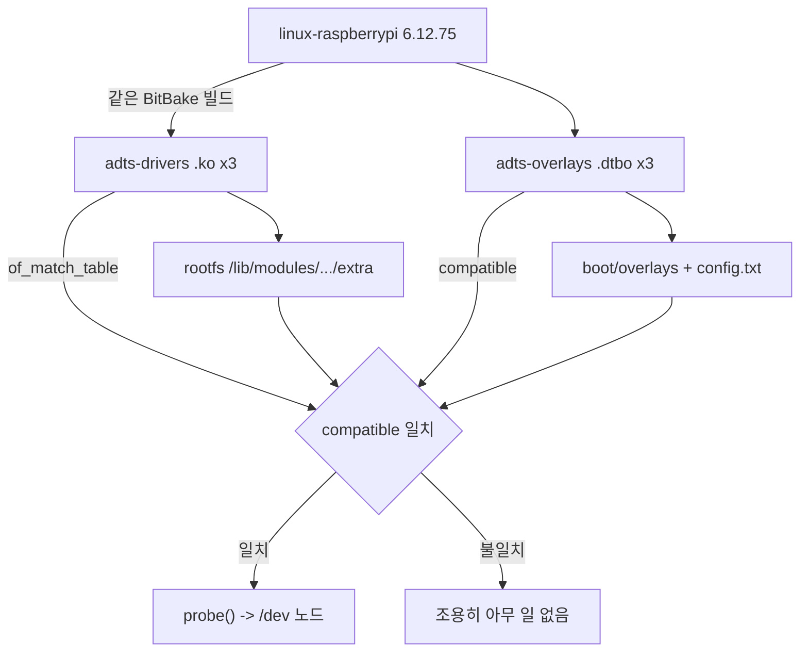

# 커널·드라이버·디바이스 트리 연결

| 항목 | 내용 |
|---|---|
| 문서 ID | `ADTS-YOC-72` |
| 담당 | 이현우 |
| 대상 소스 | `yocto/meta-adts/recipes-kernel/`, `recipes-bsp/adts-overlays/` |
| 기준 코드 | Yocto `8f4e897` (2026-08-20) · RPi `SRCREV 7b347a4` |

---

## 1. 개요

드라이버가 실제 장치로 나타나려면 네 단계가 전부 맞아야 한다.

```
1. 커널과 외부 모듈이 같은 빌드에서 만들어진다
2. .ko 가 rootfs 에 설치되고 필요한 모듈이 적재된다
3. .dtbo 가 부트 파티션에 들어가며 config.txt 에서 활성화된다
4. DT 의 compatible 과 드라이버의 of_match_table 이 일치해 probe() 가 호출된다
```

패키지 설치와 장치 생성은 별개다.

```
패키지 설치 -> 모듈 적재 -> DT 적용 -> compatible 일치 -> probe 성공 -> /dev 노드
```

문제 진단은 이 순서대로 끊어서 보는 것이 빠르다.



---

## 2. 커널 핀

`linux-raspberrypi_6.12.bbappend` 가 덮어쓴다.

```
LINUX_VERSION  = 6.12.75
SRCREV_machine = 8561d7d545fc55308ff98161ef1819f181f53ca6
SRCREV_meta    = e66f40994fc740818776a0f3af55e8b6d74bfbef
```

Raspberry Pi OS 에서 검증한 소스 버전과 맞춰 Yocto 고유 문제와 커널 버전 차이를
분리한다.

같은 버전 번호라고 `.ko` 가 호환되지는 않는다. 커널 config, `CONFIG_LOCALVERSION`,
`Module.symvers` 까지 맞아야 하고, 그래서 커널과 모듈을 한 BitBake 빌드에서 만든다.

`SRCREV_meta` 는 6.12.93 레시피가 쓰던 Yocto kernel-cache revision 을 그대로 유지한다.
같은 stable 시리즈라 대개 동작하지만, metadata/config 검사 경고가 나오면 이 조합을 먼저
의심할 것.

이 핀이 적용되려면 `BBFILE_PRIORITY_adts = 10` 이 `meta-raspberrypi`(9)보다 높아야 한다
([layers-and-recipes.md](layers-and-recipes.md) 2.1).

---

## 3. 드라이버 3종

| 모듈 | 버스/역할 | 노드 | 담당 |
|---|---|---|---|
| `turret_driver.ko` | serdev, STM32 와 UART0(GPIO14/15) | `/dev/turret` | 이현우 |
| `imu_driver.ko` | I2C1, ICM-20948 `0x69` | `/dev/imu` | 송영빈 |
| `led_sw_driver.ko` | platform, LED×3 / 스위치×2 / 부저 | `/dev/led_sw` | 강유근 |

세 모듈이 `driver/Makefile` 하나의 `obj-m` 에 함께 있으므로 레시피도 하나로 만든다.

---

## 4. 오버레이 3종

| 오버레이 | 부모/버스 | `compatible` |
|---|---|---|
| `turret-overlay` | `uart0` 자식 | `adts,turret` |
| `imu-overlay` | `i2c1` 자식 | `adts,imu-icm20948` |
| `led-sw-overlay` | platform 노드 | `adts,led-sw` |

`dtc -@` 가 필수다. `__symbols__` 를 포함해야 `&uart0`, `&i2c1` 같은 phandle 참조를 실행
시 해석할 수 있다. 없으면 오버레이가 적용되지 않는데 오류도 나지 않는다.

### 4.1 소스 동기화 규칙

드라이버 레시피와 오버레이 레시피는 같은 RPi 커밋을 쓴다.

```
SRCREV = "7b347a4e41deeaf16da584aca48ca2c1420d319f"
```

드라이버를 수정하면 RPi 저장소에 push 한 뒤 두 레시피의 `SRCREV` 를 함께 갱신해야
한다. `compatible` 과 `of_match_table` 이 어긋나면 빌드 오류 없이 안 붙는다. 이
프로젝트에서 "빌드는 됐는데 장치가 없다"의 1순위 원인이다.

---

## 5. 부팅 시 적재

```bitbake
KERNEL_MODULE_AUTOLOAD += "turret_driver imu_driver led_sw_driver"
```

이 변수가 `/etc/modules-load.d/` 항목을 만든다. 패키지 설치와 모듈 적재는 별개다.

---

## 6. `led_sw` 부팅 시 `-EPROBE_DEFER`

### 6.1 관찰

```
부팅 4.5s / 5.7s
  -> of_get_named_gpio 유예
  -> legacy GPIO 17/18 fallback
  -> gpio_request_one = -517 (-EPROBE_DEFER)
  -> 모듈 적재 실패
```

부팅 완료 후 수동 `modprobe` 는 DT 를 정상 해석해 성공한다. Raspberry Pi OS 와 Yocto
모두에서 같은 증상이므로 패키징이 아니라 드라이버의 적재 시점 의존 문제다.

### 6.2 원인

두 겹이다.

1. GPIO/PWM 컨트롤러가 아직 준비되지 않은 시점에 fallback 경로로 진입한다.
2. gpiochip base 가 512 이므로 BCM 번호를 그대로 legacy 정수 GPIO 로 쓰는 fallback 이
   애초에 유효하지 않다.

재시도 가능한 상황(`-EPROBE_DEFER`)을 영구 실패로 바꾸면서 로그도 남기지 않았다.
재시도를 넣어도 존재하지 않는 번호를 다시 요청할 뿐이라 효과가 없다.

커널 로그의 `-517` 은 `-EPROBE_DEFER` 다. 이 값을 삼키면 커널의 재시도 메커니즘이
통째로 무력화된다.

### 6.3 대응

| 시점 | 조치 |
|---|---|
| 단기 | 자동 적재를 끄고 systemd 로 시스템 초기화 이후 적재 |
| 근본 | DT descriptor 기반 API 로 통일하고 `-EPROBE_DEFER` 를 그대로 상위로 올린다. 잘못된 legacy fallback 제거 |

`-EPROBE_DEFER` 를 올릴 때 전역 포인터를 남기면 안 된다. devm 이 메모리를 회수하므로
재probe 가 해제된 메모리를 쓴다.

### 6.4 IMU probe `-5 (EIO)`

DT 가 `1-0069` 에 바인딩되고 드라이버가 통신을 시도했지만 칩이 응답하지 않은 상태다.
ICM-20948 이 물리적으로 연결되지 않았다면 정상적인 실패다. 배선·전원·주소를 확인한
실기에서 다시 판단한다.

---

## 7. 검증

| 항목 | 방법 | 등급 | 결과 |
|---|---|---|---|
| 커널 버전 핀 | `bitbake -e` | B | 6.12.75 |
| 모듈 3종 빌드 | 단계별 이미지 phase2 | B | 성공 |
| DTBO 3종 빌드 | `dtc -@` | B | 성공 |
| `/dev/turret` 생성 | Raspberry Pi OS 실기 | A | 정상 |
| `/dev/led_sw` 부팅 자동 생성 | 실기 | D | 6절 |
| `/dev/imu` | 실기 | C | `-EIO` — 배선 확인 필요 |
| Yocto 이미지 부팅 후 3종 | — | D | 미실행 |

---

## 8. 참고

- 커널 핀: `yocto/meta-adts/recipes-kernel/linux/linux-raspberrypi_6.12.bbappend`
- 드라이버 레시피: `yocto/meta-adts/recipes-kernel/adts-drivers/adts-drivers_git.bb`
- 오버레이 레시피: `yocto/meta-adts/recipes-bsp/adts-overlays/adts-overlays_git.bb`
- 드라이버 구현: [../rpi/driver/README.md](../rpi/driver/README.md)
- 레시피 해설: [layers-and-recipes.md](layers-and-recipes.md)
