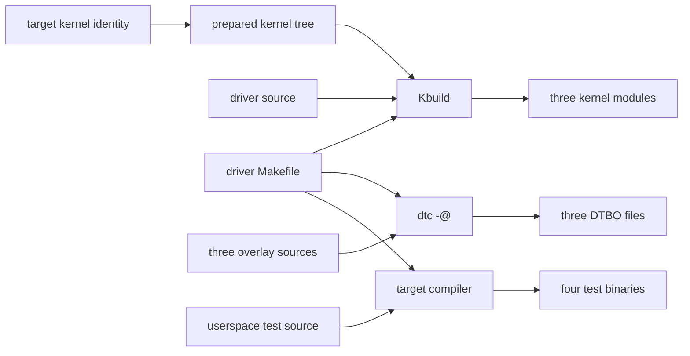

# RPi 커널 모듈과 Device Tree overlay 빌드

RPi의 커널 모듈·Device Tree overlay와 userspace 검사 도구를 재현 가능하게 빌드하고,
배포 대상 커널과의 일치 여부를 검증하는 절차를 정리한다.

| 항목 | 값 |
|---|---|
| 문서 ID | `ADTS-RPI-KERNEL-BUILD` |
| 담당 | 이현우 |
| 기준 코드 | RPi `62f3d7b` (2026-08-24) |
| 빌드 정의 | `RPi/driver/Makefile` |
| 원본 자료 | `RPi/driver/KERNEL_BUILD.md`, `RPi/docker/README.md` |
| 검증 커널 | `6.12.75+rpt-rpi-v8`, ARM64 |

## 빌드 경계

이 문서는 `RPi/driver/`에서 생성하는 kernel space 산출물과 검사 도구를 다룬다.
daemon CMake build, systemd 설치, module 적재와 boot 설정은 이 문서의 범위에 포함하지
않는다. Yocto image는 같은 source를 recipe task 안에서 다시 빌드한다.



`driver/Makefile`의 공개 target과 산출물은 다음과 같다.

| target | 산출물 |
|---|---|
| `modules` | `turret_driver.ko`, `imu_driver.ko`, `led_sw_driver.ko` |
| `dtbo` | `turret-overlay.dtbo`, `imu-overlay.dtbo`, `led-sw-overlay.dtbo` |
| `apps` | `turret_test`, `imu_test`, `led_sw_test`, `encoder_jitter_test` |
| `all` | `dtbo`, `modules`, `apps` 전체 |
| `rpi` | ARM64용 변수를 적용한 `all` |

Makefile에서 첫 번째 일반 target은 `apps`이다. 따라서 인자 없는 `make`에 전체 빌드를
의존하지 않고 `modules`, `dtbo`, `apps`, `all` 중 필요한 target을 명시한다.

## 대상 커널 일치 조건

out-of-tree module은 실행 중인 kernel과 독립적인 바이너리가 아니다. module release와
architecture가 대상 kernel과 일치해야 하며, `CONFIG_MODVERSIONS`를 사용하는 kernel에서는
symbol CRC도 일치해야 한다.

| 입력 | 역할 |
|---|---|
| kernel source 또는 headers tree | kbuild와 kernel API 제공 |
| `.config` | target kernel feature와 local version 결정 |
| `Module.symvers` | exported symbol CRC 제공 |
| prepared script·generated header | external module compile 지원 |
| target compiler | module과 검사 도구의 architecture 결정 |

`make modules_prepare`는 generated header와 script를 준비하지만 target의
`Module.symvers`를 생성하지 않는다. cross build에서는 target headers가 제공하는
`Module.symvers`를 별도로 사용한다.

RPi에서 다음 값으로 build tree가 실행 kernel과 연결돼 있는지 먼저 확인한다.

```bash
target_krel=$(uname -r)
printf 'target kernel: %s\n' "$target_krel"
test -f "/lib/modules/$target_krel/build/Makefile"
```

검사가 실패하면 실행 kernel과 같은 release의 headers를 설치한 뒤 다시 확인한다. kernel이
갱신되면 이전 `.ko`를 재사용하지 않고 새 headers 또는 source tree로 다시 빌드한다.

## RPi native 빌드

실행 대상 RPi에서 빌드하면 `/lib/modules/$(uname -r)/build`가 기본 `KDIR`로 선택된다.
저장소 root에서 다음 target을 명시적으로 실행한다.

```bash
cd RPi
make -C driver modules
make -C driver dtbo
make -C driver apps
```

세 종류를 한 번에 빌드할 때는 `all`을 사용한다.

```bash
make -C driver all
```

module build에는 실행 kernel과 일치하는 prepared headers가 필요하다. overlay build에는
`dtc`, 검사 도구 build에는 target용 GCC가 필요하다.

## ARM64 Docker 빌드

비Linux ARM64 개발 장비에서는 `RPi/docker/Dockerfile`이 준비하는 Raspberry Pi kernel
source와 Linux build tool을 사용한다. target kernel의 `.config`와 `Module.symvers`는
Docker image에 포함하지 않고 대상 RPi에서 가져온다.

개발 장비에서 target release와 접속 정보를 지정하고 kernel 입력을 준비한다.

```bash
target_krel='6.12.75+rpt-rpi-v8'
target_host='pi@<rpi-address>'
kernel_input='/absolute/path/to/pi-kernel'

mkdir -p "$kernel_input"
scp "$target_host:/usr/src/linux-headers-$target_krel/.config" \
  "$kernel_input/.config"
scp "$target_host:/usr/src/linux-headers-$target_krel/Module.symvers" \
  "$kernel_input/Module.symvers"
```

대상 RPi에는 해당 release의 headers가 설치돼 있어야 한다. 개발 장비에서는 RPi 저장소의
Dockerfile로 image를 만들고 source와 kernel 입력을 mount한다.

```bash
repo_root='/absolute/path/to/Final_Project/RPi'

docker build -t adts-build "$repo_root/docker"
docker run --rm -it \
  -e TARGET_KREL="$target_krel" \
  -v "$repo_root:/work" \
  -v "$kernel_input:/pi-kernel:ro" \
  adts-build bash
```

ARM64 container 안에서 kernel tree를 준비하고 release 문자열을 확인한 뒤 빌드한다.

```bash
cd /usr/src/linux
cp /pi-kernel/.config .config
export ARCH=arm64
make olddefconfig
make LOCALVERSION= modules_prepare
cp /pi-kernel/Module.symvers .

test "$(cat include/config/kernel.release)" = "$TARGET_KREL"

make -C /work/driver rpi \
  RPI_KDIR=/usr/src/linux \
  RPI_ARCH=arm64 \
  RPI_CROSS= \
  LOCALVERSION=
```

현재 Dockerfile의 기본 compiler는 ARM64 host에서 native compile하는 구성을 기준으로 한다.
x86_64 host에서는 image에 `gcc-aarch64-linux-gnu`를 추가하고
`RPI_CROSS=aarch64-linux-gnu-`를 지정한다. module과 userspace 검사 도구는 같은 target
architecture로 빌드한다.

## 산출물 검증

### module architecture와 vermagic

`modinfo`는 build container 또는 Linux target에서 실행한다. `vermagic`의 첫 field가 대상
`uname -r`과 같아야 한다.

```bash
expected_krel='6.12.75+rpt-rpi-v8'

for module in \
  driver/turret_driver.ko \
  driver/imu_driver.ko \
  driver/led_sw_driver.ko
do
  file "$module" | grep 'ARM aarch64'
  actual_krel=$(modinfo -F vermagic "$module" | awk '{print $1}')
  test "$actual_krel" = "$expected_krel"
done
```

release·architecture 검사만으로 symbol CRC까지 증명되지는 않는다. 최종 적재 검사는 대상
RPi에서 수행하며, installer가 module을 교체하는 운영 경로에서는 현재 사용 중인 module을
내린 뒤 `modprobe` 결과와 kernel log를 확인한다.

### Device Tree overlay

세 DTBO가 존재하고 `dtc`로 다시 해석되는지 확인한다.

```bash
for overlay in \
  driver/overlays/turret-overlay.dtbo \
  driver/overlays/imu-overlay.dtbo \
  driver/overlays/led-sw-overlay.dtbo
do
  test -s "$overlay"
  dtc -I dtb -O dts "$overlay" >/dev/null
done
```

`-@`로 생성한 overlay에는 외부 label을 위한 fixup이 포함될 수 있다. decompile warning과
명령 실패를 같은 결과로 취급하지 않고 종료 코드를 기준으로 판정한다.

### userspace 검사 도구

Docker 또는 cross build 결과는 네 실행 파일이 모두 ARM64인지 확인한다.

```bash
for app in \
  driver/turret_test \
  driver/imu_test \
  driver/led_sw_test \
  driver/encoder_jitter_test
do
  test -x "$app"
  file "$app" | grep 'ARM aarch64'
done
```

## Yocto 빌드 경로

Yocto에서는 개발용 Docker 절차를 재사용하지 않는다. BitBake가 선택한 kernel의
`STAGING_KERNEL_DIR`와 toolchain으로 source를 다시 빌드한다.

| recipe | 역할 |
|---|---|
| `yocto/meta-adts/recipes-kernel/adts-drivers/adts-drivers_git.bb` | `inherit module`, `EXTRA_OEMAKE = "KDIR=${STAGING_KERNEL_DIR}"`, `MAKE_TARGETS = "modules"` 적용 |
| `yocto/meta-adts/recipes-bsp/adts-overlays/adts-overlays_git.bb` | DTS 3종을 `dtc-native`로 compile하고 boot overlay로 설치 |

module recipe가 `MAKE_TARGETS = "modules"`를 지정하므로 userspace 검사 도구와 DTBO가 kernel
task에 섞이지 않는다. kernel recipe가 바뀌면 dependency에 따라 module도 해당 kernel
metadata로 다시 빌드된다.

## CI gate

`.github/workflows/static_analysis.yml`의 `driver-analysis`는 driver·shared source의
cppcheck와 host용 `turret_test` warning gate를 실행한다. GitHub runner에는 배포 대상
kernel tree가 없으므로 이 job은 `.ko`를 만들지 않는다. CI 통과는 source-level 정적 검사
근거이며, target용 module build·vermagic·적재 검사를 대신하지 않는다.

## 검증 기준선

2026-08-24에 RPi `62f3d7b`의 Makefile과 보존된 ARM64 build 산출물을 확인했다.

| 항목 | 결과 |
|---|---|
| `modules`, `dtbo`, `apps`, `all`, `rpi` target과 산출물 대응 | 일치 |
| module 3종 architecture | ELF 64-bit ARM aarch64 |
| module 3종 vermagic | `6.12.75+rpt-rpi-v8 SMP preempt mod_unload modversions aarch64` |
| DTBO 3종 decompile | 통과 |
| userspace 검사 도구 4종 target | ARM64 build 대상으로 정의 |

새 source 또는 kernel release를 배포할 때는 이 기준선을 그대로 재사용하지 않고 같은 명령으로
산출물을 다시 검증한다.
