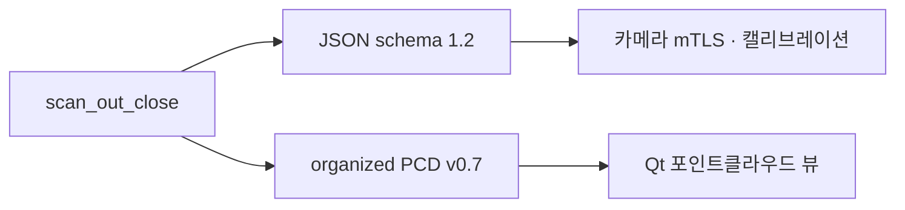

# 스캔 좌표계와 산출물

| 항목 | 내용 |
|---|---|
| 문서 ID | `ADTS-DMN-31` |
| 담당 | 이현우 |
| 대상 소스 | `RPi/daemon/core/scan_output.c`, `scan_output.h` |
| 기준 코드 | RPi `2a683ee` (2026-08-21). 대상 파일은 `149bc63` 이후 변경 없음 |
| 산출물 | JSON schema 1.2 · organized PCD v0.7 |

---

## 1. 개요

`scan_output`은 기구각을 계약각으로 변환하고, 측정값을 organized 격자에 배치한 뒤
JSON과 PCD를 생성한다. epoll·ioctl·`/dev/turret` 제어는 다루지 않는다.

| 파일 | 성격 | 소비자 |
|---|---|---|
| `..._pan_tilt_lidar.json` | 셀 대표 측정·병합 통계·메타데이터 | 카메라 mTLS 업로드와 캘리브레이션 |
| `..._sweep-000001.pcd` | 같은 격자를 3D 좌표로 투영한 파생물 | Qt 포인트클라우드 뷰 |



JSON은 PCD를 재계산하는 계약 입력이다. 셀별 대표 샘플과 거리 분포를 보존하지만,
병합 전 개별 프레임 전체를 보존하는 raw 로그는 아니다.

기본 경로는 `/var/lib/adts/scans`다. 디렉터리 생성이 실패하면 `./scans`를 사용한다.

```
calib-20260821-162255_sweep-000001_pan_tilt_lidar.json
calib-20260821-162255_sweep-000001.pcd
```

---

## 2. 기구각과 계약각

프로토콜은 모터의 기구각을 전송하고, 산출물은 `lidar_scan` 프레임의 계약각을 사용한다.
틸트 스윕이 바닥점인 nadir를 통과하므로 두 각도 체계는 일대일로 같지 않다.

```
기구 틸트 m <= 0 : 계약 pan = p         tilt = -900 - m
기구 틸트 m >  0 : 계약 pan = p + 1800  tilt = -900 + m
```

`mech_to_contract()`가 변환을 단독 소유하며 계약 pan을 `0..3599`로 정규화한다.

| 기구각 `(p, m)` | 계약각 `(pan, tilt)` | 방향 |
|---|---|---|
| `(p, -900)` | `(p, 0)` | 벽 A 수평 |
| `(p, 0)` | `(p, -900)` | nadir |
| `(p, +900)` | `(p+1800, 0)` | 벽 B 수평 |

한 틸트 스윕이 방위 `p`와 `p+180°`를 함께 훑으므로 기구 팬을 약 180° 이동해 계약
방위 360°를 채운다.

---

## 3. 계약 좌표계

프레임 이름은 `lidar_scan`, 단위는 미터다. 원점은 팬·틸트 회전축 교점이다.

```
r = (distance_mm + 84mm) / 1000
x =  r · cos(tilt) · sin(pan)
y = -r · sin(tilt)
z =  r · cos(tilt) · cos(pan)
```

| 축 | 방향 |
|---|---|
| `+x` | right |
| `+y` | down |
| `+z` | forward |

84mm는 회전축 교점에서 라이다 발광면까지의 거리다. 라이다 보고 거리에 이 값을 더한
반경을 사용한다. 센서 높이 `sensor_height_m`는 좌표에 적용하지 않고 메타데이터로만
기록한다.

| 계약각 | 1.000m 반경의 좌표 |
|---|---|
| pan 0°, tilt 0° | `(0, 0, 1)` |
| pan 90°, tilt 0° | `(1, 0, 0)` |
| tilt −90° | `(0, 1, 0)` |
| pan 180°, tilt 0° | `(0, 0, −1)` |

---

## 4. 표준 스캔과 organized 격자

### 4.1 요청과 출력

| 요청 기구각 | 값 | 출력 계약각 | 값 |
|---|---:|---|---:|
| pan | `0..1791` | 열 | 400 (`0..359.1°`) |
| tilt | `-900..+900` | 행 | 101 (`-90..0°`) |
| step | 9 (0.9°) | 셀 | 40,400 |
| height | 1805mm | 표준 소요 | 약 571.3초 |

현재 틸트 순항 속도는 750pps, 즉 84.375°/s다. 라이다 100Hz에서 순항 샘플 간격은
0.84375°이며 0.9° 셀당 약 1.067샘플을 확보한다. S-Curve 가감속 구간에서는 샘플이
더 조밀해진다.

팬 끝값 1791은 200줄 × 2방위 × 0.9°로 360°를 덮고, 첫 줄과 마지막 줄의 중복 평면을
피하기 위한 값이다. nadir를 가로지르면 방위축은 항상 360° 전체로 만들고 관측하지 않은
셀은 비워 둔다.

`scan_out_expected_points()`가 반환하는 표준 요청 진행률 분모는 40,200이고, organized
출력 배열은 40,400셀이다. 전자는 요청 범위의 기구각 위치 수, 후자는 펼쳐진 계약각
격자 크기다.

### 4.2 인덱싱

`grid_index()`는 계약 pan을 wrap-around하고 `step/2`를 더해 가장 가까운 셀로
반올림한다. full-circle 격자의 360° 인덱스는 0° 열로 접는다. 범위 밖 각도는 끝 셀로
고정하지 않고 `out_of_range_angle_count`에 집계한 뒤 제외한다.

셀 순서는 row-major이며 row 0이 가장 높은 계약 tilt다. 관측하지 않은 셀도 배열에서
제거하지 않으므로 JSON과 PCD의 같은 `(row, column)`은 같은 방향을 뜻한다.

### 4.3 병합

같은 셀에 여러 샘플이 들어오면 거리 분포를 누적하고 셀 중심에 가장 가까운 샘플을
대표 메타데이터로 선택한다.

| 판정 | 조건 | 출력 거리 |
|---|---|---|
| 평균 가능 | `samples >= 2`, spread ≤ `max(30mm, min_distance × 15%)` | 반올림 평균 |
| 평균 거부 | spread가 허용치를 초과 | 대표 샘플 거리 |

평균 거부는 깊이 불연속에서 앞뒤 표면의 거리를 섞어 허공의 점을 만드는 것을 막는다.

---

## 5. PCD v0.7

```text
# .PCD v0.7 - adts scan (organized)
# frame = lidar_scan (origin = pan/tilt axis intersection)  +x right +y down +z forward  unit = meter
# range_offset_m = 0.0840
# sensor_height_m = 1.8050
# session=calib-20260821-162255 scan=sweep-000001
VERSION 0.7
FIELDS x y z
SIZE 4 4 4
TYPE F F F
COUNT 1 1 1
WIDTH 400
HEIGHT 101
VIEWPOINT 0 0 0 1 0 0 0
POINTS 40400
DATA ascii
```

- `WIDTH × HEIGHT = POINTS`를 유지한다.
- 관측하지 않은 셀은 `nan nan nan`으로 기록한다.
- 관측된 셀은 `x y z`를 소수점 아래 4자리로 기록한다.
- PCD에는 기구각·센서 상태·병합 통계가 없으므로 해당 정보는 JSON에서 읽는다.

---

## 6. JSON schema 1.2

| 블록 | 내용 |
|---|---|
| `interface_version` / `schema_version` | `1.0` / `1.2` |
| `session_id` / `scan_id` | 세션 시각 / 스캔 식별자 |
| `producer` | `adts_daemon`, protocol version |
| `sensor` | 모델, 100Hz, `range_offset_m` |
| `frame` | 프레임 이름·축·변환식 |
| `scan` | 격자 크기·계약각 범위·높이·시간 |
| `mechanism` | 기구각 요청·홈 provenance·각도 출처 |
| `diagnostics` | 병합·평균거부·범위밖·상태 히스토그램 |
| `measurements` | 빈 셀을 포함한 40,400개 row-major 요소 |

```json
{ "sequence": 0, "row": 0, "column": 0,
  "timestamp_ns": 22991773463822,
  "device_time_ms": 22999333, "stm32_time_ms": 2053766,
  "pan_rad": 0.000000, "tilt_rad": -0.001745,
  "distance_m": 0.3250, "distance_status": 1,
  "samples": 4, "spread_mm": 4, "signal_strength": 8004,
  "range_precision_raw": 255, "checksum_valid": true,
  "angle_source": "step_count", "timestamp_source": "host_rx_monotonic",
  "valid": true,
  "quality_flags": ["VALID_RANGE","RANGE_AVERAGED","RANGE_PRECISION_NA"] }
```

### 6.1 필드 의미

| 필드 | 의미 |
|---|---|
| `scan.sample_count` | 수신 프레임 수가 아니라 `rows × columns`, 즉 배열 길이 |
| `scan.valid_count` | `filled` 셀 수 |
| `sequence` | 셀이 처음 채워진 순서 |
| `samples` | 해당 셀에 병합된 샘플 수 |
| `timestamp_ns` | 대표 샘플의 호스트 수신 단조 시각 |
| `distance_m` | 라이다 발광면 기준 거리. 좌표 계산 시 `range_offset_m`을 더함 |
| `valid` | 셀이 채워졌는지 여부 |
| `distance_status` | F2 P가 보고한 원본 거리 상태 |

빈 셀은 측정 필드를 `null`, `samples`를 0, `valid`를 `false`, `quality_flags`를
`["NO_MEASUREMENT"]`로 기록한다. 채워진 셀의 `valid`는 셀 존재 여부이므로 소비자는
품질 정책에 따라 `distance_status`와 `quality_flags`를 별도로 해석한다.

홈 provenance는 14비트 팬·틸트 엔코더 raw 값과 홈 각도를 보존한다. 개별 측정각은
현재 `angle_source: "step_count"`이며 개별 `pan_encoder_count`·`tilt_encoder_count`는
`null`이다.

---

## 7. 파일 수명주기

`scan_out_open()`은 요청을 복사하고 출력 경로를 정한 뒤 PCD 최종 경로를 실제로
열었다 지워 쓰기 가능 여부를 확인한다. 이어 101×400 격자를 메모리에 할당한다.

`scan_out_add()`는 점을 계약각으로 변환해 격자에 배치한다. `scan_out_close()`는 JSON과
PCD를 기록하고 두 `fclose()` 결과가 모두 성공한 경우에만 `true`를 반환한다. 호출 후
격자와 핸들을 해제하고 포인터를 `NULL`로 만든다.

---

## 8. 검증 기준선

| 항목 | 근거 | 결과 |
|---|---|---|
| 현재 소스 host harness | 2026-08-24 macOS clang `-Werror`, 4개 축 방향점 | expected 40,200, 격자 101×400, JSON/PCD 생성 통과 |
| 실측 쌍 전수 대조 | 2026-08-21 750pps Run 2 JSON/PCD, 40,400셀 | row-major·NaN·유한점·병합 수 일치 |
| 유한 좌표 재계산 | JSON 거리·각도·84mm offset으로 PCD 전수 재계산 | 40,182점 일치, 최대 차이 0.054mm |
| 보존 항등식 | filled 40,182 + merged 13,573 | 상태 히스토그램 합 53,755와 일치 |
| 실기 시간 | 같은 Run 2 | 571.3초, filled 99.46%, 범위 밖 0 |

---

## 9. 참고

- 구현: `RPi/daemon/core/scan_output.c`, `scan_output.h`
- 요청 기본값과 공유 상태: `RPi/shared/daemon_module.h`
- 기구각 wire 계약: `RPi/shared/protocol.h`
- 실측 기준선: `STM32/docs/motor_profile_test/raw_data/scan_phase4_750pps_run2.{json,pcd}`
