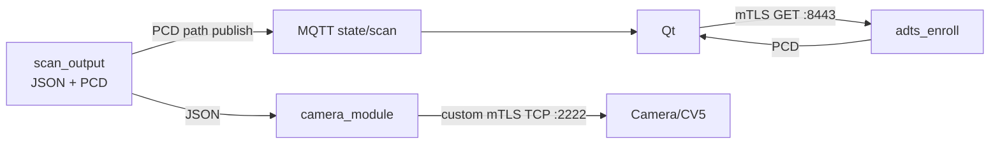

# 스캔 산출물 포맷 — `.json` / `.pcd` 전 필드 레퍼런스

> 출처: 스캔 산출물 포맷 상세 (팀 위키 문서)
> **이 사본**: 2026-08-21 기준 스냅샷
> 구현: `RPi/daemon/core/scan_output.c` · 담당 이현우
> 기준: `develop/a21a23f` · `schema_version 1.2` / `interface_version 1.0` / `protocol_version 5`

스캐너 데몬이 스캔 1회마다 내놓는 **두 파일**의 모든 필드를 설명한다.
소비자(카메라 단 캘리브레이션 / Qt 뷰어)가 이 문서만 보고 파싱할 수 있어야 한다.

## 0. 한눈에

스캔 1회 → 파일 **2개**가 같은 디렉터리(`/var/lib/adts/scans`)에 떨어진다.

| 파일 | 내용 | 크기(0.9° 격자) | 용도 |
|---|---|---|---|
| `<session>_<scan>_pan_tilt_lidar.json` | **원시 측정** (각도 + 거리 + 품질) | 약 25 MB | 계약상 **golden reference**. 캘리브 입력 |
| `<session>_<scan>.pcd` | **변환 후 (x,y,z)** | 약 0.9 MB | 뷰어·시각 확인용 편의 산출물 |

예: `calib-20260811-091522_sweep-000001_pan_tilt_lidar.json`

- `session_id` = `calib-<YYYYMMDD>-<HHMMSS>` (스캔 시작 시각, 로컬 시간)
- `scan_id` = `sweep-000001` (현재는 세션당 1회 고정)

> ⚠️ 현재 이름은 초 단위 시각 + 고정 scan ID라 **같은 초에 두 결과를 마감하면 기존
> 파일을 덮어쓸 수 있다.** 운영에서는 동시/연속 trigger를 피하고, 코드에서는 subsecond
> 또는 monotonic sequence + exclusive create/atomic rename이 필요하다.

> ⚠️ **JSON에는 x/y/z가 없다.** 일부러 그렇다. 좌표는 `distance_m` + 각도에서 소비자가
> 직접 계산한다 — 변환식이 바뀌어도 원시 데이터가 오염되지 않게 하기 위해서다. PCD는
> 그 계산을 미리 해 둔 **편의본**이지 진실의 원본이 아니다.

## 1. 좌표계 계약 (가장 중요)

```
frame name  : lidar_scan
origin      : pan/tilt 회전축 교점  ← 라이다 발광면이 아니다
handedness  : right
convention  : +x right, +y down, +z forward
unit        : meter, radian
```

### 1.1 변환식

```
r = distance_m + sensor.range_offset_m       ← 반드시 더할 것 (§1.2)

x =  r * cos(tilt) * sin(pan)
y = -r * sin(tilt)
z =  r * cos(tilt) * cos(pan)
```

### 1.2 ⚠️ `range_offset_m`을 빠뜨리면 방 전체가 수축한다

`measurements[].distance_m`은 라이다 **발광면 기준** 거리다. 좌표 원점은 **회전축
교점**이라 그 사이 거리(실측 **84 mm**)를 더해야 한다.

```
 원점(축교점) ●────84mm────▷ 발광면 ────── d(라이다 보고) ──────▶ 표적
              └──────────── r = d + 84mm ──────────────────────┘
```

빠뜨리면 장면 전체가 원점 쪽으로 84mm 균일하게 수축한다. 그런데 **평면 잔차로는 안
잡힌다** — 평평한 면은 여전히 평평하게 적합되기 때문이다. 대신 곡률로 나타난다:
천장까지 수직거리 `H`인 면을 입사각 `α`로 보면 `H − 84·cos α`로 휘어 보인다.
그래서 캘리브가 미묘하게 안 맞는데 원인을 못 찾는 형태가 된다.

### 1.3 ⚠️ 각도가 두 종류다 — 혼동 주의

같은 JSON 안에 **기구각**과 **계약각**이 함께 들어 있다.

| | 어디에 | 0이 가리키는 곳 | 범위 |
|---|---|---|---|
| **계약각** | `measurements[].pan_rad`/`tilt_rad`, `scan.*_rad`, 좌표식 | tilt 0 = **수평** | tilt −90°~0°, pan 0°~360° |
| **기구각** | `mechanism.tilt_zero`, `mechanism.*_range_ddeg` | tilt 0 = **nadir**(바로 아래) | tilt −90°~+90°, pan 0°~180° |

`mechanism.tilt_zero = "nadir"`는 모터 축의 영점을 말하는 것이지 좌표의 φ가 아니다.
이걸 φ 정의로 읽으면 전체가 90° 틀어진다.

- ICD의 φ가 "수평 기준 고각, 아래가 음수" → `tilt_rad`를 그대로 사용
- ICD의 φ가 "nadir 기준" → `φ = tilt_rad + 90°`

**왜 둘이 다른가**: 2축 스윕은 틸트가 바닥(nadir)을 지나가므로, 한 줄이 방위 *p*와
*p+180*을 **함께** 훑는다. 그래서 기구각과 계약각이 1:1이 아니다.

```
기구 tilt m ≤ 0 :  계약 pan = p        tilt = -90 - m
기구 tilt m >  0 :  계약 pan = p + 180  tilt = -90 + m
```

팬 모터가 0~180°만 돌아도 계약 방위 360°가 채워지는 이유가 이것이다.

### 1.4 ⚠️ 좌표에 들어가지 않는 값

| 값 | 좌표 반영 | 설명 |
|---|---|---|
| `sensor.range_offset_m` (0.084) | ✅ **들어감** | 축교점 → 발광면 |
| `scan.sensor_height_m` | ❌ **메타데이터만** | 지면 → **회전축 교점** 높이 |
| 카메라 중심 위치 | ❌ 정보 없음 | 캘리브가 푸는 외부 파라미터 |

`sensor_height_m`을 좌표에 반영하지 않는 이유: frame 이름이 `lidar_scan`이면 원점은
라이다 자신이므로 `tilt=0`인 점의 `y`는 0이어야 한다. 예전에 높이를 빼서 모든 y가
−1.2m로 찍힌 적이 있는데, 그건 사실상 `actuator_base` 계열 좌표라 라벨과
불일치였다(2026-07-29 수정).

### 1.5 ⚠️ 미검증 — 방위 부호(손대칭)

`pan`이 증가할 때 빔이 시계 방향으로 도는지 반시계인지 **아직 실기로 확인하지 않았다.**
평평한 천장·바닥은 회전 대칭이라 mirror 버그를 못 잡는다. **비대칭 지형지물로 대조하기
전까지는 방위의 손대칭을 신뢰하지 말 것.**

또한 `pan = 0`은 **팬 축의 기구 홈**(펌웨어의 `MOTOR_PAN_ZERO_OFFSET_DEG` 상수)이며
카메라 광축과 아무 관계가 없다. 그 회전을 찾는 것이 캘리브레이션의 목적이다.

## 2. organized grid — 두 파일의 공통 구조

두 파일 모두 **행×열 격자**를 순서대로 나열한다. `row-major`.

```
row    = 고각(elevation).  row 0 = tilt 최댓값(0°=수평), 아래로 갈수록 −90°(nadir)
column = 방위(azimuth).    col 0 = 방위 0°, 항상 한 바퀴(360°)
```

0.9° 격자 표준 스캔이면 **101행 × 400열 = 40,400셀**.

### 2.1 ⚠️ 열 수는 "스팬/스텝+1"이 아니다

방위 축은 **언제나 360° 한 바퀴로 고정**한다. 스윕이 바닥을 넘으면 덮이는 방위가 두
토막으로 갈라질 수 있어(예: 팬 0~90° → 방위 0~90°와 180~270°), 연속된 열에 담기지
않기 때문이다. 안 훑은 방위는 **빈 셀**로 남긴다.

이렇게 하면 **열 번호가 절대 방위와 1:1**이 되어 소비자 해석이 단순해진다.

```
col  →  방위(deg) = col × step_deg
row  →  고각(deg) = tilt_max_deg − row × step_deg
```

### 2.2 빈 셀

측정이 없는 셀은 **구멍이 아니라 명시적으로** 표시된다.

| 파일 | 빈 셀 표현 |
|---|---|
| JSON | 모든 값 `null`, `"valid": false`, `quality_flags: ["NO_MEASUREMENT"]` |
| PCD | `nan nan nan` |

**빈 셀은 정상이다.** 대표적으로 ① 팬을 180°만 돌리므로 nadir 행의 절반은 원리적으로
안 찍힌다 ② 라이다가 무효를 반환한 방향(흡수·경면반사·범위 밖).

### 2.3 ⚠️ 세 가지 "개수"가 서로 다르다

| 숫자 | 뜻 | 실측 예 |
|---|---|---|
| `rows × columns` | 격자 셀 수 | 101 × 400 = **40,400** |
| `event/progress.expected` | 기구 샘플 수 어림값(팬 줄 × 틸트 스텝) | 200 × 201 = **40,200** |
| 실제 수신 샘플 | 연속 스윕이라 격자점에 안 맞음 | **41,255** |
| `scan.valid_count` | 실제로 채워진 셀 | **40,355** |

연속 스윕에서 라이다는 100Hz로 계속 쏘므로 샘플이 격자점에 딱 맞춰 나오지 않는다.
**실제 샘플 수가 `expected`를 넘을 수 있다**(진행률이 100%를 초과할 수 있음).

### 2.4 셀 병합 — 한 셀에 샘플이 여러 개 올 때

틸트 45°/s ÷ 라이다 100Hz = **0.45°/샘플**이므로 0.9° 격자에는 샘플이 보통 **2개씩**
떨어진다.

> ⚠️ 이 수치는 문서마다 다르다 — MQTT 계약과 아키텍처 문서는 90°/s(셀당 1점)로 적고
> 있고, 2026-08-11 스캔 실측(206점/줄)도 90°/s에 가깝다. 현재 STM32 코드는
> TIM2 = 400Hz(45°/s)다. 어느 쪽이 의도인지 확인 필요.

- **거리**: 누적해서 평균 후보로 삼는다
- **각도·시각·품질 필드**: 셀 중심에 **가장 가까운 샘플**의 값으로 대표를 삼는다

평균을 쓸지는 산포로 판단한다:

```
허용치 tol = max(30mm, 가까운쪽거리 × 15%)
spread = d_max − d_min
spread ≤ tol  →  평균 사용     (flag: RANGE_AVERAGED)
spread >  tol →  대표값 사용   (flag: AVG_REFUSED_SPREAD)
```

**왜 무조건 평균하지 않나**: 셀이 깊이 에지(벽 모서리 등)를 물면 두 샘플이 서로 다른
면을 맞는다. 그걸 평균하면 **어느 면에도 없는 가짜 점**이 생긴다. 우리 미션이 구조
에지 기반 캘리브라 이 가짜 점이 정확도보다 훨씬 해롭다.

**상대 허용치(15%)를 같이 두는 이유**: 비스듬히 스치는 면은 한 셀 안에서도 거리차가
원래 크다. 0.9° × 10m = 16cm 폭이고 입사각 80°면 정상 깊이차가 45cm까지 나온다.
절대치만 쓰면 정작 평균이 필요한 자리에서 전부 거부된다. 진짜 에지는 보통 m 단위로 뛴다.

> 💡 `AVG_REFUSED_SPREAD` 플래그는 **깊이 에지 후보**라는 뜻이라, 하류 에지 검출에
> 그대로 단서로 쓸 수 있다.

## 3. `.json` — 원시 측정 (golden reference)

### 3.1 전체 구조

```json
{
  "interface_version": "1.0",
  "schema_version": "1.2",
  "session_id": "calib-20260811-091522",
  "scan_id": "sweep-000001",
  "producer": { ... },
  "sensor":   { ... },
  "frame":    { ... },
  "units":    { ... },
  "scan":     { ... },
  "mechanism":{ ... },
  "diagnostics": { ... },
  "measurements": [ ... ]      ← rows × columns 개, row-major
}
```

### 3.2 헤더 블록

**`producer`**

```json
"producer": { "software": "adts_daemon", "protocol_version": 5 }
```

**`sensor`**

```json
"sensor": { "model": "TOFSense-F2P", "lidar_rate_hz": 100, "range_offset_m": 0.0840 }
```

| 필드 | 설명 |
|---|---|
| `model` | 라이다 모델. TOFSense-F2 P |
| `lidar_rate_hz` | 100 (하드 상한) |
| `range_offset_m` | **회전축 교점 → 발광면 거리. §1.2 참조 — 반드시 더할 것** |

**`frame`**

```json
"frame": {
  "name": "lidar_scan",
  "origin": "pan_tilt_axis_intersection",
  "handedness": "right",
  "convention": "+x right, +y down, +z forward; pan+ right, tilt+ up",
  "range_formula": "r = distance_m + sensor.range_offset_m; x = r*cos(tilt)*sin(pan), y = -r*sin(tilt), z = r*cos(tilt)*cos(pan)"
}
```

변환식이 **문자열로 파일 안에 들어 있다.** 문서와 데이터가 어긋날 여지를 없애기 위해서다.

**`units`**

```json
"units": { "distance": "meter", "angle": "radian", "timestamp": "nanosecond" }
```

**`scan`**

```json
"scan": {
  "mode": "continuous_tilt_sweep",
  "rows": 101, "columns": 400,
  "pan_min_rad": 0.000000, "pan_max_rad": 6.267477,
  "tilt_min_rad": -1.570796, "tilt_max_rad": 0.000000,
  "grid_step_rad": 0.015708,
  "sensor_height_m": 2.4000,
  "sample_count": 40400,
  "valid_count": 40355,
  "started_at_ns": 253434413722,
  "ended_at_ns": 1098973811377
}
```

| 필드 | 설명 |
|---|---|
| `mode` | `continuous_tilt_sweep`. step-and-shoot 빌드는 다른 값 |
| `rows`/`columns` | 격자 크기 |
| `pan_min_rad`/`pan_max_rad` | **계약각** 방위 범위. 열 0 ~ 열 N−1의 중심각 |
| `tilt_min_rad`/`tilt_max_rad` | **계약각** 고각 범위. `max`가 row 0 |
| `grid_step_rad` | 격자 간격 (0.9° = 0.015708 rad) |
| `sensor_height_m` | 지면→회전축 높이. **좌표 미적용**(§1.4). `0`이면 모름 |
| `sample_count` | = `rows × columns` |
| `valid_count` | 실제로 채워진 셀 수 |
| `started_at_ns`/`ended_at_ns` | RPi 단조시계(`CLOCK_MONOTONIC`) 기준 ns |

> ⚠️ **헤더의 각도 범위는 계약각이고,** `mechanism`의 범위는 기구각이다. 요청은 기구각으로
> 들어오지만 헤더에 그대로 실으면 헤더의 pan(0~180)과 measurements의 pan(0~360)이 어긋나
> 소비자가 데이터를 범위 밖으로 판정한다.

> ⚠️ **시각은 전부 같은 clock domain이어야 한다.** `started_at_ns`/`ended_at_ns`/
> `measurements[].timestamp_ns`는 셋 다 RPi 단조시계다. STM32 시계는 별도
> 필드(`stm32_time_ms`)로 보존한다 — 섞으면 measurement 24초 vs scan 749초처럼 전부
> 범위 밖이 된다(실제 겪음).

**`mechanism`**

```json
"mechanism": {
  "sweep_axis": "tilt", "index_axis": "pan", "tilt_zero": "nadir",
  "angle_source": "step_count", "home_method": "absolute_encoder",
  "pan_range_ddeg": [0, 1791], "tilt_range_ddeg": [-900, 900],
  "step_ddeg": 9,
  "home": { "pan_encoder_raw": 7610, "tilt_encoder_raw": 13741,
            "pan_ddeg": 64, "tilt_ddeg": -102, "encoder_bits": 14 }
}
```

**계약각으로 환산하기 전의 기구 원본.** 산출물이 이상할 때 "변환 문제인지 구동
문제인지"를 가르는 근거다.

| 필드 | 설명 |
|---|---|
| `sweep_axis`/`index_axis` | 빠른 축 / 느린 축. 현재 틸트가 빠른 축 |
| `tilt_zero` | **모터 축의 영점 위치. 좌표의 φ가 아니다 (§1.3)** |
| `angle_source` | `step_count` = 스텝 카운터. 스윕 중 엔코더는 읽지 않는다 |
| `home_method` | `absolute_encoder` (MT6701). 리밋스위치 없음 |
| `pan_range_ddeg`/`tilt_range_ddeg` | **기구각** 요청 범위 (0.1° 단위) |
| `step_ddeg` | 격자 간격 (0.1° 단위). `9` = 0.9° |
| `home` | 홈 provenance. 홈을 안 거쳤으면 `null` |

`home` 블록이 중요한 이유: `*_ddeg`는 조립 시 실측한 영점 상수를 적용한 결과다. 나중에
그 상수가 틀렸다고 밝혀져도 `*_encoder_raw`로부터 각도를 재계산할 수 있다. **재스캔 없이
복구 가능한 유일한 경로다.**

- `pan_encoder_raw`/`tilt_encoder_raw`: MT6701 14비트 원본 (0~16383, 1 count ≈ 0.02197°)
- `0xFFFF`(65535)가 들어 있으면 **엔코더 없이 찍은 브링업 스캔**이다(14비트가 낼 수 없는 값)

**`diagnostics`**

```json
"diagnostics": {
  "checksum_error_count": 0,
  "merged_sample_count": 41255,
  "avg_refused_cell_count": 542,
  "out_of_range_angle_count": 0,
  "encoder_gap_count": null,
  "dis_status_histogram": { "0": 28, "1": 81582, "2": 0, "other": 0 }
}
```

| 필드 | 설명 | 정상값 |
|---|---|---|
| `checksum_error_count` | UART 프레임 CRC 오류 수 | **0** |
| `merged_sample_count` | 이미 찬 셀에 추가로 도착한 샘플 수 | 격자보다 스윕이 조밀하면 큼 |
| `avg_refused_cell_count` | 산포가 커서 평균을 거부한 셀 수 (§2.4) | 깊이 에지가 많으면 큼 |
| `out_of_range_angle_count` | 요청 격자 밖 각도로 와서 버린 점 | **0** |
| `encoder_gap_count` | 엔코더 대조 불일치 횟수 | **항상 `null`** |
| `dis_status_histogram` | 라이다 원본 상태코드 분포 | `"1"`이 대부분 |

> ⚠️ `encoder_gap_count`가 `0`이 아니라 `null`인 것은 의도적이다. STM32가 이 값을
> 상행하는 경로가 아직 없어 데몬은 **모른다**. `0`으로 적으면 "대조에서 한 번도 안
> 틀어졌다"는 거짓 주장이 된다.

`dis_status`: 데이터시트상 `1` = valid. 실측에서 유효점 25,195/25,195 전부 1이었다.
파서는 이 값으로 거르지 않고 **원본 그대로 올린다** — 판정은 소비자 몫.

### 3.3 `measurements[]` — 셀 하나

**측정된 셀**:

```json
{
  "sequence": 403, "row": 0, "column": 1,
  "timestamp_ns": 266513306009,
  "device_time_ms": 175765,
  "stm32_time_ms": 178386,
  "encoder_timestamp_ns": null,
  "pan_rad": 0.015708, "tilt_rad": 0.000000,
  "pan_encoder_count": null, "tilt_encoder_count": null,
  "distance_m": 0.6320, "distance_status": 1,
  "samples": 11, "spread_mm": 5,
  "signal_strength": 12378,
  "range_precision_raw": 255, "range_precision_m": null,
  "checksum_valid": true,
  "angle_source": "step_count",
  "timestamp_source": "host_rx_monotonic",
  "encoder_interpolation_valid": null,
  "valid": true,
  "quality_flags": ["VALID_RANGE","RANGE_AVERAGED","RANGE_PRECISION_NA"]
}
```

| 필드 | 타입 | 설명 |
|---|---|---|
| `sequence` | int | 이 스윕에서 몇 번째로 **채워진 셀**인가 (수신 순번) |
| `row`/`column` | int | 격자 좌표. 배열 순서와 일치하므로 검증용 |
| `timestamp_ns` | int | **RPi 단조시계** 수신 시각 |
| `device_time_ms` | int | 라이다 자체 시계 (F2P system time 원본) |
| `stm32_time_ms` | int | STM32 HAL tick — **각도를 래치한 시각** |
| `encoder_timestamp_ns` | null | 미구현 |
| `pan_rad`/`tilt_rad` | float | **계약각** (§1.3). 라디안 |
| `pan_encoder_count`/`tilt_encoder_count` | null | 미구현 (스윕 중 엔코더를 안 읽는다) |
| `distance_m` | float | **발광면 기준** 거리. `range_offset_m`을 더해야 반경 |
| `distance_status` | int | 라이다 원본 상태코드. 1 = valid |
| `samples` | int | 이 셀에 도착한 샘플 수 (255에서 포화) |
| `spread_mm` | int | `d_max − d_min`. 0이면 샘플 1개 또는 완전 일치 |
| `signal_strength` | int | F2P 원본 신호세기 (정규화 안 함) |
| `range_precision_raw` | int | F2P 원본. **F2P는 항상 255(0xFF)** |
| `range_precision_m` | float\|null | 위가 0xFF면 `null` |
| `checksum_valid` | bool | 프레임 CRC 통과 여부 |
| `valid` | bool | 측정 있음 |
| `quality_flags` | string[] | 아래 표 |

**빈 셀**:

```json
{ "sequence": null, "row": 5, "column": 200, "timestamp_ns": null,
  ... 전 필드 null ...,
  "samples": 0, "valid": false, "quality_flags": ["NO_MEASUREMENT"] }
```

### `quality_flags`

| 플래그 | 뜻 |
|---|---|
| `VALID_RANGE` | 측정값 있음 |
| `NO_MEASUREMENT` | 빈 셀 |
| `RANGE_AVERAGED` | 셀 내 다중 샘플을 **평균**했다 (§2.4) |
| `AVG_REFUSED_SPREAD` | 산포가 커서 평균을 **거부**했다 → **깊이 에지 후보** |
| `RANGE_PRECISION_NA` | `range_precision_raw == 0xFF` (F2P 미지원) |

### ⚠️ `range_precision`을 정밀도로 쓰지 말 것

User Manual상 이 레지스터(IIC 0x2C)는 **cm 단위** 정밀도이고 `0x00` = <1cm,
`0xFF` = ≥255cm다. 그런데 **실측(2026-07-29) 결과 F2 P는 359/359 전부 `0xFF`**를
보낸다. 매뉴얼 §7.3.4 *"If there is no corresponding parameter in the register, the
default output is 0xff"* 에 따라 **이 모델이 지원하지 않는 필드**로 판단했다.
0.7m 측정에 정밀도 ≥2.55m는 스펙(±3cm)과 모순이므로 값으로 쓰면 안 된다.

**에지 검출의 분모 σ로는 다음을 쓸 것**: 데이터시트 거리구간별 표준편차
(`<1cm @ [0.05, 10]m`, `<6cm @ [10, 25]m`) 또는 반복측정 실측 분산.

## 4. `.pcd` — 변환 후 좌표

### 4.1 헤더

```
# .PCD v0.7 - adts scan (organized)
# frame = lidar_scan (origin = pan/tilt axis intersection)  +x right +y down +z forward  unit = meter
# range_offset_m = 0.0840 (축교점→발광면. 좌표에 **적용됨**: r = distance + offset)
# sensor_height_m = 2.4000 (좌표에 미적용 — 메타데이터)
# session=calib-20260811-091522 scan=sweep-000001
VERSION 0.7
FIELDS x y z
SIZE 4 4 4
TYPE F F F
COUNT 1 1 1
WIDTH 400
HEIGHT 101
VIEWPOINT 0 0 0 1 0 0 0
POINTS 40400
DATA ascii
```

- `WIDTH` = 열(방위), `HEIGHT` = 행(고각) → organized point cloud. PCL이 이걸 그대로
  2D 이미지처럼 다룰 수 있다
- `POINTS` = `WIDTH × HEIGHT` (빈 셀 포함)
- `DATA ascii` — 소수점 **4자리**(0.1mm 해상도)
- `#` 주석 5줄은 PCL 파서가 무시한다. 필요한 메타데이터는 여기 다 들어 있다

### 4.2 본문

한 줄에 한 점, row-major:

```
0.0000 0.0000 0.6360
0.0099 0.0000 0.6319
nan nan nan
```

- `range_offset_m`이 **이미 적용돼 있다.** PCD를 쓰는 쪽은 더하면 안 된다
- `sensor_height_m`은 적용돼 있지 않다
- 빈 셀은 `nan nan nan`

### 4.3 어느 파일을 쓸 것인가

| | JSON | PCD |
|---|---|---|
| 캘리브 입력 | ✅ **권장** | 가능하지만 품질 정보 없음 |
| 뷰어에서 눈으로 확인 | ✗ | ✅ |
| 품질 필터링(신호세기, 에지 후보) | ✅ 가능 | ✗ 불가 |
| 각도 원본 필요 | ✅ | ✗ (좌표만) |
| 파일 크기 | 25MB | 0.9MB |

**변환식이 바뀌거나** `range_offset`이 재실측되면 PCD는 다시 만들어야 하지만 JSON은
그대로 유효하다. 그래서 JSON이 golden reference다.

## 5. 파일 가져가는 법



### 5.1 Qt/관제 — PCD HTTPS

MQTT `adts/state/scan.pcd`에는 경로만 오고, Qt가 mTLS 8443에서 PCD 본문을 받는다.

```
GET https://<rpi>:8443/scans
GET https://<rpi>:8443/scan/<파일명>
```

### 5.2 Camera/CV5 — JSON 직접 업로드

`camera_module.c`가 EXPORT 진입에서 JSON 파일을 읽어 `camera.conf`의 host(기본
`172.20.32.43:2222`)로 custom framing과 mTLS를 사용해 직접 전송한다. **MQTT나 8443
endpoint를 경유하지 않는다.**

> ⚠️ `scan_out_close()` 내부는 JSON/PCD writer 성공 여부를 알고 log로 남기지만 현재
> 반환형이 `void`다. core가 이후 `result.valid=1`을 무조건 설정하므로 disk full·권한·
> close 실패에서도 MQTT `ok:true`와 Camera upload 시도가 발생할 수 있다. 소비자는 파일
> 존재와 크기를 추가 검증해야 한다.

## 6. 소비자 구현 체크리스트

- [ ] `r = distance_m + sensor.range_offset_m` — **빠뜨리면 84mm 수축** (§1.2)
- [ ] `tilt_rad`는 **수평 기준**이다. `mechanism.tilt_zero="nadir"`를 φ 정의로 읽지 말 것 (§1.3)
- [ ] `sensor_height_m`은 좌표에 **안 들어가 있다** (§1.4)
- [ ] 빈 셀(`valid:false` / `nan`)을 건너뛸 것 — 정상이다 (§2.2)
- [ ] `row`/`column`을 배열 인덱스와 대조해 파싱 검증
- [ ] `range_precision_m`은 **항상 null** — σ는 데이터시트 값을 쓸 것 (§3.3)
- [ ] `mechanism.home.pan_encoder_raw == 65535`면 **엔코더 없이 찍은 브링업 데이터**
- [ ] `AVG_REFUSED_SPREAD`는 깊이 에지 후보로 활용 가능 (§2.4)
- [ ] 방위 손대칭이 **미검증**임을 인지 (§1.5)

## 7. 알려진 이슈 / 미결

| 항목 | 상태 |
|---|---|
| **파일명 충돌** | 초 단위 session + 고정 `sweep-000001`이라 같은 초 결과가 overwrite될 수 있음 |
| **export false success** | JSON/PCD write 실패가 `result.valid`에 전파되지 않음 |
| **방위 부호(손대칭) 미검증** | 비대칭 지형지물로 대조 필요 (§1.5) |
| `sensor_height_m`을 사람이 입력 | 실측 1805mm인데 2400을 준 사례 있음. nadir 측정값으로 자동 채우는 것이 맞음 |
| `encoder_gap_count` | 상행 경로 없음 → 항상 `null` |
| `pan_encoder_count`/`tilt_encoder_count` | 스윕 중 엔코더를 안 읽으므로 `null` 유지 (설계상 의도) |
| `checksum_error_count` | 현재 항상 0 하드코딩 — 드라이버가 카운트를 상행하지 않음 |
| 킷 거치 기울기 | 2026-08-11 스캔에서 바닥평면 기준 **3.75°** 확인. 산출물이 그만큼 회전돼 있음 |
