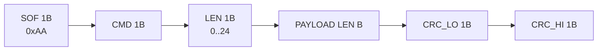
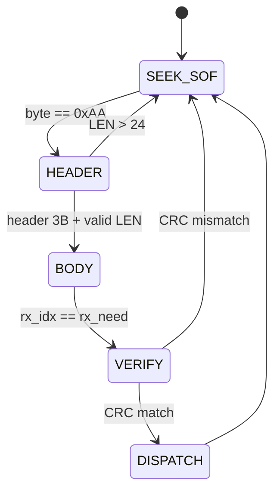
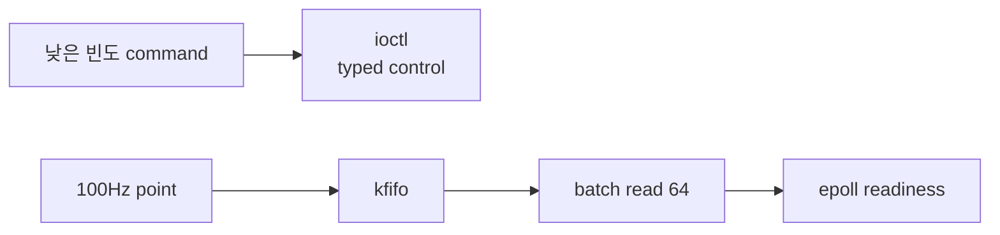

# STM32 ↔ RPI UART 프로토콜 · ABI · CRC · ioctl 계약

> 출처: 01-2. UART protocol v5·ABI·CRC·ioctl 계약 상세 (팀 위키 문서)
> **이 사본**: 2026-08-21 기준 스냅샷
> 기준 파일: `shared/protocol.h` · 코드 기준: `develop` / `4372771` / 2026-08-19

## ⚠️ 원본이 v5 기준이다 (2026-08-21 코드 대조)

원본 제목부터 "protocol **v5**"이고, 현행 헤더는 **v6**이다. 아래 다섯 가지가 어긋난다.

| 항목 | 원본 (v5) | 현행 헤더 (v6) |
|---|---|---|
| `proto_status` | 5B | **15B** (`proto_assert_status_15B`) |
| `proto_err` | 1B | **2B** (`axis` 필드 추가) |
| STM32 오류 코드 | 1~6 | **1~8** (`ERR_BUSY` 7, `ERR_ENCODER` 8) |
| 데몬 notice 코드 | 100~105 | **100~106** (`ERR_BUSY` 106) |
| `turret_link_state` | v5에서 20B | v6에서 다시 커짐 → **ioctl 매직 변경** |

마지막 줄이 실무에 바로 걸린다 — **드라이버와 데몬을 같이 재빌드하지 않으면 구버전
유저스페이스가 `-ENOTTY`로 즉시 실패한다.**

> 💡 로컬에서 v5로 보인다면 브랜치를 확인할 것. 오래된 feature 브랜치에 v5가 남아 있다.
> 기준은 `RPi origin/main`이며, STM32 사본과 md5까지 일치한다(2026-08-20 확인).

---

## 1. `protocol.h`가 단일 진실 소스인 이유

같은 헤더를 STM32 펌웨어, Linux 드라이버, 데몬이 해석한다. 세 곳의 command number ·
payload size · angle unit이 하나라도 다르면 **CRC가 맞아도 의미가 달라진다.** 따라서
변경 시 version을 올리고 세 consumer를 함께 빌드해야 한다.

| 사본 | 경로 | 역할 |
|---|---|---|
| RPi | `RPi/shared/protocol.h` | **마스터** — 프로토콜 변경은 여기서 먼저 |
| STM32 | `STM32/shared/protocol.h` | 다운스트림 — CI drift-check가 마스터와 대조 |

## 2. wire frame

전체 길이는 `3 + LEN + 2`다. 최대 frame은 **29B**다. 파서는 SOF를 찾은 뒤 header 3B가
완성되면 LEN을 검사하고, 예상 전체 길이를 계산한다.

## 3. CRC-16/CCITT-FALSE

초기값 `0xFFFF`, polynomial `0x1021`, reflected가 아닌 방식. CRC 대상은
**SOF·CMD·LEN·payload**이며 CRC byte 자체는 제외한다. wire에는 **little-endian으로 low
byte 먼저** 둔다.

> CRC는 우연한 bit error를 찾지만 **인증은 하지 않는다.** UART noise에는 CRC, network
> 공격에는 TLS와 ACL이 필요하다.

## 4. command matrix

| 방향 | CMD | payload | 결과 |
|---|---|---|---|
| RPi→STM | `PING` 0x01 | 없음 | PONG sequence 증가 |
| STM→RPi | `PONG` 0x02 | 없음 | heartbeat 관측 |
| RPi→STM | `HOME` 0x10 | 없음 | HOMED 8B |
| RPi→STM | `SCAN_START` 0x11 | `scan_start` 10B | scan begin |
| RPi→STM | `SCAN_STOP` 0x12 | 없음 | partial export |
| RPi→STM | `DISARM` 0x13 | 없음 | motor disable |
| STM→RPi | `HOMED` 0x20 | `homed` 8B | raw encoder provenance |
| STM→RPi | `STATUS` 0x21 | `status` **15B** | angle/flags/진단 카운터 |
| STM→RPi | `SCAN_DATA` 0x22 | `point` 18B | kfifo stream |
| STM→RPi | `SCAN_DONE` 0x23 | `done` 4B | reported count |
| STM→RPi | `ERROR` 0x2F | `error` **2B** | last_err + axis |

**대역이 방향을 뜻한다** — 새 명령은 방향에 맞는 대역에서 고를 것.

| 대역 | 방향 |
|---|---|
| `0x01`~`0x02` | 생존 확인 (양방향) |
| `0x10`~`0x1F` | RPi → STM32 (명령) |
| `0x20`~`0x2F` | STM32 → RPi (보고) |

## 5. payload 구조

### 5.1 `proto_scan_start` 10B

pan start/end, tilt start/end는 signed 16-bit deci-degree이고 step은 unsigned 16-bit다.
1.0°는 10이다.

> ⚠️ **데몬의 JSON int가 이 구조로 narrowing되기 전에 범위를 검사해야 한다.** 현재 core는
> `0 < step_ddeg <= 3600`을 확인하므로 음수와 일반적인 초과값은 거절한다. 그러나 MQTT/CLI가
> 그 전에 `int16_t`/`uint16_t`로 줄이므로 **매우 큰 정수가 modulo wrap 후 유효한 각도로
> 보일 수 있다**(예: 65546 → 10). 넓은 타입에서 범위를 확인한 뒤 cast해야 계약이 완결된다.
> → `daemon/modules/mqtt/mqtt_module.c` 451~455행. **`origin/main`에 그대로 있다.**

### 5.2 `proto_scan_point` 18B

| field | byte | clock/unit | 의미 |
|---|---|---|---|
| `pan_ddeg` | 2 | mechanism 0.1° | slow axis |
| `tilt_ddeg` | 2 | mechanism 0.1° | fast axis |
| `d_mm` | 2 | mm | emitter-face range |
| `signal_strength` | 2 | sensor raw | **재질 판정값 아님** |
| `device_time_ms` | 4 | LiDAR clock | 다른 clock과 직접 비교 금지 |
| `stm_ts_ms` | 4 | STM HAL tick | latch time |
| `dis_status` | 1 | raw | 1 = valid |
| `range_precision` | 1 | raw | F2P는 0xFF 미지원 |

### 5.3 `proto_homed` 8B

두 MT6701 raw 14-bit 값과 zero offset 적용 후 angle을 함께 보낸다. 나중에 zero constant
오류가 발견돼도 **raw로 재계산하기 위한 provenance**다.

## 6. packed와 padding

컴파일러는 CPU alignment를 위해 field 사이에 padding을 넣을 수 있다. wire protocol은 byte
위치가 고정돼야 하므로 `PROTO_PACKED`를 사용한다. 헤더 마지막의 typedef assertion은 size가
18/10/4/8/15/2B가 아니면 **컴파일을 실패시킨다.**

packed는 unaligned access 비용이나 fault 가능성이 있으므로 드라이버는 payload를 local
packed struct로 `memcpy`한 후 사용한다.

## 7. endianness

현재 payload는 양측 architecture가 little-endian이라는 전제와 계약 주석을 따른다. byte
stream을 다른 architecture나 language가 파싱하면 명시적으로 little-endian decode해야 한다.

> ⚠️ **Camera framing은 반대로 big-endian이므로 두 protocol을 혼동하면 안 된다.**

## 8. RX parser state machine

파서가 frame 중간에서 깨져도 다음 `0xAA`를 찾아 복구한다. 다만 **payload 안의 0xAA를 새
SOF로 오인하지 않도록** 현재 frame 길이를 완성할 때까지는 SOF search를 하지 않는다.

## 9. ioctl ABI

`PROTO_WANT_IOCTL`을 헤더 include **전에** 정의하면 user-space ioctl 구역이 열린다.

| ioctl | direction | argument |
|---|---|---|
| `HOME` | no data | command |
| `SCAN_START` | user→kernel | `proto_scan_start` |
| `SCAN_STOP` | no data | command |
| `DISARM` | no data | command |
| `GET_STATE` | kernel→user | `turret_link_state` |
| `PING` | no data | command |

`_IOR`/`_IOW`는 magic·number·direction·size를 ioctl number에 인코딩한다.
`turret_link_state` 크기가 바뀌면 number도 바뀐다. **mismatch가 silent memory corruption이
아니라 `ENOTTY`로 드러나는 장점이 있다.**

> ⚠️ include 순서를 지켜야 한다. 인클루드 가드 때문에 한 번 처리되면 다시 안 읽으므로,
> ioctl이 필요한 TU는 반드시 `#define PROTO_WANT_IOCTL 1`을 **먼저** 쓴다. 뒤집으면
> 진단이 "`TURRET_HOME`이 없다"로만 나와 원인을 찾기 어렵다.

## 10. heartbeat 계약

데몬은 100ms마다 PING ioctl을 보내고 드라이버는 PONG마다 `pong_seq`를 증가시킨다. 데몬은
sequence 변화 시각을 자기 `CLOCK_MONOTONIC`으로 기록하고 **300ms가 넘으면 link_dead**로
판단한다.

드라이버의 `link_alive` 필드 자체만 믿지 않는 이유는, 드라이버가 "마지막으로 언제 PONG이
왔는지"라는 **policy clock을 소유하지 않기** 때문이다.

## 11. backward compatibility

`HOMED`는 구 펌웨어의 `len=0`도 flag는 세우되 provenance만 비워 둔다. 반면 `SCAN_DATA`는
payload size가 **정확히 18B여야** 받아들인다. streaming data를 잘못된 layout으로 해석하는
것보다 명시적으로 drop하는 편이 안전하다.

## 12. 변경 체크리스트

1. `PROTO_VERSION` 증가 여부 결정
2. payload size assertion 수정
3. 드라이버·데몬·STM32 세 빌드
4. command direction과 unit 문서 갱신
5. known CRC vector test
6. mixed-version 실험에서 예상 `ENOTTY`/drop 확인
7. UART utilization 재계산

## 13. error code namespace

STM32-origin error는 **1~8**이고 daemon-origin notice는 **100~106**이다.

| 범위 | owner | 예 |
|---|---|---|
| 1~8 | STM32 protocol | bad CRC, not homed, stall, LiDAR, busy, encoder |
| 100~106 | `daemon_module` 계약 | disarm, home timeout, not-level, upload, bad request, export, busy |

namespace를 나눈 이유는 **Qt가 code 하나만 보고 어느 계층에서 발생했는지 판단**하게 하기
위해서다. 데몬이 JSON parse 오류에 STM의 `ERR_OUT_OF_RANGE=4`를 재사용하면 통신은 되지만
원인 분석이 불가능해진다.

전체 코드표 → [MQTT 토픽 계약 §3.5](mqtt-topic-contract.md)

## 14. frame 예시를 해석하는 방법

`PING`은 payload가 없으므로 header는 `AA 01 00`이다. CRC 함수에 이 3B를 넣어 16-bit 값을
얻고 low/high 순서로 붙인다. `SCAN_START`는 LEN이 10이며 payload field가 모두
little-endian 2B다.

packet dump를 볼 때는 다음 순서로 검사한다.

1. 첫 byte가 `AA`인가
2. CMD가 direction에 맞는가
3. LEN이 24 이하이며 command payload size와 같은가
4. 수신 byte 수가 `3+LEN+2`인가
5. CRC를 다시 계산해 일치하는가
6. field별 signedness와 0.1° 단위를 적용했는가

> **CRC가 맞는데 angle이 10배 틀리면 전송 오류가 아니라 unit 해석 오류다.**
> CRC는 semantic correctness를 보장하지 않는다.

## 15. ioctl과 stream을 분리한 설계 판단

command는 낮은 빈도로 한 번씩 발생하고 payload type이 고정돼 ioctl이 적합하다. scan point는
수만 번 발생하므로 매 point마다 ioctl을 호출하면 system call과 control path가 과도하게
반복된다. 드라이버가 queue에 쌓고 데몬이 **한 번의 read로 최대 64개**를 가져오면 syscall
수와 context switch가 감소한다.

## 16. 실패가 보이는 방식

| 상황 | 드러나는 방식 |
|---|---|
| LEN 초과 | parser reset + kernel warning |
| CRC mismatch | frame drop + warning |
| FIFO full | point drop + rate-limited warning |
| wrong ioctl size/version | `ENOTTY` |
| `copy_from_user`/`copy_to_user` 실패 | `EFAULT` |
| HOME 전 SCAN | STM `ERROR 3` |
| invalid scan range | STM `ERROR 4` 또는 daemon request reject |
| PONG 300ms 무응답 | daemon DISARM |

이 표를 기준으로 **"응답 없음"을 한 종류로 취급하지 말고** dmesg, daemon journal, MQTT
event를 계층별로 확인한다.
