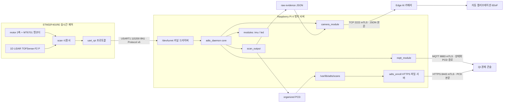
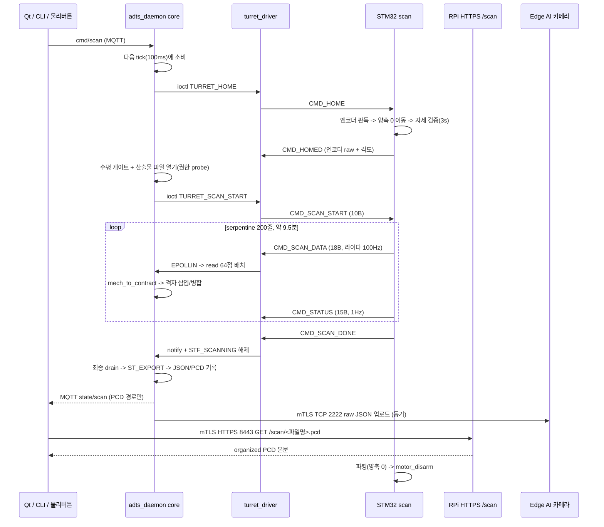
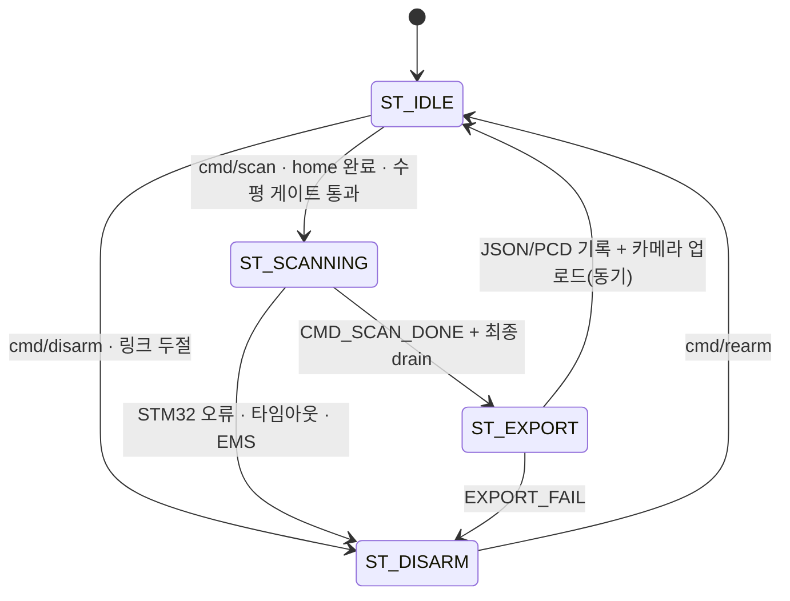

# 시스템 아키텍처

| 항목 | 내용 |
|---|---|
| 문서 ID | `ADTS-ARC-01` |
| 담당 | 이현우 (Device 파트) |
| 대상 소스 | `RPi/shared/`, `RPi/daemon/`, `RPi/driver/`, `STM32/App/` |
| 기준 코드 | RPi `f51ba0f` / STM32 `c5c1c67` (2026-08-21) |
| 범위 | 디바이스 계층 다섯 노드와 그 경계 |

---

## 1. 개요

이 킷은 1D 라이다를 2축 팬-틸트로 주사해 실내를 organized 2D 포인트클라우드로 만들고,
같은 장면의 CCTV 영상과 결합해 마커 없이 카메라-라이다 외부 파라미터(6DoF)를 자동
산출한다.

디바이스 계층은 다섯 노드로 구성된다. 각 노드의 경계는 "무엇을 모르는가"로 정의한다.

| 계층 | 아는 것 | 모르는 것 |
|---|---|---|
| STM32 | 모터 위치, 라이다 측정값 | 계약 좌표계 |
| 커널 드라이버 | 프레임 무결성 | 점의 의미 |
| 데몬 코어 | 순서와 실패 정책 | 파일 포맷 |
| `scan_output` | 기하와 산출물 | fd·ioctl |
| 모듈(mqtt/camera) | 외부 전송 | FSM 정책 |

이 분리로 얻는 것은 셋이다.

1. 좌표 변환을 호스트에서 단위 시험할 수 있다 (`scan_output` 은 Linux 헤더 미포함).
2. 좌표 규약을 바꿔도 펌웨어·커널 모듈을 다시 만들 필요가 없다.
3. 모듈을 mock 으로 바꿔 코어 FSM 을 하드웨어 없이 시험할 수 있다.

### 1.1 경계를 어겼을 때 생기는 일

각 경계는 관념이 아니라 실제로 겪은 실패에서 나왔다.

| 경계 | 어기면 | 실제 사례 |
|---|---|---|
| STM32 가 계약 좌표계를 모른다 | 좌표 규약이 바뀔 때마다 펌웨어를 다시 굽고 플래시해야 한다 | 좌표계를 z-up mm 에서 `lidar_scan` +y down meter 로 바꿀 때 펌웨어는 한 줄도 건드리지 않았다 |
| 드라이버가 점의 의미를 모른다 | 기구각·계약각 변환이 커널 공간에 들어가 부동소수 연산과 정책이 섞인다 | 드라이버는 18B payload 를 그대로 kfifo 에 넣는다. 변환 실수가 나도 사용자 공간에서 고친다 |
| 코어가 파일 포맷을 모른다 | 산출물 포맷을 바꾸려면 FSM 을 건드려야 한다 | `scan_output` 이 Linux 헤더를 포함하지 않아 macOS clang 에서 그대로 단위 시험된다 |
| 모듈이 FSM 정책을 모른다 | 수신 콜백이 상태를 바꿔 코어의 전이 순서와 경쟁한다 | `on_message` 는 `shared_ctx` 플래그만 세우고 실제 전이는 다음 100ms tick 이 한다 |

경계가 없어서 겪은 반례도 있다. 데몬 판정 코드가 STM32 오류코드와 같은 공간을 쓰던
시절 `4` 하나가 세 뜻으로 쓰였고, Qt 는 `code=4` 를 받고도 STM32 가 거절한 것인지
데몬이 페이로드를 못 읽은 것인지 알 수 없었다. 지금은 100 미만이 STM32, 100 이상이
데몬이다.

---

## 2. 노드 구성



| 노드 | 입력 | 책임 | 출력 |
|---|---|---|---|
| STM32 scan | 모터·엔코더, 라이다, RPi 명령 | HOME, serpentine 스윕, 점 상행 | `SCAN_DATA`/`DONE`/`STATUS`/`ERROR` |
| STM32 uart_rpi | USART1 바이트 | 프레임 파싱·디스패치·송신 | Protocol v6 프레임 |
| turret_driver | UART 스트림 | SOF/LEN/CRC 검증, 두 채널 분리 | `read()` / `ioctl` / `poll` |
| daemon core | 장치 이벤트, 타이머, 시그널, 모듈 | FSM·타임아웃·모듈 조율 | 상태 전이, 산출물 확정 |
| scan_output | 스캔 점 | 좌표 변환, 격자 병합, 파일 기록 | JSON, PCD |

### 2.1 산출물 전달 계약

| 산출물 | 성격 | 실제 소비자 | 전달 경로 |
|---|---|---|---|
| 원시 JSON | 변환 전 거리·기구각·진단값인 golden evidence | Edge AI 카메라의 캘리브레이션 앱 | `camera_module` 이 mTLS TCP 2222 로 파일 본문 업로드 |
| organized PCD | JSON 에서 좌표 변환한 뷰어·운영 편의 산출물 | Qt Top View | MQTT `state/scan` 으로 경로만 통지한 뒤 Qt 가 HTTPS 8443 `GET /scan/<파일명>.pcd` 로 다운로드 |

MQTT 는 PCD 파일을 운반하지 않는다. `state/scan` 에는 RPi 기준 `.pcd` 경로와 점수만
들어가고, Qt 의 `ScanFetcher` 가 경로에서 파일명만 뽑아 `adts_enroll` 의 읽기 전용 HTTPS
endpoint 로 본문을 받는다. JSON 경로·본문은 Qt 에 보내지 않고 카메라 업로드에만 쓴다.

두 산출물을 나눈 이유는 소비자가 요구하는 것이 다르기 때문이다. 캘리브레이션 연산은
변환 전 값이 필요하다. PCD 만 주면 84mm 오프셋과 기구각·계약각 변환이 이미 적용된
뒤라 그 단계에 버그가 있어도 카메라 쪽에서 되짚을 수 없다. 반대로 Qt Top View 는
좌표만 있으면 되고 거리·엔코더 raw 는 쓰지 않는다.

### 2.2 데이터량과 전송 예산

| 구간 | 단위 | 초당 | 부하 |
|---|---|---|---|
| STM32 → 드라이버 | `CMD_SCAN_DATA` 23B 프레임 | 100 | UART 115200 의 약 20% |
| 드라이버 → 데몬 | `read()` 1회 최대 64점 (`SCAN_BATCH`) | 이벤트 구동 | kfifo 1024점 버퍼 |
| 데몬 → Qt | `event/progress` | 2 (500ms) | QoS0, 유실 허용 |
| STM32 → 데몬 | `CMD_STATUS` 20B 프레임 | 1 | 진단 카운터 5종 |

`proto_scan_point` 를 18B 로 키우면서 프레임이 11B 에서 23B 가 되었고 UART 점유율이
9.5% 에서 20% 로 올랐다. 여유를 쓴 대가로 각도·엔코더·`dis_status` 를 점마다 함께
올려 RPi 쪽 연관 부담을 0 으로 만들었다.

---

## 3. 하드웨어

| 항목 | 사양 |
|---|---|
| 카메라 | 한화비전 PNM-C16083RVQ (4채널). 커스텀 AI 모델 업로드 불가, 네이티브 클래스만 |
| 엣지 서버 | Raspberry Pi 4 (커널 6.12.y 고정) |
| 실시간 제어 | STM32F401RE |
| 라이다 | TOFSense-F2 P — 100Hz 상한, FOV 1~2°, 10m 이내 정확도 1cm 미만 |
| 모터 | 17HS4401 스텝 ×2 + DRV8825 ×2, 1/16 마이크로스텝 (0.1125°/펄스) |
| 엔코더 | MT6701 자기 절대각 ×2 (14비트, 0.022°/count) |
| IMU | ICM-20948 (0x69), RPi I2C1 직결 |
| 표시 | LED ×3 + 스위치 ×2 + 부저 ×1, RPi GPIO 직결 |

### 3.1 STM32 핀 배정

`adts.ioc` 가 최종 기준이다.

| 용도 | 배정 |
|---|---|
| RPi 링크 | USART1 PA9 TX / PA10 RX, 115200 8N1 |
| VCP 디버그 | USART2 |
| 라이다 | USART6 |
| Pan STEP / DIR / EN | TIM1, PB13 / PB0 / PB1 |
| Tilt STEP / DIR / EN | TIM2, PA7 / PB2 / PB12 |
| Pan 엔코더 | I2C3 (PA8 SCL / PC9 SDA) |
| Tilt 엔코더 | I2C1 (PB8 SCL / PB9 SDA) |
| 워치독 | IWDG |

- 마이크로스텝은 DRV8825 모듈의 물리 스위치로 설정한다. GPIO 를 쓰지 않는다.
- Debug 는 `Serial Wire` 로 둔다. Trace 를 켜면 SWO 가 PB3 를 점유한다.
- `TILT_DIR` 라벨이 PA7 과 PB10 에 중복돼 있다. 코드는 PA7 을 쓴다.

### 3.2 RPi 핀 배정 (BCM)

| 용도 | 핀 |
|---|---|
| LED 초록 / 노랑 / 빨강 | 17 / 27 / 22 |
| 부저 | 18 (하드웨어 PWM0) |
| 스위치 스캔시작 / EMS | 23 / 24 (active-low 풀업, 50ms 폴링) |
| IMU | I2C1 (GPIO2/3), 주소 0x69 |
| STM32 링크 | UART0 PL011, GPIO14 TX / GPIO15 RX |

gpiochip base 가 512 다. BCM 17 의 전역 번호는 529 이고, 전역 17 은 어느 칩에도 속하지
않는다. 레거시 정수 GPIO 번호로는 성공하지 않으므로 GPIO 는 DT 오버레이로 잡아야
한다. `led_sw` 부팅 실패의 근본 원인이며 상세는
[../components/yocto/kernel-drivers-dt.md](../components/yocto/kernel-drivers-dt.md) 6절에
있다.

### 3.3 기구 구성

- 틸트 = 빠른 축. 한 줄이 −90° → +90° (벽 A → 바닥 → 벽 B). 영점 = 바닥(nadir).
- 팬 = 느린 축. 줄마다 한 스텝, 스윕 동안 정지.
- serpentine — 줄마다 틸트 방향 반전. 되감기 구간이 없다.
- 리밋 스위치를 쓰지 않는다. 양축 모두 MT6701 절대 엔코더로 홈을 잡는다. 절대각이라
  구동 없이 판독 1회로 위치가 확정된다(약 0.3ms).

리밋이 없는 대가로 양축 모두 벤치 실측 영점 상수(`MOTOR_*_ZERO_OFFSET_DEG`)에
의존한다. 좌표가 통째로 틀어지면 여기부터 확인한다. `CMD_HOMED` 가 엔코더 raw 를 함께
올리므로 오프라인 재계산은 가능하다.

### 3.4 모터 속도

ISR 이 펄스마다 `tim->ARR` 을 다시 쓰는 사다리꼴 램프이므로 CubeMX 의 Period 값은
실행에 영향이 없다. `motor.h` 상수가 정한다.

```
MOTOR_START_PPS         50    양축 공통 출발/도착
MOTOR_PAN_CRUISE_PPS   100    11.25도/s    ACCEL  600 pps^2
MOTOR_TILT_CRUISE_PPS  800    90도/s       ACCEL 1200 pps^2
```

틸트 800pps(90°/s) × 라이다 100Hz = 0.9°마다 한 점. 표준 격자 0.9°의 근거다.

---

## 4. 계층 간 계약

경계는 넷이며, 한쪽만 고치면 조용히 깨지는 항목은 전부 여기에 있다.

| 경계 | 계약 | 원본 파일 | 문서 |
|---|---|---|---|
| STM32 ↔ 드라이버 | Protocol v6 와이어 프레임 | `shared/protocol.h` | [../interfaces/stm32-rpi-uart.md](../interfaces/stm32-rpi-uart.md) |
| 드라이버 ↔ 데몬 | `read`/`poll`/`ioctl` ABI | `protocol.h` ioctl 절 | [../components/rpi/driver/turret.md](../components/rpi/driver/turret.md) |
| 코어 ↔ 모듈 | `shared_ctx` 소유권 | `shared/daemon_module.h` | [../components/rpi/daemon/modules.md](../components/rpi/daemon/modules.md) |
| 데몬 ↔ Qt·카메라 | 토픽 JSON, 산출물 포맷 | 각 모듈 | [../interfaces/mqtt-topics.md](../interfaces/mqtt-topics.md), [../interfaces/scan-artifacts.md](../interfaces/scan-artifacts.md) |

### 4.1 기구각과 계약각

프로토콜이 나르는 것은 기구각(모터가 어디 있는지)이고 산출물에 담기는 것은 계약각이다.
틸트 스윕이 바닥을 지나므로 둘은 1:1 이 아니다.

```
기구 틸트 m <= 0 :  계약 pan = p        tilt = -90 - m     (벽 A 쪽 반)
기구 틸트 m >  0 :  계약 pan = p + 180  tilt = -90 + m     (벽 B 쪽 반)
```

한 줄이 방위 `p` 와 `p+180` 을 함께 훑으므로 팬이 180°만 돌아도 계약 방위 360°가
채워진다. 케이블이 감기지 않고 되감기 구간도 필요 없다. 표준 스캔의 팬 범위가
`0~1791`(179.1°)인 이유이며, 200줄 × 2방위 × 0.9° = 정확히 360° 다. `1800` 까지 돌면
첫 줄과 마지막 줄이 같은 수직 평면이라 그 방위만 두 번 찍힌다.

변환 주체는 데몬의 `mech_to_contract()` 하나다. 계약 좌표계는 `lidar_scan` frame,
단위는 미터다.

```
x =  r · cos(tilt) · sin(pan)
y = -r · sin(tilt)
z =  r · cos(tilt) · cos(pan)
r = 라이다 보고 거리 + 84mm          (축교점 -> 발광면)
```

원점은 팬·틸트 회전축 교점이고 센서 높이는 좌표에 들어가지 않는 메타데이터다.
84mm 를 빼먹으면 평면이 가운데가 파인 사발 모양으로 휜다. 수축이 평행이동이 아니라
각 점의 시선 방향이기 때문이며, 정면에서 84mm 인 것이 α=30°에서는 73mm 로 줄어든다.

상세는 [../interfaces/scan-artifacts.md](../interfaces/scan-artifacts.md) 에 있다.

### 4.2 각도와 거리의 동기

라이다 16바이트 프레임이 완성되는 순간 ISR 에서 스텝카운트와 엔코더를 래치한다
(`scan_latch_angles`). 폴링 방식은 폐기됐다. 최대 10ms 어긋나고 그동안 틸트가 0.9°
이동해 격자에 스미어가 남기 때문이다.

매칭이 STM32 에서 원자적으로 끝나므로 `(pan, tilt, d)` 가 짝지어진 채로 올라온다.
드라이버와 데몬은 연관 작업을 하지 않는다.

각도원은 스윕 중 스텝카운트다. 엔코더는 세 곳에서만 쓴다.

1. 홈 확립
2. 틸트 줄 끝(±90) 대조·재영점
3. 팬 줄 시작 검증

I2C 판독 완료 시각이 라이다 샘플 시각과 다르므로 스윕 중에는 엔코더를 읽지 않는다.
팬은 폐루프 보정도 하지 않는다. 정지 상태의 0.9° 이동은 탈조 위험이 없고, 보정
이동이 오히려 새 실패 모드가 되기 때문이다. 감시만 한다.

### 4.3 불변식

1. 와이어 헤더 순서는 SOF, CMD, LEN 이다 (LEN 이 CMD 앞이 아니다).
2. 프로토콜의 pan/tilt 는 기구각이고 좌표 변환은 데몬만 한다.
3. STM32 ISR 은 바이트와 각도 스냅샷만 잡고, 파싱·상태 전이는 메인루프에서 한다.
4. 드라이버 `read()` 는 점 스트림, `ioctl(GET_STATE)` 는 제어 스냅샷이다.
5. 데몬은 단일 epoll 스레드에서 `shared_ctx` 와 FSM 을 소유한다(락이 없다).
6. `scan_output` 은 fd·ioctl 을 모르고 기하와 산출물만 소유한다.
7. JSON 은 raw evidence, PCD 는 derived geometry 다.
8. 카메라 업로드는 `ST_EXPORT` 콜백 안에서 동기 실행된다.
9. 각도원은 스윕 중 스텝카운트다. 엔코더는 홈과 줄 경계에서만 쓴다.

---

## 5. 스캔 1회 타임라인



`CMD_SCAN_DONE` 이 파킹보다 먼저 나간다. 데몬이 산출물을 먼저 마감하기 위해서이며,
대가로 데몬은 파킹 완료 ACK 대신 고정 15초 유예를 쓴다.

---

## 6. 런타임 제어면

데몬은 락이 없는 단일 스레드 epoll 루프다.

| 얻는 것 | 대가 |
|---|---|
| 공유 상태 경쟁이 없다 | 콜백 하나가 오래 막으면 타이머·heartbeat·DISARM·시그널이 같이 밀린다 |
| 모듈을 mock 으로 바꿔 코어를 단독 시험할 수 있다 | 모든 콜백에 블로킹 금지 계약이 필요하다 |

이 계약을 의도적으로 어기는 곳은 카메라 업로드 하나다. `--once` 모드에서
`ST_EXPORT → IDLE → exit` 이므로 비동기로 두면 전송 중에 프로세스가 죽는다. 대신
소켓 타임아웃과 논블로킹 connect 로 최대 정지 시간을 묶고, 끝에서
`core_hb_reprime()` 으로 heartbeat 를 다시 채운다. 이것이 없으면 25MB 전송 시간을
heartbeat 두절로 오판해 성공한 스캔마다 헛 DISARM 이 걸린다. 근거는
[../interfaces/camera-upload.md](../interfaces/camera-upload.md) 에 있다.

논블로킹 connect 가 필요한 이유는 `SO_SNDTIMEO` 가 `connect` 에는 적용되지 않기
때문이다. 카메라가 응답하지 않으면 `tcp_syn_retries=6` 기준 약 127초 동안 epoll 이
통째로 멈춘다.

### 6.1 FSM



`ST_DISARM` 은 어느 상태에서나 진입한다. 빠져나오는 길은 명시적 `rearm` 하나뿐이라,
안전정지가 걸린 뒤 저절로 스캔이 재개되는 경로가 없다.

| 상수 | 값 | 역할 |
|---|---|---|
| `TICK_MS` | 100 | heartbeat PING 과 전이 판정 주기 |
| `HOME_TIMEOUT_MS` | 20,000 | 홈 무응답 판정 |
| `SCAN_FIRST_POINT_TIMEOUT_MS` | 15,000 | `SCAN_START` 후 첫 점까지 |
| `SCAN_IDLE_TIMEOUT_MS` | 3,000 | 스윕 중 점 끊김 판정 |
| `POST_SCAN_DISARM_MS` | 15,000 | 파킹 유예 후 자동 DISARM |

전이 판정을 100ms tick 한 곳에 모은 결과, 명령 수신·타이머·시그널이 모두 같은 순서로
소비된다. 대신 명령은 최대 100ms 지연된다.

`POST_SCAN_DISARM_MS` 가 고정 유예인 이유는 `CMD_SCAN_DONE` 이 파킹보다 먼저 나가기
때문이다(5절). 파킹 완료 ACK 이 계약에 없으므로 시간으로 대신한다.

---

## 7. 실측 기준선

2026-08-19 표준 스캔 `calib-20260819-185256` 기준이다.

| 항목 | 값 |
|---|---|
| 격자 | 101행 × 400열 = 40,400 셀 |
| 유효 셀 | 40,088 (99.23%) |
| 수신 프레임 | 52,794 (`dis_status` 0: 57 / 1: 52,737) |
| 병합 샘플 | 12,706 |
| 평균 거부 셀 | 236 |
| 범위 밖 각도 | 0 |
| 소요 | 약 9.5분 |
| 홈 provenance | pan enc raw 8953 / tilt enc raw 5569 |
| STM32 진단 카운터 5종 | 전부 0 |
| 카메라 mTLS 업로드 | 성공 |

진단 카운터는 Protocol v6 의 15바이트 `CMD_STATUS` 에만 있다. 값이 읽혔다는 사실이 v6
펌웨어 실기 동작의 증거다.

| 시점 | 프로토콜 | 결과 | 등급 |
|---|---|---|---|
| 2026-07-09 | v3 | UART full-duplex 50 프레임 | C |
| 2026-07-30 | v5 | 71×360 격자, 유효 25,195(98.6%), 평면 잔차 RMS 11.0mm | C |
| 2026-08-19 | v6 | 위 표 | A |

---

## 8. 폐기된 설계

| 이전 | 현재 | 폐기 이유 |
|---|---|---|
| 팬 = 리밋스위치 홈 | 양축 MT6701 엔코더 | 절대각이라 구동 없이 확정 |
| 좌표계 z-up, mm | `lidar_scan` +y down, meter | 영상 좌표 친화 |
| 팬 = 빠른 축 | 틸트가 빠른 축 | 케이블 감김·되감기 제거 |
| 되감기(`SC_SETTLE`/`SC_REWIND`) | serpentine | 불필요해짐 |
| IMU = MPU-6050 | ICM-20948 | 부품 교체 |
| 부저 = GPIO26 소프트 PWM | GPIO18 하드웨어 PWM0 | 지터 제거 |
| 카메라 업로드 = 평문 TCP 8081 | mTLS 2222 | 보안 요건 |
| RPi `vision/` 이미지 보정 | 삭제, 카메라 단 담당 | 역할 재배치 |
| 시퀀서가 ISR 안 | 메인루프 | `HAL_Delay` 데드락, 블로킹 I2C 로 라이다 유실 |
| 각도-거리 폴링 매칭 | ISR 원자 래치 | 최대 10ms 어긋나 격자 스미어 |
| 칼만 필터 | 제외 확정 | 정적 스캔이라 궤적예측 무의미, 라이다 100Hz 고정 |

주제는 2026-07-22 에 안티드론 조준(`A.D.T.S`)에서 스캔·캘리브레이션으로 전환됐다.
전환 근거는 고정 4채널 카메라의 픽셀에서 터렛 각도로 가는 정밀 변환이 8주 내
비현실적이라는 판단이었다. 고정 카메라 좌표가 터렛 좌표와 다르고, 시차가 표적 거리에
의존하며, 채널별 왜곡 캘리브가 필요한 데다, 카메라가 고정이라 비주얼 서보잉 루프가
닫히지 않는다. 디바이스 파트 자산은 대부분 승계됐고 미션만 교체됐다. 경로·저장소명에
`adts` 가 남아 있는 이유다.

---

## 9. 실패 처리

오류코드는 100 을 경계로 출처가 갈린다.

| 범위 | 출처 | 축 정보 |
|---|---|---|
| 1 ~ 8 | STM32 `proto_err_code` | v6 비트 플래그 (1=팬, 2=틸트, 3=둘 다) |
| 100 ~ 106 | 데몬 자체 판정 | 항상 0 |

경계마다 실패를 흡수하는 방식이 다르다.

| 경계 | 실패 | 처리 |
|---|---|---|
| 와이어 | CRC 불일치, LEN 초과 | 드라이버가 프레임 폐기 후 재동기. `ERR_BAD_CRC`/`ERR_BAD_LEN` |
| 와이어 | 보드에 옛 펌웨어 | 드라이버의 payload 길이 불일치 경고. `PROTO_VERSION` 은 와이어로 보내지 않는다 |
| 링크 | heartbeat 두절 | 100ms tick 이 판정, DISARM |
| 시퀀서 | 엔코더 판독 실패 | `ERR_ENCODER`(8), 즉시 `motor_disarm` |
| 시퀀서 | 스텝카운트와 엔코더가 2.0° 초과 이격 | `ERR_STALL`(5), 즉시 `motor_disarm` |
| 코어 | 수평 게이트 초과 | `NOT_LEVEL`(102), 스캔 거절 |
| 코어 | 산출물 기록 실패 | `EXPORT_FAIL`(105). 측정값 복구 불가 |
| 모듈 | 카메라 업로드 실패 | `UPLOAD_FAIL`(103). 파일은 로컬에 남는다 |

`ERR_BUSY`(7)는 v6 에서 추가됐는데, 추가된 날 곧바로 자기 역할을 했다. 같은 릴리스에서
`CMD_STATUS` 주기 송신을 켜자 데몬의 홈 대기 불변식이 깨졌다. 데몬은 "`TURRET_HOME`
ioctl 이 `STF_HOMED` 를 내리므로 이후 `homed==1` 은 이번 HOME 의 응답"이라는 전제에
기대는데, 주기 송신이 이전 홈의 값을 되살려 홈이 끝나기 전에 `SCAN_START` 가 나갔다.
`ERR_BUSY` 가 그것을 잡았다. 그 코드가 없었다면 STM32 가 요청을 조용히 무시해
원인을 찾기 훨씬 어려웠을 것이다.

이 프로젝트의 실패 원칙은 조용히 degraded 로 도는 것보다 시끄럽게 실패하는 편이 낫다는
것이다. 데몬 CMake 가 OpenSSL 을 못 찾으면 카메라 업로드를 평문으로 폴백하지 않고
비활성으로 컴파일하고, 브로커는 인증서가 없으면 시작하지 않는다.

---

## 10. 검증

| 항목 | 방법 | 등급 | 결과 |
|---|---|---|---|
| 계층 분리 — 호스트 단위 시험 | macOS clang `-Werror` 로 `scan_output` 단독 빌드 | B | 통과. Linux 헤더 미포함 확인 |
| 와이어 계약 4개 사본 동일성 | CI `protocol-sync-check` | A | RPi·STM32 사본 sha 일치 |
| 스캔 1회 전 구간 | 2026-08-19 표준 스캔 | A | 7절 표 |
| 카메라 mTLS 업로드 | 같은 스캔 | A | 성공 |
| 진단 카운터 5종 | 같은 스캔 `state/daemon` `.diag` | A | 전부 0 |
| 탈조 감시 발화 | 2026-08-21 스캔 | B | `ERR_STALL` `code=5` 관측. 축 미확인 |
| Yocto 이미지 전 구간 | — | D | `adts-image` 미실행 |

---

## 11. 참고

- 계약 원본: `RPi/shared/protocol.h`, `RPi/shared/daemon_module.h`
- 핀 배정 최종 기준: `STM32/adts.ioc`
- 인터페이스: [../interfaces/README.md](../interfaces/README.md)
- RPi 컴포넌트: [../components/rpi/README.md](../components/rpi/README.md)
- STM32 컴포넌트: [../components/stm32/README.md](../components/stm32/README.md)
- Yocto: [../components/yocto/README.md](../components/yocto/README.md)
